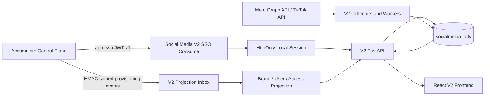
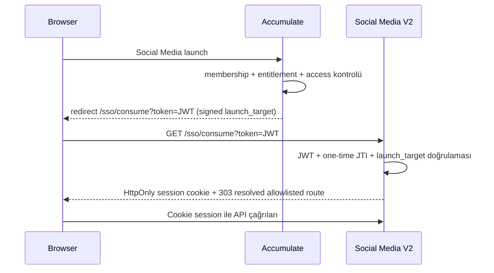

# Social Media V2 Downstream Master Plan

| Alan | Değer |
|---|---|
| Tarih | `2026-07-10` |
| Durum | Revizyon 4 — ChatGPT 5.3 için uygulamaya hazır normatif plan |
| Hedef proje | `/home/api/colab_scripts/SocialMediadownstream` |
| Canonical GitHub repository | `https://github.com/abbasalipanah/SocialMediaV2.git` |
| Ürün kimliği | `social_media` |
| Frontend development URL | `http://localhost:3010/` |
| Ürün tanımı | Accumulate control-plane ile çalışan bağımsız Social Media V2 downstream uygulaması |

## 0. ChatGPT 5.3 uygulama protokolü

Bu dosya fikir listesi değil, Social Media V2 için **normatif uygulama sözleşmesidir**. ChatGPT 5.3 veya başka bir implementasyon ajanı aşağıdaki sırayı ve durma koşullarını değiştiremez.

### 0.1 Zorunlu çalışma sırası

1. Bu planın tamamını okumadan kod değişikliğine başlama.
2. Yalnız `/home/api/colab_scripts/SocialMediadownstream` içinde write yap; SocialMedia, Accumulate ve performance_marketing kaynaklarını salt-okunur tut.
3. Fazları §14 sırasıyla uygula; bir fazın çıkış kapısı yeşil olmadan sonraki faza geçme.
4. Production DB, production secret, provider authorization, service/timer veya Accumulate routing üzerinde bu planın açık final gate'i olmadan işlem yapma.
5. Provider/schema/runtime gerçeği planla uyuşmazsa fallback uydurma, kapsam genişletme veya legacy yolu sessizce kullanma; dur ve kanıtla birlikte kullanıcı kararı iste.
6. Secret, OAuth code, access/refresh token veya signed activation intent'i Markdown'a, source code'a, Git'e, test fixture'a, komut çıktısına veya log'a yazma.
7. Her faz sonunda source-project snapshot, architecture boundary, vocabulary guard ve ilgili testleri yeniden çalıştır.
8. Son durum `READY_FOR_OWNER_TIKTOK_ACTIVATION` olana kadar production TikTok bağlantısı başlatma.
9. Bu duruma gelince kullanıcı adına OAuth'u açma veya linki takip etme; yalnız §3.7'de tanımlanan sabit, secretsız owner activation URL'sini kullanıcıya ver ve dur.

### 0.2 Ajanın değiştiremeyeceği ürün kararları

- Canonical platform seti tam olarak `facebook | instagram | tiktok`.
- Platform label'ları tam olarak `Facebook | Instagram | TikTok`.
- TikTok production bağlantısı yalnız hesap sahibi tarafından, son aşamada verilen manual activation linkiyle yapılır.
- TikTok advertiser flow kapalıdır; ayrı kullanıcı onayı olmadan açılamaz.
- Cronjob/orchestrator/data writer sahipliği cutover'a kadar V1'dedir.
- İlk cutover schema-compatible'dır; `/api/v2`, dedicated read DB, event bus veya onaysız yeni tablo eklenmez.
- Eksik/unsupported provider verisi `0` olarak uydurulmaz.
- Bu planda açıkça ertelenen hiçbir karar “uygulamayı tamamlamak için gerekli” gerekçesiyle otomatik kapsam içine alınmaz.

### 0.3 Tamamlandı iddiasının biçimi

ChatGPT 5.3 işi tamamladığını söylemeden önce şu dört sonucu ayrı ayrı raporlar:

1. `RELEASE_CANDIDATE_COMPLETE`
2. `WRITER_OWNERSHIP_CUTOVER_COMPLETE`
3. `READY_FOR_OWNER_TIKTOK_ACTIVATION`
4. Owner aktivasyonu sonrasında `TIKTOK_CONNECTION_VERIFIED`

İlk üç sonuç aynı şey değildir. Üçüncü sonuçta ajan yalnız sabit owner URL'sini paylaşır; dördüncü sonuç ancak kullanıcı TikTok consent akışını kendisi tamamladıktan ve callback/readiness doğrulaması yeşil olduktan sonra verilebilir.

## 1. Yönetici kararı

`SocialMediadownstream`, mevcut SocialMedia uygulamasının basit bir kopyası değildir. Yeni proje **Social Media V2** olarak ele alınacaktır.

V2'nin kaynakları ve görevleri şöyledir:

| Kaynak | V2'deki rolü |
|---|---|
| `/home/api/colab_scripts/SocialMedia` | Kanıtlanmış backend, veri modeli, collector, worker ve operasyon davranışının kaynağı |
| `/home/api/colab_scripts/Accumulate` | Mevcut canlı Social Media sayfalarının UX/ürün sözleşmesi ve Accumulate SSO/webhook authority sözleşmesinin kaynağı |
| `/home/api/colab_scripts/performance_marketing` | Yeni sidebar, topbar, parent/child brand seçimi, settings kabuğu, local session ve provisioning yaklaşımının görsel/davranışsal referansı |
| `/home/api/colab_scripts/SocialMediadownstream` | Yazılmasına izin verilen tek proje; V2'nin bütün runtime sahipliği burada olacaktır |

Temel ürün kararı:

- Accumulate; user, brand, parent/child hierarchy, membership, entitlement ve app-access authority olmaya devam eder.
- Social Media V2; kendi session'ını, authority projection'ını, Social Media domain verisini, dashboard API'lerini ve frontend'ini sahiplenir.
- V2 tamamlanana kadar production cronjob, orchestrator, scheduler veya data-collection işi V2'de çalışmaz.
- Social Media V1 bütün mevcut production cronjob/orchestrator/data-collection işlerinin tek sahibi ve tek writer'ı olarak kesintisiz devam eder.
- Facebook/Instagram collector ve worker davranışının V2 kod karşılığı yalnız offline/diferansiyel testlerle hazırlanır; final cutover onayına kadar aktive edilmez.
- TikTok, V2'nin üçüncü canonical platformudur ve yeni platform olarak uçtan uca geliştirilecektir.
- V2 frontend, Settings ve public API sözlüğünde yalnız `Brand` kullanılır; `client` eski terimi kullanılmaz.
- V2 yeni kod, env, route, header, log ve ürün metinlerinde `ARS` terimi kullanılmaz.
- Production social data için mevcut `socialmedia_adv` DB kullanılmaya devam eder.
- Final cutover onayından önce production DB'ye **bağlantı dahil hiçbir temas yapılmaz**.
- Mevcut ve yıllardır çalışan veri toplama davranışı, karakterizasyon ve diferansiyel testler yeşil olmadan değiştirilmez.

Repository kararı:

- `origin`, yalnız `https://github.com/abbasalipanah/SocialMediaV2.git` olacaktır.
- V1 SocialMedia repository'si canonical remote değildir; yalnız read-only migration/parity kaynağıdır.
- `git rev-parse --show-toplevel` sonucu tam olarak `/home/api/colab_scripts/SocialMediadownstream` olmalıdır; parent workspace Git repository'sine bağlı çalışma kabul edilmez.
- V1 geçmişi gerekiyorsa yalnız fetch yapılabilen `v1-source` remote/bundle üzerinden alınır; `v1-source` push URL'si devre dışıdır.
- SocialMedia, Accumulate veya parent workspace repository'sine giden hiçbir push target bulunamaz.
- Target repository'nin mevcut durumu ilk uygulama adımında doğrulanır; remote boşsa bu master plan korunarak initialize edilir ve generic rehber repository-dışı migration input'a ayrılır, doluysa önce clone/fetch edilip içerik çakışması raporlanır.
- Remote push, branch publish veya PR işlemi ayrıca açık publishing onayı olmadan yapılmaz.

## 2. Değiştirilemez sınırlar

### 2.1 Salt-okunur kaynak projeler

Aşağıdaki klasörlerde dosya oluşturulmayacak, düzenlenmeyecek, silinmeyecek; build, format, migration veya write üreten test çalıştırılmayacaktır:

- `/home/api/colab_scripts/SocialMedia`
- `/home/api/colab_scripts/Accumulate`
- `/home/api/colab_scripts/performance_marketing`

Her V2 milestone'u öncesinde ve sonrasında bu üç projenin aşağıdaki bilgileri karşılaştırılacaktır:

- branch ve HEAD
- `git status --short`
- tracked diff hash'i
- untracked dosya listesi

Kaynak projelerin başlangıçta zaten dirty olması, yeni değişiklik yapıldığı anlamına gelmez. Başarı ölçütü başlangıç snapshot'ının birebir korunmasıdır.

### 2.2 Production DB ve servis güvenliği

Final cutover penceresine kadar:

- production DB URL'si V2 geliştirme/CI ortamına verilmeyecek;
- V2, SocialMedia veya Accumulate `.env` dosyalarını fallback olarak okumayacak;
- production Meta token dosyaları kopyalanmayacak;
- Alembic, `create_all`, autogenerate veya schema inspection production'da çalıştırılmayacak;
- V2 servis/timer unit'leri production secret olmadan, disabled/masked ve cutover sentinel'i olmadan başlatılamayacak;
- `SOCIAL_WRITES_ENABLED` varsayılan olarak `false` olacak;
- mutation endpoint'leri ve worker entrypoint'leri write flag'i yoksa fail-closed davranacak.

### 2.3 Secret ve artifact yasağı

Yeni projeye şunlar taşınmayacaktır:

- `.env` ve credential/token dosyaları
- `.venv`, `venv`, `node_modules`
- `dist`, cache, `__pycache__`, `.pytest_cache`
- log, tmp, rapor çıktıları, XLSX/CSV/PDF runtime artifact'leri
- mevcut media volume'un kopyası

Yalnız eksiksiz ama secretsız `.env.example` dosyaları üretilecektir.

### 2.4 V2 dormant-development modu

V2 tamamen bitene kadar çalışır bir production alternatifi olarak konumlandırılmayacaktır.

- Production traffic V1'e gitmeye devam eder.
- V1 cronjob/orchestrator/collector/timer tanımları değiştirilmez.
- V2 production service ve timer'ları kurulsa bile disabled/masked kalır ve production secret almaz.
- V2'de schedule tanımı, worker code'u veya orchestrator parity çalışması yapılabilir; bunlar yalnız disposable local ortamda test edilir.
- V2 frontend/API geliştirmesi fixture ve disposable PostgreSQL ile yapılır.
- Production DB üzerinde shadow read, shadow write veya dual write yapılmaz.
- V2 mutation/sync/backfill kontrolleri production-dark modda backend capability ile kapalıdır; UI bu aksiyonları aktifmiş gibi göstermez.
- Aktivasyon yalnız bütün Definition of Done maddeleri tamamlandıktan ve ayrı final cutover onayı verildikten sonra mümkündür.

Önerilen runtime state modeli:

| Mode | DB | Mutation | Worker/schedule | Kullanım |
|---|---|---|---|---|
| `development` | disposable local DB | local-only | manual/local-only | geliştirme ve test |
| `dormant` | production bağlantısı yok | kapalı | kapalı/masked | production'a karanlık deploy |
| `cutover_read_only` | final pencerede read-only | kapalı | kapalı | ilk production smoke |
| `cutover_credential_migration` | production | yalnız `credential_mirror/verify` command'ları | kapalı/masked | global writer fence sonrasında TokenVault hazırlığı |
| `cutover_canary` | production | allowlist edilmiş `social_data_canary` ve izole `control_plane_canary` command'ları | kapalı/masked | writer freeze sonrasında kontrollü manual doğrulama |
| `cutover_control_plane_drain` | production | yalnız signed provisioning receive/requeue/snapshot/drain command'ları | kapalı/masked | gerçek Accumulate outbox projection hazırlığı |
| `cutover_activation` | production | yalnız signed provisioning receive, `credential_scrub`, active-sentinel handoff ve launch barrier command'ları | kapalı/masked | final authority freeze altında atomik aktivasyon |
| `active` | production | capability + write guard | onaylı worker aileleri | final V2 runtime |

Cutover mode geçişleri tek yönlü ve auditlidir: `cutover_read_only → cutover_credential_migration → cutover_canary → cutover_control_plane_drain → cutover_activation → active`. Her mode merkezi `WritePolicy` içinde yalnız tabloda yazan command family'lerini açar; farklı bir command veya sıra fail-closed olur. Rollback bunun tersine gitmez; §16.3'teki explicit restore state machine'ini kullanır.

### 2.5 Canonical terminoloji ve vocabulary guard

V2 ürün/domain sözlüğü:

- `Brand`
- `Parent Brand`
- `Child Brand`
- `Brand Family`
- `Social Account`
- `Facebook Page`
- `Instagram Profile`
- `TikTok Account`
- `Platform`

Canonical platform ID'leri yalnız:

- `facebook`
- `instagram`
- `tiktok`

Canonical platform matrisi:

| ID | Product label | Account entity | Frontend route | Dashboard API |
|---|---|---|---|---|
| `facebook` | `Facebook` | `Facebook Page` | `/facebook` | `/api/dashboards/facebook` |
| `instagram` | `Instagram` | `Instagram Profile` | `/instagram` | `/api/dashboards/instagram` |
| `tiktok` | `TikTok` | `TikTok Account` | `/tiktok` | `/api/dashboards/tiktok` |

Case-insensitive yasak platform-suffix tokenı `organic`'dir. `Facebook Organic`, `Instagram Organic`, `TikTok Organic`, `facebook_organic`, `instagram-organic`, `tiktokOrganic`, `/organic`, `organic_*`, `*_organic` ve başka separator/case varyantları yeni runtime/config/artifact yüzeyinde üretilemez.

Yasak kapsamı:

- frontend navigation, page title, Settings label, table, modal ve kullanıcı metni;
- route/slug/test ID, TypeScript/Python type, enum, constant ve package adı;
- domain/platform/capability ID;
- request/response DTO değeri, OpenAPI enum/example/tag;
- metric ID/name/tag/label ve structured log/telemetry/job/stage/key;
- provider registry/mapping output'u;
- environment/header/config key'i, deployment manifest'i ve generated build artifact'i.

Legacy istisnası yalnız consume-only `infrastructure/persistence/legacy_socialmedia` adapter'ıdır. Eski DB/migration/source değerleri `facebook_organic`, `instagram_organic` veya `tiktok_organic` içeriyorsa adapter çıkışı anında canonical ID'ye çevrilir; raw değer domain'e, API'ye, log'a veya UI'a taşınmaz. Bunun dışında suffix strip ederek sessiz alias kabul etmek yasaktır; canonical olmayan system metadata `unsupported_platform` ile fail-closed reddedilir ve raw yasak değer response/log içinde echo edilmez.

Provider veya kullanıcı tarafından oluşturulan caption, comment, Brand adı ve başka opaque free-text bu platform-metadata guard'ının hedefi değildir; gerçek içerik değiştirilmez. Bu free-text hiçbir zaman platform label/ID, metric ID veya telemetry metadata olarak yeniden kullanılmaz ve secrets/PII içerebileceği için ham biçimde loglanmaz.

Yasak yeni terimler:

- `client`
- `ARS`
- `Media Planner` ve ona özel role/capability adları

TikTok'un dış protokolünde zorunlu `client_key`, `client_id` ve `client_secret` wire alanları ürün/domain terminolojisi değildir. Bunlar yalnız `infrastructure/providers/tiktok/accounts` içinde exact serialized request-key/field-alias olarak dar allowlist edilir; internal property/config adı sırasıyla App ID/App secret sözlüğünü kullanır. Wire anahtarları DTO, OpenAPI, UI, log, metric veya domain type olarak publish edilemez. Bu istisna genel `client*` identifier kullanımına izin vermez.

Mevcut production şemasında eski identifier'lar bulunabileceği için, birebir kolon/tablo adı yalnız `infrastructure/persistence/legacy_socialmedia` uyumluluk adapter'ında ve historical migration'larda görülebilir. Bu isimler domain modeline, API DTO'suna, frontend type'larına, route'lara, log alanlarına veya kullanıcı metinlerine sızamaz. CI vocabulary testi reference dokümanları, historical migration'ları ve bu tek adapter sınırını hariç tutarak yasağı uygular.

### 2.6 Canonical vocabulary guard — feature geliştirmeden önce

ChatGPT 5.3 ilk feature kodundan önce tek bir `tools/check_canonical_vocabulary` guard'ı kurar. Guard şu yüzeyleri tarar:

- `backend/app` — yalnız legacy consume adapter'ın raw-input fixture'ı dar allowlist;
- `frontend/src`, `frontend/public`, config/env templates ve deploy manifest'leri;
- generated OpenAPI, generated frontend API type'ları ve provider mapper contract'ları;
- system-produced structured log/metric registry ve job isimleri;
- `npm build` sonrası frontend `dist`, Python package/wheel ve container build context'i.

Guard'ın kendi negative fixture'ı, bu master plan, repository-dışı reference dokümanları, historical migrations ve §2.5'teki üç exact TikTok wire alias'ı dosya/AST alanı bazında dar allowlist olabilir. Bütün `tests/`, bütün `infrastructure/` veya bir directory-wide skip kabul edilmez.

Enforcement:

- backend `PlatformId` enum/value object exact-set kontrolü;
- provider mapper: canonical input → canonical output, legacy adapter raw alias → canonical output, unknown → error;
- frontend page catalog exact-set testi;
- OpenAPI JSON içinde system metadata enum/example/tag taraması;
- rendered sidebar/topbar/Settings/heading Playwright testi;
- final artifact scan.

Bir violation non-zero exit üretir ve feature implementation, CI merge, release candidate ile production aktivasyonunu bloklar. Ajan eşleşmeyi raporlayıp canonical modele düzeltmeden ilerleyemez.

## 3. Bugünkü gerçek durum ve çözülmesi gereken boşluklar

### 3.1 Mevcut SocialMedia backend bağımsız değildir

Bugünkü kod aşağıdaki yollarla Accumulate runtime'ına bağlıdır:

- `backend/app/__init__.py`, Accumulate `backend/app` yolunu package path'e ekler.
- `backend/app/_accumulate_base.py`, Accumulate kaynaklarını runtime'da dinamik yükler.
- Facebook adapter ve `legacy/{collector,meta_graph,metrics_store}.py` dosyaları gerçek implementasyonu Accumulate'dan alır.
- Model registry, Accumulate-only modelleri dinamik olarak metadata'ya ekler.
- DB/env, media, tmp, metric registry, venv, `PYTHONPATH` ve systemd tanımları Accumulate yollarına fallback eder.

V2 kabul kriteri: runtime import graph'ında veya deployment tanımında üç kaynak projeden hiçbirine dosya yolu bağımlılığı kalmayacaktır.

Mevcut SocialMedia route/service yüzeyi V2'ye olduğu gibi mount edilmez. Bazı görünürdeki GET/settings query akışları setup state'i ensure/recalculate edip commit edebilir. V2 için sert HTTP invariant'ı:

- Dashboard, Settings, health, readiness ve activation-handoff gibi **safe query GET/HEAD** yolları DB/filesystem/provider mutation yapamaz.
- Safe query path'i `ensure`, `upsert`, `commit`, token refresh, media fetch-persist veya job enqueue çağıramaz.
- Dış protokol nedeniyle GET olmak zorunda kalan yalnız `/sso/consume` ve exact TikTok OAuth callback route'u `protocol-command GET` olarak ayrı endpoint-semantics registry'de listelenir; bunlar query değildir ve merkezi `WritePolicy`, one-time claim, replay guard, `no-store`, audit ile daraltılır.
- `/settings/tiktok/connect` her durumda safe GET'tir; activation intent consume/lease etmez, provider state üretmez ve provider egress yapmaz.
- Registry dışındaki hiçbir GET command/mutation yapamaz; yeni `protocol-command GET` eklemek ayrı architecture review ister.
- Bütün command/mutation yolları merkezi dormant/write policy kontrolünden geçer; side-effect audit testi bu sınırı statik ve integration testleriyle doğrular.

### 3.2 Dashboard ve frontend sahipliği bölünmüştür

Canlı Social Media UX'i Accumulate'tadır. Dashboard verisi de halen Accumulate'ın büyük `/api/dashboards/{platform}` route'undan üretilir. Mevcut SocialMedia backend'i dashboard, asset listesi, connection/OAuth ve tam sync yüzeyinin tamamını sunmaz.

V2'de:

- Accumulate'ın 5.000+ satırlık dashboard route'u kopyalanmayacak;
- yalnız `social_total`, Facebook, Instagram ve yeni TikTok sözleşmeleri kurulacak;
- dashboard query, aggregation, content, audience, community ve media proxy küçük servisler olacaktır;
- browser, SSO consume sonrasında Accumulate API'lerine runtime data çağrısı yapmayacaktır.

### 3.3 Normal clone, aktif çalışma ağacı davranışını kaybeder

SocialMedia'daki committed HEAD yanında cover persistence, 30 günlük ilk backfill, Instagram follower-history onarımı ve ilgili status/test davranışlarını içeren mevcut dirty değişiklikler vardır.

Bu nedenle:

1. Git geçmişi committed HEAD üzerinden clone edilir.
2. Dirty diff'in SHA-256/binary snapshot'ı V2 migration girdisi olarak kaydedilir.
3. Diff körlemesine uygulanmaz.
4. Her davranış characterization test ile doğrulanarak temiz V2 modülüne aktarılır.
5. Geçici raw patch final repo artifact'i olarak tutulmaz.

### 3.4 TikTok yeni ürün kapsamıdır

Mevcut SocialMedia V1'de TikTok tarafı tam bir platform implementasyonu değildir; callback/config başlangıcı vardır fakat production-grade token exchange, account discovery/linking, collector, normalizer, dashboard ve Settings akışı tamamlanmış değildir.

Bu nedenle TikTok için Facebook/Instagram gibi upstream differential parity iddiası kurulamaz. TikTok V2 kapsamında net-new olarak geliştirilir:

- OAuth/token lifecycle;
- TikTok account discovery ve Brand linking;
- permission/scope health;
- Profile/account metrics;
- Content/video metrics;
- audience verisi API tarafından gerçekten desteklendiği ölçüde;
- sync freshness, error ve backfill state;
- Overview aggregation;
- TikTok platform sayfası;
- Settings ve Brand Setup entegrasyonu.

TikTok UI, Facebook ve Instagram ile aynı kart/grid/KPI görsel sistemini kullanır; fakat desteklenmeyen metriği `0` veya sahte KPI olarak göstermez. Backend platform capability sözleşmesi hangi kartların mevcut, unavailable veya partial olduğunu açıkça döndürür.

TikTok platform kuralları:

- Canonical internal platform ID `tiktok` olur; TikTok Ads/paid kimliğiyle birleştirilmez.
- OAuth `state` zorunlu, tek kullanımlık ve Brand/user/session'a bağlıdır; secret yoksa doğrulama fail-closed olur.
- Token exchange, refresh, revoke, granted-scope validation ve encrypted persistence tamamlanmadan platform `connected` sayılmaz.
- İlk gerçek data kapsamı onaylı TikTok ürün/scope'larının sağladığı profile ve public-video verileriyle sınırlıdır.
- Follower/following/likes/video-count snapshot'ları ile video view/like/comment/share sayaçları capability varsa kullanılabilir.
- Comment body/reply, mentions, audience demographics veya geçmişe dönük günlük profile history onaylı API capability olmadan vaat edilmez.
- Historical series, collection başladıktan sonra günlük snapshot'lardan oluşur; geçmiş veri varmış gibi backfill edilmez.
- Kısa ömürlü provider cover URL'leri kalıcı URL kabul edilmez; media store'a güvenli cache/persistence yapılır.
- Development/app-review TikTok Sandbox ve ayrı staging PostgreSQL ile yapılır; production DB kullanılmaz.

Seçilen canonical provider family:

```text
tiktok_business_accounts_v1_3
```

Paylaşılan App ID, TikTok account-holder authorization URL'si, `auth_code` callback'i ve scope adları TikTok API for Business Accounts sözleşmesine aittir. Bu nedenle standart TikTok for Developers Login Kit token endpoint'leri bu credential profile ile **karıştırılmaz**. `open.tiktokapis.com/v2/oauth/token/` bu app contract'ının account-holder token endpoint'i değildir.

Canonical resmi referanslar:

- [TikTok API for Business — Accounts authorization](https://business-api.tiktok.com/portal/docs?id=1738083939371009)
- [TikTok API for Business — Accounts authentication](https://business-api.tiktok.com/portal/docs?id=1738084387220481)
- [TikTok account-holder redirect URL rules](https://business-api.tiktok.com/portal/docs?id=1832209711206401)
- [TikTok API for Business v1.3 endpoint catalog](https://business-api.tiktok.com/gateway/docs/index?doc_id=1735713875563521&language=ENGLISH)
- [TikTok Marketing API authorization](https://business-api.tiktok.com/portal/docs?id=1738373141733378) — yalnız ertelenmiş advertiser flow referansı
- [TikTok Marketing API authentication](https://business-api.tiktok.com/portal/docs?id=1738373164380162) — yalnız ertelenmiş advertiser flow referansı

### 3.5 Paylaşılan TikTok app registration contract'ı

Aşağıdaki non-secret değerler V2 implementasyonuna doğrudan girer; tahmin edilmez veya başka App ID ile değiştirilmez:

| Alan | Exact değer / hüküm |
|---|---|
| Provider product | `TikTok API for Business — Accounts API v1.3` |
| Provider profile ID | `tiktok_business_accounts_v1_3` |
| App ID | `7657818426198474768` |
| Consent/app display name hedefi | `Accumulate TikTok` |
| App logo | V2'ye kopyalanan mevcut onaylı Accumulate logo asset'i |
| Account-holder authorization base | `https://www.tiktok.com/v2/auth/authorize/` |
| Advertiser authorization base | `https://business-api.tiktok.com/portal/auth` — kayıtlı fakat disabled |
| Provider console'da gözlenen redirect URI | `https://social.theaccumulate.com/api/social/tiktok/oauth/callback` |
| Owner activation link base | `https://social.theaccumulate.com/settings/tiktok/connect` |
| App secret | **Plana yazılmaz**; paylaşılan değer exposed kabul edilir ve rotate edilmiş değer secret injection ile verilir |

App ID type invariant:

- `7657818426198474768` bütün config, Python/TypeScript domain, state binding, JSON ve provider wire katmanlarında opaque ASCII decimal **string**'dir.
- Regex/length contract'ı `^[0-9]{19}$`; leading/trailing whitespace, sign, exponent veya decimal kabul edilmez.
- JavaScript `number`, Python `int/float` veya JSON number'a parse/serialize edilemez; frontend'e numeric value olarak publish edilmez.
- Backend config `StrictStr`/eşdeğeri, frontend type `string` kullanır. Authorization `client_key`, token `client_id` ve declarative future advertiser `app_id` exact string equality testinden geçer.

Provider consent ekranında görülebilen app display name de canonical ürün sözlüğüne uyar. Production aktivasyonundan önce TikTok panelindeki ad tam olarak `Accumulate TikTok` olmalıdır; forbidden suffix içeren eski console adıyla owner activation gate'i açılmaz ve sabit link kullanıcıya ready olarak teslim edilmez.

Ekran görüntüsünde paylaşılan account scope inventory'si ve V2 kararı:

| Scope | V2 kararı |
|---|---|
| `user.info.basic` | Required read baseline |
| `user.info.stats` | Required read baseline |
| `user.insights` | Required read baseline |
| `video.list` | Required read baseline |
| `video.insights` | Required read baseline |
| `user.info.username` | Optional read capability |
| `user.info.profile` | Optional read capability |
| `user.account.type` | Optional read capability |
| `comment.list` | Optional; yalnız read-comments capability/provider approval varsa |
| `discovery.search.words` | Deferred; ayrı ürün kararı olmadan request edilmez |
| `biz.brand.insights` | Deferred; ayrı ürün kararı olmadan request edilmez |
| `comment.list.manage` | Forbidden; V2 read-only reporting kapsamına girmez |
| `video.publish` | Forbidden; V2 content publishing yapmaz |
| `video.upload` | Forbidden; V2 content upload yapmaz |
| `biz.spark.auth` | Forbidden; ad/Spark authorization V2 kapsamına girmez |

Requested scope set şu formülle üretilir:

```text
requested_scopes = provider_portal_approved_scopes
                   ∩ (v2_required_read_scopes
                      ∪ (v2_optional_read_scopes ∩ enabled_capability_scopes))
```

Deferred/forbidden scope'lar bu formüle hiçbir koşulda girmez. Required baseline scope'lardan biri yoksa connection `connected` sayılmaz. Optional scope eksikse platform capability registry ilgili kartı `partial` veya `unavailable` yapar. Token response scope'ları ve `/tt_user/token_info/get/` sonucu yeniden karşılaştırılır; console URL'sindeki scope stringi tek authority değildir.

### 3.6 Env, endpoint ve wire contract

V2 `.env.example` aşağıdaki exact non-secret değerleri ve boş secret alanlarını taşır:

```dotenv
SOCIAL_TIKTOK_PROVIDER_PROFILE=tiktok_business_accounts_v1_3
SOCIAL_TIKTOK_BUSINESS_APP_ID=7657818426198474768
SOCIAL_TIKTOK_BUSINESS_APP_SECRET=
SOCIAL_TIKTOK_SECRET_ROTATED_AT=

SOCIAL_TIKTOK_ACCOUNT_ENABLED=false
SOCIAL_TIKTOK_ACCOUNT_OAUTH_MODE=disabled
SOCIAL_TIKTOK_COLLECTION_ENABLED=false
SOCIAL_TIKTOK_ACCOUNT_AUTHORIZATION_URL=https://www.tiktok.com/v2/auth/authorize/
SOCIAL_TIKTOK_ACCOUNT_TOKEN_URL=https://business-api.tiktok.com/open_api/v1.3/tt_user/oauth2/token/
SOCIAL_TIKTOK_ACCOUNT_REFRESH_URL=https://business-api.tiktok.com/open_api/v1.3/tt_user/oauth2/refresh_token/
SOCIAL_TIKTOK_ACCOUNT_REVOKE_URL=https://business-api.tiktok.com/open_api/v1.3/tt_user/oauth2/revoke/
SOCIAL_TIKTOK_ACCOUNT_TOKEN_INFO_URL=https://business-api.tiktok.com/open_api/v1.3/tt_user/token_info/get/
SOCIAL_TIKTOK_ACCOUNT_PROFILE_URL=https://business-api.tiktok.com/open_api/v1.3/business/get/
SOCIAL_TIKTOK_ACCOUNT_VIDEO_LIST_URL=https://business-api.tiktok.com/open_api/v1.3/business/video/list/
SOCIAL_TIKTOK_ACCOUNT_REQUIRED_SCOPES=user.info.basic,user.info.stats,user.insights,video.list,video.insights
SOCIAL_TIKTOK_ACCOUNT_OPTIONAL_SCOPES=user.info.username,user.info.profile,user.account.type,comment.list

SOCIAL_TIKTOK_ADVERTISER_ENABLED=false
SOCIAL_TIKTOK_ADVERTISER_AUTHORIZATION_URL=https://business-api.tiktok.com/portal/auth
SOCIAL_TIKTOK_ADVERTISER_TOKEN_URL=https://business-api.tiktok.com/open_api/v1.3/oauth2/access_token/
SOCIAL_TIKTOK_ADVERTISER_REVOKE_URL=https://business-api.tiktok.com/open_api/v1.3/oauth2/revoke_token/
SOCIAL_TIKTOK_ADVERTISER_DISCOVERY_URL=https://business-api.tiktok.com/open_api/v1.3/oauth2/advertiser/get/

SOCIAL_TIKTOK_REDIRECT_URI=https://social.theaccumulate.com/api/social/tiktok/oauth/callback
SOCIAL_TIKTOK_ACTIVATION_LINK_BASE=https://social.theaccumulate.com/settings/tiktok/connect
SOCIAL_TIKTOK_OAUTH_STATE_SECRET=
SOCIAL_CREDENTIAL_ACTIVE_KEY_ID=
SOCIAL_CREDENTIAL_KEYRING_JSON=
```

Secret contract:

- Screenshot'ta görünen secret artık geçerli production secret kabul edilmez; TikTok panelinden rotate edilir.
- Tek Business app credential profile kullanılır. Accounts runtime adapter'ı ve declarative disabled advertiser metadata'sı aynı App ID/rotated secret source'u için iki bağımsız env secret kopyası oluşturmaz.
- Gerçek secret yalnız Git dışındaki local development secret'ı veya production secret-manager/environment injection üzerinden sağlanır.
- Production repository, artifact, health response, exception, log, test fixture veya documentation içinde plaintext secret bulunamaz.
- `SOCIAL_TIKTOK_SECRET_ROTATED_AT` secretsız operator attestation metadata'sıdır; tek başına yeterli değildir, provider readiness probe ve audit kaydıyla doğrulanır.

Provider-family wire ayrımı:

| Operation | Endpoint/response | Exact wire |
|---|---|---|
| Account authorize | `https://www.tiktok.com/v2/auth/authorize/` → callback `auth_code`, `state` | `client_key`, `response_type=code`, `scope`, exact `redirect_uri`, signed opaque `state` |
| Account token | `/tt_user/oauth2/token/` | `client_id`, `client_secret`, `auth_code`, `grant_type=authorization_code`, exact same `redirect_uri` |
| Account refresh | `/tt_user/oauth2/refresh_token/` | `client_id`, `client_secret`, `grant_type=refresh_token`, latest `refresh_token` |
| Account revoke | `/tt_user/oauth2/revoke/` | `client_id`, `client_secret`, current `access_token` |
| Advertiser future metadata — disabled | `/portal/auth` → `auth_code`; `/oauth2/access_token/` | `app_id`, `secret`, `auth_code`; V2 runtime'da implement edilmez |

- İlk V2'de yalnız account-holder wire mapper/runtime adapter'ı bulunur. Advertiser satırı paylaşılan provider registration bilgisini koruyan declarative future metadata'dır; adapter, route, DTO veya capability üretmez.
- Account mapper Login Kit veya advertiser field/endpoint fallback'i yapamaz.
- Seçilen Business v1.3 contract PKCE `code_challenge/code_verifier` alanı tanımlamaz; Login Kit PKCE davranışı bu flow'a eklenmez.
- `state`; flow, provider profile/version, App ID, Accumulate user, somut Brand, local session, activation-intent ID, redirect URI, nonce, issued-at ve expiry'ye bağlı signed + server-side one-time claim'dir.
- Browser'a verilen `state` opaque değerdir; raw user/Brand/session kimliği veya PII taşımaz.
- State claim atomik consume edilmeden `auth_code` exchange edilmez. Flow/App ID/redirect/session/Brand uyuşmazlığı fail-closed olur.
- Provider URL parametreleri backend tarafından oluşturulur; screenshot'taki `state=your_custom_params` veya tam authorization URL'si runtime'a kopyalanmaz.
- `active` production account flow host allowlist'i yalnız `www.tiktok.com` ve `business-api.tiktok.com`, path allowlist'i yalnız §3.6'da kayıtlı exact endpoint'lerdir. `open.tiktokapis.com` bu provider profile için egress deny'dır; custom host yalnız disposable development/Sandbox fixture'ında kullanılabilir.

Redirect URI blocker gate'i:

- Gözlenen console değeri slash'siz `/callback` olarak plana kaydedilmiştir; sessiz slash ekleme/çıkarma veya 301/307/308 redirect yapılmaz.
- Güncel provider kuralı trailing slash gerektiriyorsa provider console ve backend/env aynı change set içinde `/callback/` değerine geçirilir.
- Backend router `redirect_slashes=False` kullanır ve yalnız seçilen tek callback path'ini register eder; slash'li/slash'siz iki alias birlikte açılamaz.
- Final readiness; TikTok console'da gerçekten kayıtlı/accepted URI, backend route registry, §10 canonical route contract'ı ve `SOCIAL_TIKTOK_REDIRECT_URI` değerini byte-for-byte karşılaştırır.
- Bu doğrulama geçmeden status `blocked_configuration` olur; activation gate açılamaz ve sabit owner linki ready olarak teslim edilemez.

### 3.7 Yalnız owner tarafından yapılacak son TikTok aktivasyonu

Global V2 `active` modu TikTok OAuth'u otomatik açmaz. TikTok account-holder gate'i ayrı kalır:

```text
SOCIAL_TIKTOK_ACCOUNT_ENABLED=false
SOCIAL_TIKTOK_ACCOUNT_OAUTH_MODE=disabled
SOCIAL_TIKTOK_COLLECTION_ENABLED=false
SOCIAL_TIKTOK_ADVERTISER_ENABLED=false
```

Production için izin verilen tek account OAuth mode'u `manual_intent_only`'dir; genel/public connect modu yoktur. `dormant`, bütün `cutover_*` modları ve `Activated V2` sonrasındaki owner onayı öncesinde mode kesinlikle `disabled` kalır. Disabled durumda start/callback; state üretmeden, provider egress yapmadan ve persistence çalıştırmadan fail-closed döner.

Effective enable yalnız şu conjunction ile oluşur:

```text
ACCOUNT_ENABLED == true
and OAUTH_MODE == manual_intent_only
and activation_gate_sentinel.status == active
and activation_gate_sentinel.config_version == loaded_provider_config_version
```

Sentinel `v2:tiktok:activation-gate` key'i altında `enabled_at`, config version, approved scope hash, callback hash, operator/owner approval IDs ve expiry taşır; secret taşımaz. Env/config önce deploy edilebilir fakat sentinel aktif değilken start/callback kapalı kalır. Signed operator command readiness'i tekrar doğrulayıp sentinel'i son adımda açar; böylece env + DB arasında unsafe yarı-açık durum olmaz.

Kullanıcıya verilecek final link sabit ve secretsızdır:

```text
https://social.theaccumulate.com/settings/tiktok/connect
```

Bu URL bearer capability, OAuth state, activation token, user veya Brand kimliği taşımaz; chat/Markdown içinde güvenle paylaşılabilen tek link budur. GET safe-query'dir: intent consume/lease etmez, durable state yazmaz, provider URL/state üretmez ve provider egress yapmaz. Mail/chat preview, prefetch veya link scanner bu URL'yi açsa bile aktivasyonu etkileyemez.

Fresh SSO exact contract:

- Mevcut 12 saatlik local session tek başına kabul edilmez; owner linki her zaman yeni Accumulate SSO round-trip'i ister.
- Accumulate launch contract'ında arbitrary `return_to` yerine server allowlist'indeki fixed target `tiktok_owner_activation` kullanılır.
- `/sso/consume` sonrası `sso_consumed_at >= tiktok_activation_gate_enabled_at` ve SSO yaşı en fazla 5 dakika olmalıdır.
- Yeni SSO `jti`si yalnız oluşturulacak activation intent'e bağlanır; local session consume sonrasında rotate edilir.
- Eski local session + doğru owner hesabı bile fresh SSO olmadan Connect POST'unu açamaz.

Fresh SSO sonrasında backend şu eşitlikleri doğrular:

```text
contract.app_id == social_media
social_media in contract.allowed_apps
contract.launch_target == tiktok_owner_activation
contract.user_id == local_session.user_id
contract.brand_id == selected_concrete_brand_id
local_session.sso_jti == contract.jti
brand + entitlement + access_window are active
access_mode == write
capabilities includes tiktok.connection.manage
```

Bu plan owner `user_id` veya hedef Brand ID tahmin etmez ve hardcode etmez. Fresh Accumulate context somut Brand'i çözemezse sayfa OAuth başlatmaz; kullanıcıyı Accumulate'a dönüp doğru Brand'i seçmeye yönlendirir.

Parent `All child brands` rollup için bağlantı kurulamaz. URL/query Brand değeri authority değildir; activation summary sırasında Brand selector kilitlidir. Arbitrary `return_to` ve open redirect reddedilir.

Activation intent browser linkinde bulunmaz. Yalnız owner'ın same-origin + CSRF korumalı explicit `Connect TikTok` POST'u sırasında server-side oluşturulur:

- en az 256-bit yüksek entropili internal reference, tek kullanımlık ve 15 dakika TTL;
- owner user, somut Brand, fresh SSO JTI, local session, `app_id=social_media`, flow=`account_holder`, requested scopes ve exact redirect URI'ye bağlı;
- raw reference browser URL'sine, response body'ye, application log'una veya audit payload'ına yazılmaz;
- issuer, reason, created-at, expires-at, leased-at ve consumed-at secretsız audit edilir;
- POST intent'i atomik lease eder ve aynı transaction boundary'sinden sonra opaque OAuth state üretir.

Owner aktivasyon sırası:

1. `RELEASE_CANDIDATE_COMPLETE` ve `WRITER_OWNERSHIP_CUTOVER_COMPLETE` yeşil.
2. TikTok hâlâ disabled; production provider call/token yok.
3. Provider app approval, display name `Accumulate TikTok`, logo, exact callback, required scopes ve rotated secret doğrulanır.
4. Business Accounts Sandbox/staging auth → token → refresh → revoke ve capability testleri yeşil.
5. TokenVault, secret leak scan ve callback/state replay testleri yeşil.
6. Kullanıcının ayrıca verdiği manual activation onayı audit edilir.
7. Account env/config `enabled=true` + `manual_intent_only` olarak deploy edilir; ardından signed operator command readiness'i tekrar doğrulayıp version-matched activation-gate sentinel'ini açar. Internal intent creation bundan önce fail-closed, advertiser disabled kalır.
8. ChatGPT 5.3 kullanıcıya yalnız sabit `https://social.theaccumulate.com/settings/tiktok/connect` linkini verir ve açmadan durur: `READY_FOR_OWNER_TIKTOK_ACTIVATION`.
9. Kullanıcı linki açar; safe GET hiçbir intent/state/write/provider egress üretmeden fresh Accumulate SSO'yu zorlar.
10. Fresh SSO consume local session'ı rotate eder; kullanıcı target Brand, account-holder flow ve requested scopes özetini görür.
11. Kullanıcı `Connect TikTok` butonuna basar. Same-origin + CSRF korumalı POST güncel authorization'ı tekrar doğrular, internal intent'i create+lease eder ve one-time opaque OAuth state ile TikTok consent'e yönlendirir.
12. Callback token exchange'den önce account gate, provider profile, state, intent, fresh SSO JTI, session, Brand, access ve **requested-scope allowlist** değerlerini tekrar doğrular.
13. Token exchange sonrası access/refresh token yalnız kısa ömürlü process memory'deyken — DB/file staging yapmadan — response scope'ları ve `/tt_user/token_info/get/` active scope'ları normalize edilip exact-set karşılaştırılır. İki provider cevabı uyuşmazsa, required scope eksikse veya forbidden scope beklenmedik biçimde grant edilmişse token revoke/discard edilir; CredentialStore, connection ve Brand link yazılmaz.
14. Scope gate yeşilse token encrypted `CredentialStore`'a yazılır; TikTok account kimliği owner'a gösterilir, exact Brand-account linki idempotent oluşturulur ve connection `pending_verification` olur.
15. Owner bağlantıyı onayladıktan sonra yalnız `tiktok_connection_canary` WritePolicy ile bu connection için manual ilk sync yapılır; başka Brand/account write'ı olmadığı kanıtlanır.
16. Canary checksum, readiness, metric capability ve audit zinciri yeşilse connection `connected` olur ve `TIKTOK_CONNECTION_VERIFIED` verilir. Ayrı post-connection acknowledgement sonrasında automated collection config+sentinel açılır ve yalnız bu linked connection worker selection'a alınabilir.

`SOCIAL_TIKTOK_COLLECTION_ENABLED=false` automated timer/worker selection'ını kapatır; §3.7 adım 15'teki dar manual canary command'ını ifade etmez. `tiktok_connection_canary`:

- yalnız `pending_verification` durumundaki yeni connection ID + intent'teki exact Brand + tek onaylı tarih/window için çalışır;
- explicit signed operator/owner acknowledgement ve merkezi `WritePolicy` ister;
- timer/scheduler/normal worker entrypoint'inden çağrılamaz, one-shot'tır;
- ayrı canary checkpoint/lock namespace'i, row/media sınırı ve before/after checksum taşır;
- başka connection/Brand seçmeye çalışırsa fail-closed olur;
- hata halinde automated collection kapalı kalır ve canary etkileri reconcile edilmeden tekrar çalışmaz.

Automated collection ancak `SOCIAL_TIKTOK_COLLECTION_ENABLED=true` **ve** version-matched `v2:tiktok:collection-gate` sentinel'i active olduğunda açılır. Sentinel yalnız verified connection allowlist'i, config version, canary checksum, enabled-at ve approval audit ID'lerini taşır; global “bütün TikTok hesapları” seçimi yapamaz.

Start ile callback arasında access kaldırılırsa token/link persist edilmez; exchange olmuşsa token güvenli biçimde revoke/discard edilir. Kill switch account gate'i `enabled=false`, OAuth mode'u `disabled` yapar, kullanılmamış intent/state'leri invalidate eder ve yeni start/callback'i kapatır. `SOCIAL_TIKTOK_COLLECTION_ENABLED` ayrı kill switch'tir; owner OAuth gate'ini açmak collector'ı otomatik açmaz. Mevcut verified connection'ın worker selection'ı yalnız §3.7 adım 16 sonrasında bu ayrı policy ile açılabilir.

## 4. Hedef mimari



Development boyunca yukarıdaki collector/worker hattı yalnız disposable local ortamda bulunur. Production'da V1 tek writer olmaya devam eder; V2 hattı final cutover'a kadar dormant kalır.

Authority sınırı:

| Veri / karar | Owner |
|---|---|
| User kimliği ve durumu | Accumulate |
| Brand ve parent/child hierarchy | Accumulate |
| Membership, role, entitlement, access window | Accumulate |
| SSO assertion ve provisioning event üretimi | Accumulate |
| Local session ve replay koruması | Social Media V2 |
| Authority projection/cache | Social Media V2 |
| Linked social accounts ve sync selection | Social Media V2 |
| Metrics, content, comments, media, health ve backfill | Social Media V2 |
| Dashboard aggregation ve API DTO'ları | Social Media V2 |
| Frontend shell ve Social Media sayfaları | Social Media V2 |
| V1 production cron/orchestrator/collector işleri — cutover öncesi | Social Media V1 |
| V2 collector/worker işleri — yalnız final cutover sonrası | Social Media V2 |

## 5. Hedef repository yapısı

```text
SocialMediadownstream/
├── backend/
│   ├── app/
│   │   ├── core/
│   │   │   ├── config.py
│   │   │   ├── security.py
│   │   │   ├── permissions.py
│   │   │   └── time.py
│   │   ├── domain/
│   │   │   ├── authority/
│   │   │   ├── brands/
│   │   │   ├── platforms/
│   │   │   ├── social_accounts/
│   │   │   ├── metrics/
│   │   │   ├── reporting/
│   │   │   ├── sync/
│   │   │   └── insights/
│   │   ├── application/
│   │   │   ├── commands/
│   │   │   ├── queries/
│   │   │   ├── services/
│   │   │   └── ports/
│   │   │       ├── persistence/
│   │   │       ├── credentials/
│   │   │       ├── checkpoints/
│   │   │       └── platforms/
│   │   │           ├── profile.py
│   │   │           ├── content.py
│   │   │           ├── comments.py
│   │   │           └── audience.py
│   │   ├── infrastructure/
│   │   │   ├── persistence/
│   │   │   │   └── legacy_socialmedia/
│   │   │   ├── credentials/
│   │   │   ├── checkpoints/
│   │   │   └── providers/
│   │   │       ├── meta/
│   │   │       │   ├── facebook/
│   │   │       │   └── instagram/
│   │   │       └── tiktok/
│   │   │           └── accounts/
│   │   ├── api/
│   │   │   ├── auth/
│   │   │   ├── dashboards/
│   │   │   ├── settings/
│   │   │   ├── insights/
│   │   │   └── internal/
│   │   ├── capabilities/
│   │   │   └── registry.py
│   │   └── workers/
│   ├── alembic/
│   ├── tests/
│   └── pyproject.toml
├── frontend/
│   ├── src/
│   │   ├── app/
│   │   ├── api/
│   │   ├── auth/
│   │   ├── layout/
│   │   ├── routes/
│   │   ├── ui/
│   │   └── features/
│   │       ├── overview/
│   │       ├── facebook/
│   │       ├── instagram/
│   │       ├── tiktok/
│   │       ├── settings/
│   │       └── insights/
│   ├── tests/
│   └── package.json
├── deploy/
├── docs/
└── tools/
```

Bu yapı §19.1'de onaylanan canonical package sınırıdır; ikinci bir alternatif backend ağacı tutulmaz.

Kurallar:

- Route dosyaları orchestration yapar; business logic, SQL veya provider detaylarını taşımaz.
- Domain katmanı ORM, FastAPI, provider SDK/HTTP wire modeli veya eski DB entity'si import etmez.
- Application command ve query'leri portlara bağımlıdır; infrastructure implementasyonlarına doğrudan bağlanmaz.
- Tek devasa platform adapter yoktur. Profile, Content, Comments ve Audience bağımsız capability portlarıdır.
- Bir platform capability'yi desteklemiyorsa no-op/sahte `0` üretmez; registry yalnız `unsupported`, `not_approved`, `not_configured`, `blocked_configuration`, `manual_activation_required`, `partial` veya `available` döndürür.
- Eski production şema isimleri yalnız `infrastructure/persistence/legacy_socialmedia` içinde kalır.
- İlk V2 TikTok runtime adapter'ı yalnız `infrastructure/providers/tiktok/accounts` altında Business Accounts flow'udur; advertiser endpoint bilgisi config contract'ında disabled kalır, ayrı runtime adapter/route yazılmaz.

TikTok connection state exact-set'i `disconnected | pending_owner_activation | pending_verification | connected | revoked | error` olur. Capability status ile connection state aynı enum değildir; `manual_activation_required` capability cevabı kullanıcıya bağlantı varmış gibi gösterilemez.

### 5.1 Metric semantic catalog — zorunlu temel

Her metric, collector, persistence veya dashboard kodunda kullanılmadan önce versioned catalog'a kayıtlı olmak zorundadır. Serbest string metric ID üretimi kabul edilmez.

Zorunlu semantic türleri:

| Tür | Anlam | Period aggregation | Örnek |
|---|---|---|---|
| `snapshot` | Belirli andaki/gün sonundaki durum | Son geçerli değer veya açık snapshot karşılaştırması; günler toplanmaz | follower count, profile total count |
| `flow` | Bir zaman aralığında oluşan artış/azalış | Uyumlu aralıklar güvenle toplanabilir | daily followers gained/lost, günlük event sayısı |
| `cumulative` | Provider'ın yaşam boyu veya bugüne kadarki sayacı | Total metric için son geçerli değer kullanılır; dönem değişimi gerekiyorsa ayrı bir derived `flow` metric üretilir | video view/like/comment/share total counters |
| `ratio` | Pay/payda ilişkisi | Oranlar toplanmaz ve basit ortalama alınmaz; pay/payda üzerinden yeniden hesaplanır | engagement rate, completion rate |

Catalog entry en az şu alanları taşır; semantik türüne uygulanmayan conditional alanlar sessizce atlanmaz, schema'da açık `null`/`not_applicable` contract'ına uyar:

```text
metric_id
platform
entity_scope
semantic_type
unit
source_field
collection_granularity
period_aggregation
brand_rollup_aggregation
null_policy
reset_policy
derived_from_metric_ids
derivation_operator
derivation_version
derivation_window
first_sample_policy
numerator_metric_id
denominator_metric_id
zero_denominator_policy
allowed_breakdowns
required_capability
version
```

Sert kurallar:

- Missing/null değer `0` kabul edilmez.
- Snapshot metric günler arasında sum edilmez.
- Cumulative total ile dönem değişimi ayrı metric ID'leridir: örneğin `video_views_total` `cumulative`, `video_views_change` ise kaynakları catalog'da belirtilmiş derived `flow` olur. Raw cumulative metric'e delta aggregation semantiği yüklenmez.
- Derived metric, kaynak metric ID'lerini `derived_from_metric_ids`; dönüşüm kuralı, versiyonu ve pencere/timezone semantiğini ise ayrı `derivation_operator`, `derivation_version` ve `derivation_window` alanlarında taşır. Serbest ve executable formül metni kabul edilmez; versioned operator catalog'u kullanılır.
- Cumulative counter'dan flow türetilirken önceki geçerli sample yoksa sonuç `first_sample_policy` uyarınca `null`/`not_available` olur; ilk total değer flow diye yazılmaz. Eksik ara sample günlük değerlere uydurulmaz ve reset sonrası ilk sample açık reset policy olmadan delta üretmez.
- Ratio entry, `numerator_metric_id`, `denominator_metric_id` ve explicit `zero_denominator_policy` taşır; oranlar child Brand veya social-account rollup sırasında pay/payda üzerinden yeniden hesaplanır.
- `zero_denominator_policy` provider/ürün sözleşmesiyle açıkça tanımlanmadıkça `null` veya `not_available` olur; sırf payda sıfır diye sahte `0` üretilmez.
- Counter reset/decrease provider reset policy'sine göre anomaly veya reset olarak sınıflanır; negatif flow sessizce yazılmaz.
- Follower total ile gained/lost flow ayrı metric'lerdir ve birbirinin yerine kullanılmaz.
- TikTok video sayaç sample'ları ilk varsayım olarak `cumulative` counter'dır; `snapshot` türüyle karıştırılmaz ve provider contract başka semantik kanıtlamadan daily `flow` sayılmaz.
- Dashboard response metric semantic type ve data-status bilgisini taşır.
- Catalog dışı metric CI/contract testinde build'i durdurur.
- İlk cutover mevcut metric ID veya stored value'ları yeniden yazmaz; catalog önce interpretation/validation katmanı olarak eklenir.

Bu catalog; geçmişte yaşanan follower snapshot, daily flow ve cumulative counter karışıklıklarının Facebook, Instagram ve TikTok'ta tekrarlanmasını önleyen canonical authority'dir.

## 6. Frontend ürün ve UX sözleşmesi

### 6.1 Kaynak seçimi

- **Shell referansı:** `performance_marketing/frontend`
- **Social sayfa davranışı:** `Accumulate/frontend` içindeki aktif Social Media render zinciri
- **Kopyalanmayacaklar:** Performance paid-media/GA4 domain'i, Accumulate genel Layout/App Hub ve her iki projedeki büyük monolitler
- **Doğrudan alınabilecek görsel asset:** yalnız ihtiyaç varsa Performance Marketing'deki Accumulate logo asset'i
- **Yeni platform:** TikTok; Facebook ve Instagram sayfalarının ortak görsel diline uyarlanır

Performance Marketing kaynak kodu topluca kopyalanmaz. Sidebar, topbar ve Settings'in görsel/davranış sözleşmesi yeniden uygulanır; paid-media, GA4, campaign, currency, spend ve bunlara ait type/state/API kodları V2'ye girmez.

Modern frontend mimarisi V2'nin onaylı temelidir:

- React 19 + TypeScript strict + Vite 7;
- React Router ile declarative route ve nested Settings routing;
- TanStack Query ile server-state cache, cancellation, dedupe, polling ve scope-aware invalidation;
- OpenAPI-derived TypeScript DTO'ları ve feature-level mapper'lar;
- API boundary'de runtime response validation;
- `AuthProvider` ve `BrandScopeProvider`; dev bir global `App.tsx` state monoliti yok;
- route-level lazy loading ve Error Boundary;
- Vitest + React Testing Library + Playwright smoke;
- accessible modal/popover primitives: focus trap, Escape ve focus return;
- ilk sürümde PWA/service worker yok; stale auth/dashboard cache riski alınmaz.

Frontend `App.tsx` yalnız provider ve route composition yapar. Fetch, parent-rollup, Settings business logic veya platform KPI mapping'i taşımaz.

Frontend development server:

```text
http://localhost:3010/
```

Vite `server.port=3010` ve `strictPort=true` kullanır. Port doluysa sessizce başka porta geçmez.

### 6.2 Sidebar

Performance Marketing ile aynı davranış ve görsel yoğunluk korunacaktır:

- desktop fixed sidebar;
- `<1024px` responsive drawer ve backdrop;
- active row, ikon, connector çizgisi ve locked state;
- alt sabit bölümde Settings, Support, Back to Accumulate ve Sign Out;
- route değişiminde mobil drawer'ın kapanması;
- beyaz/blur yüzey, slate zemin, violet/indigo active state, rounded kartlar.

Social Media navigation:

1. Overview
2. Facebook
3. Instagram
4. TikTok
5. Settings — yalnız backend capability izin verirse

Paid-media platformları, GA4 ve spend tabanlı kilit mantığı taşınmaz. Kanal availability backend'in linked-account/capability cevabından gelir.

### 6.3 Topbar

Performance Marketing davranışı aynı tutulacaktır:

- parent/single/child brand araması;
- parent ve child için ayrı selector;
- parent seçiliyken `All child brands` rollup;
- kanal sayfasında `All accounts` + page/profile account selector;
- popover outside-click ve birbirini kapatma davranışı;
- mobile grid ve full-width selector davranışı;
- profile menüsünde user, email, role, SSO source ve logout.

Social uyarlamaları:

- currency/spend bilgisi gösterilmez;
- account metni `Social Account`, `Page`, `Profile` veya `TikTok Account` olarak domain'e uygun kullanılır;
- account meta alanı handle/page ID, network, sync state ve last-sync bilgisini gösterir;
- sahte alert veya kırmızı notification dot'u bulunmaz;
- UI yetkileri role string'inden türetilmez, backend permission/capability cevabından gelir.

### 6.4 Parent/child seçim semantiği

Başlangıç önceliği:

1. SSO session `brand_id`
2. kullanıcıya özel local selection
3. ilk aktif ve erişilebilir brand/parent

Kurallar:

- Storage key V2 namespace'iyle kullanıcı bazlı olacaktır: `social-media-v2:selected-brand:<user>`.
- Parent değişince child ve bütün kanal-account seçimleri resetlenir.
- Child değişince doğal parent korunur ve account seçimleri resetlenir.
- Kanal account seçimi kanal bazında memory'de korunur.
- Seçili account yeni brand scope'ta yoksa otomatik `all` olur.
- Parent rollup sırasında frontend child dashboardlarını tek tek fetch edip merge etmez; aggregation backend'de yapılır.
- Her response, resolved scope'u ve kullanılan child brand ID'lerini meta alanında döndürür.

### 6.5 Gerçek rotalar

| Route | Sayfa |
|---|---|
| `/` | Overview redirect |
| `/overview` | Social Media Overview |
| `/facebook` | Facebook workspace |
| `/instagram` | Instagram workspace |
| `/tiktok` | TikTok workspace |
| `/settings` | Social Media Settings |
| `/settings/tiktok/connect` | Owner-only, fresh-SSO-gated TikTok activation handoff; normal navigation'da görünmez |
| `/settings/audit` | Settings altında capability-gated internal audit/manual repair yüzeyi |
| `/sso/consume` | SSO consume yüzeyi |
| `/login` | SSO-first signed-out ekranı |

Facebook, Instagram ve TikTok ayrı gerçek URL'lerdir; refresh sonrasında Overview'e düşmez. `/settings/audit` ve `/settings/tiktok/connect` ayrı ürün/platform sayfası veya sidebar öğesi değildir; Settings'in yalnız explicit backend capability ve fresh owner SSO ile açılan nested internal yüzeyleridir.

### 6.6 Social Media sayfaları

#### Overview

- KPI bandı
- audience/follower growth
- reach, impressions ve engagement trends
- platform health
- content intelligence
- community/comments özeti
- recent/top content
- AI Insights
- PNG export

#### Facebook

- Cover
- Page
- Content
- Audience

#### Instagram

- Cover
- Page
- Content
- Stories
- Audience

#### TikTok

- Profile header
- Overview
- Content / Videos
- Audience — yalnız API capability varsa

TikTok sayfası Facebook ve Instagram ile aynı KPI card, trend card, content card, table, loading, empty, partial ve error state sistemini kullanır. KPI mapping TikTok data contract'ına göre yapılır; reklam metrikleri veya desteklenmeyen platform metrikleri taşınmaz.

Mevcut ürün davranışı korunur; aktif `PlatformDashboard`, `FacebookPulseDashboard` veya eski template monolitleri dosya olarak kopyalanmaz. Her bölüm küçük feature component ve hook'lara ayrılır.

### 6.7 Settings

Performance Marketing table-first settings UX'i kullanılacaktır:

- Brands
- Social Accounts
- Brand Links / Mappings
- Sync & Backfill

Davranışlar:

- parent/child hierarchy satırları ve indent/pill görünümü;
- search, sort, filter, result count ve sticky header;
- linked brands ve manual sync modalları;
- setup drawer;
- queued/running job varken polling;
- completion toast ve ilgili query'lerin refresh edilmesi;
- readiness, linked account count, last sync ve failed/pending durumları;
- super-admin audit ve manual repair.

GA4, currency, campaign, spend veya paid-media kolonları taşınmaz.

Brand Setup drawer/popup, Performance Marketing ile aynı layout ve interaction modelini kullanır:

1. Brand Information
2. Social Accounts
3. Sync Settings
4. Readiness Summary

`Social Accounts` yalnız şu platformları gösterir:

- Facebook
- Instagram
- TikTok

Google Ads, Meta Ads, GA4, DV360, CM360, Yandex, Taboola, Weborama veya Performance Marketing'e ait başka platformlar, filtreler, ikonlar, mapping türleri ve API çağrıları V2 Settings'e girmez.

## 7. SSO tasarımı

### 7.1 Akış



### 7.2 Zorunlu doğrulamalar

- algorithm yalnız beklenen HS256;
- imza;
- SSO v1 issuer bugün `iss` üretmediği için absence kabul edilir; claim mevcutsa yalnız `accumulate` kabul edilir;
- `aud = social_media`;
- `token_type = app_sso`;
- contract version `v1`;
- `app_id = social_media`;
- `allowed_apps` içinde `social_media`;
- `jti`, `exp`, issued-at ve one-time consume;
- optional signed `launch_target`: yoksa/default normal launch → `/overview`; exact `tiktok_owner_activation` → `/settings/tiktok/connect`;
- owner activation flow'unda `launch_target=tiktok_owner_activation` zorunludur; browser query/form değeri claim'i override edemez;
- unknown/unauthorized target fail-closed; absolute URL, arbitrary path veya open redirect yok;
- brand status;
- entitlement status;
- role/access-mode tutarlılığı;
- `access_start_at` / `access_expires_at`;
- settings visibility ve internal staff claim'leri.

Canonical V2 SSO role invariant'ı:

```text
role ∈ {super_admin, agency_admin, agency_operator, viewer}
platform_role == role
effective_role == role
```

Active Brand ve write-capable canonical role için `access_mode=write`; diğer durumlarda `access_mode=read` beklenir. Bilinmeyen veya deprecated role değeri `viewer` fallback'ine çevrilmez; token fail-closed reddedilir.

### 7.3 Local session

- Cookie opaque olacaktır; browser'da Accumulate JWT tutulmayacaktır.
- Cookie: `HttpOnly`, `Secure`, `SameSite=Lax`, path `/`.
- Session tokenının yalnız hash'i persistence katmanında tutulur.
- Session süresi 12 saati ve contract `access_expires_at` değerini aşamaz.
- Production'da local password/bootstrap login kapalıdır.
- SSO consume sonrasında token query-string'den 303 redirect ile hemen temizlenir.
- SSO ve auth response'ları `Cache-Control: no-store` ve sıkı referrer policy kullanır.
- Mutation endpoint'lerinde origin/CSRF koruması uygulanır.
- User, membership, entitlement veya brand access iptalinde ilgili session'lar anında revoke edilir.

### 7.4 Entegrasyon rehberinin kullanım sınırı

`accumulate-alt-uygulama-teknik-entegrasyon-rehberi.md` V2 planlama aşamasında yalnız generic SSO, HMAC webhook, brand scope, access window ve provisioning ilkeleri için local migration girdisidir. Rehberin tamamı V2 ürün sözleşmesi değildir; canonical V2 repository'sine/runtime artifact'ine dahil edilmez. Social Media'ya özel normatif contract tamamlanınca bu local kopya target repository'den çıkarılır; audit için gerekiyorsa repository dışındaki salt-okunur referans konumunda tutulur.

V2'ye **alınmayacak** rehber bölümleri/örnekleri:

- `5.3 Legacy rol adları` listesinin tamamı;
- legacy role alias/normalization tabloları;
- `Media Planner`, `media_planner`, MedPlan role veya app-role örnekleri;
- `client` role, entity veya activation semantiği;
- `X-ARS-*` legacy HMAC header'ları;
- başka downstream ürünlere özel endpoint, webhook veya capability davranışları.

V2 authorization kararı:

- Frontend role adına bakarak yetki üretmez.
- Backend, doğrulanmış SSO contract'ından `access_mode`, `settings_visible`, app entitlement, brand access ve server-produced capability setini kullanır.
- `role` yalnız contract doğrulaması/audit/display bağlamında tutulur; V2 içinde legacy isim mapping'i yapılmaz.
- `platform_role` compatibility business rule kaynağı değildir.
- `app_role` Social Media'ya özel ayrı bir contract açıkça onaylanmadıkça authorization için kullanılmaz.
- Accumulate cutover testleri V2'ye deprecated/legacy role değeri gelmediğini doğrular; gelirse sessiz normalize etmek yerine contract/cutover hatası üretilir.
- V2'ye özel normatif sözleşme `docs/contracts/social-media-v2-sso-provisioning.md` olarak ayrıca yazılır; generic entegrasyon rehberi bu belgenin yerine geçmez.
- Zorunlu `iss` kontrolü istenirse mevcut SSO v1'e sessizce eklenmez; Accumulate ve V2'nin birlikte geçeceği versioned contract değişikliği olarak ayrıca onaylanır.

## 8. Webhook ve authority projection tasarımı

### 8.1 Endpoint

Canonical endpoint:

```text
POST /internal/provisioning/events
```

Reverse proxy uyumluluğu gerekiyorsa `/api/internal/provisioning/events` aynı handler'a alias olabilir; tek business implementation bulunur.

### 8.2 HMAC sözleşmesi

Headers:

- `X-Accumulate-Timestamp`
- `X-Accumulate-Nonce`
- `X-Accumulate-Signature`

Canonical payload:

```text
METHOD
/canonical/path?sorted=query
unix_timestamp
nonce
sha256(raw_body)
```

Kurallar:

- timestamp toleransı 300 saniye;
- nonce TTL 600 saniye;
- constant-time signature comparison;
- body parse edilmeden önce signature doğrulaması;
- aynı nonce ikinci kez kullanılamaz;
- her `event_id` atomik olarak claim edilir;
- duplicate event `200 duplicate_ignored` döner;
- entity version/sequence eski event'in yeni state'i ezmesini engeller;
- unknown event `ignored/rejected` olarak ölçülür, sessizce processed sayılmaz;
- payload ve failure reason secretsız audit kaydında tutulur.

### 8.3 Desteklenen event'ler

| Event | V2 davranışı |
|---|---|
| `brand.upserted` | Brand shell ve parent ilişkisini projection'a alır |
| `brand.deleted` | Brand ailesini inactive/archive yapar ve session'ları revoke eder |
| `entitlement.updated` | `social_media` erişimini active/inactive yapar |
| `brand.app_access.changed` | App access durumunu günceller |
| `membership.upserted` | User-brand role/access projection'ını günceller |
| `brand_access.sync` | User için full brand-access snapshot uygular |
| `user.deleted` | User'ı inactive yapar ve bütün session'ları revoke eder |

Payload parser, status'u yalnız top-level alandan değil `before/after`, `entitlement`, `app_access` ve snapshot şekillerinden açık contract ile okur. `brand_access.sync` içinde boş liste bütün eski erişimleri kapatan geçerli bir snapshot'tır.

Membership webhook role alanı da aynı canonical role allowlist'iyle doğrulanır. `user.product_role.updated` ve Media Planner `app_role` semantiği Social Media V2'nin zorunlu event/authorization contract'ına dahil değildir.

### 8.4 Accumulate tarafındaki zorunlu final cutover değişikliği

SSO tokenı yalnız launch brand'ini taşır; bütün parent/child family snapshot'ını taşımaz. Bu nedenle parent/child ve membership lifecycle yalnız SSO'dan üretilemez.

Final go-live için, ayrı ve açık onaylı Accumulate cutover paketinde aşağıdakiler zorunludur:

- Social Media launch profile: `downstream_sso`
- `launch_app_id`: `social_media`
- `shell_owner`: `downstream`
- `login_mode`: `accumulate_contract_only`
- Social Media base URL'nin V2'ye yönlenmesi
- Social Media HMAC secret hedefinin tanımlanması
- generic lifecycle outbox'ın `social_media` için gerekli event'leri üretmesi
- login/cutover başlangıcında full `brand_access.sync` snapshot'ı
- sidebar ve Settings linklerinin launch profile'ı izleyerek downstream'e gitmesi
- server allowlist'inde `tiktok_owner_activation` launch target'ı; yalnız `/settings/tiktok/connect` return route'una map edilir
- bu target için mevcut downstream local session'a güvenmeyen yeni SSO assertion/JTI issuance ve signed fixed-target handoff
- arbitrary `return_to`, absolute URL veya browser-provided Brand override reddi

Bu değişiklikler V2 geliştirme sırasında yapılmaz. Final cutover onayına kadar Accumulate salt-okunur kalır. Bu paket veya eşdeğer gateway/config değişikliği olmadan canlı kullanıcı trafiğinin downstream'e otomatik geçmesi teknik olarak mümkün değildir.

## 9. Parent/child brand projection ve authorization

### 9.1 Projection kuralları

- `brand_id`, Accumulate authority kimliği olarak saklanır.
- `parent_brand_id`, Accumulate ilişkisinin projection'ıdır.
- Full brand tree önce hidden shell olarak kabul edilir.
- Yalnız `social_media` app access'i olan brand'ler active olur.
- Active child'ın hidden parent'ı navigation/rollup shell olarak gösterilebilir.
- Parent entitlement, child'ı otomatik active yapmaz.
- SSO yalnız initial launch brand'ini seçer; family erişimi webhook snapshot/projection'dan gelir.
- Brand/user access kapanınca session revoke edilir.

### 9.2 Query scope kuralları

- Her dashboard, settings ve mutation isteği backend'de brand-access kontrolünden geçer.
- Child seçimi yalnız o child'ın linked account ve verisini döndürür.
- Parent `All child brands` seçimi yalnız kullanıcının erişebildiği active child'ları aggregate eder.
- Parent rollup backend'de yapılır; frontend sayı toplamaz.
- Account filter, resolved brand family scope'unun dışına çıkamaz.
- Super-admin global settings davranışı açık bir capability gerektirir; yalnız `role=admin` yeterli değildir.
- Cross-brand erişim testleri hem GET hem mutation endpoint'lerinde zorunludur.

## 10. V2 API yüzeyi

Önerilen canonical API grupları:

```text
/api/health
/api/auth/me
/api/auth/logout
/api/workspace/brands
/api/workspace/capabilities
/api/dashboards/overview
/api/dashboards/facebook
/api/dashboards/instagram
/api/dashboards/tiktok
/api/media/instagram/{content_id}
/api/platforms/facebook/accounts
/api/platforms/instagram/accounts
/api/platforms/tiktok/accounts
/api/settings/tiktok/oauth/account/start
/api/social/tiktok/oauth/callback
/api/settings/tiktok/connection
/api/settings/brands
/api/settings/social-accounts
/api/settings/brand-links
/api/settings/sync-jobs
/api/settings/audit
/api/insights
/api/operations/sync
/api/operations/backfill
/api/operations/readiness
/sso/consume
/internal/provisioning/events
```

TikTok connection route semantics:

- `POST /api/settings/tiktok/oauth/account/start`: yalnız `manual_intent_only` mode, fresh SSO ve exact user/Brand/capability ile server-side activation intent'i create+lease eder; account-holder authorization URL/state üretimi bu explicit CSRF-korumalı command içinde olur.
- Advertiser start endpoint'i ilk V2 public API'sinde bulunmaz. Provider config'in kayıtlı olması route/capability açmaz; eklenmesi ayrı ürün kararıdır.
- `GET /api/social/tiktok/oauth/callback`: şu an provider console'da gözlenen callback candidate'ıdır. §3.6 gate `/callback/` seçerse bu satır ve backend route aynı change set'te slash'li exact path ile değiştirilir; iki alias/redirect yoktur. Handler yalnız Business Accounts `auth_code` + signed one-time state kabul eder, Login Kit `code` fallback'i yapmaz.
- `GET /api/settings/tiktok/connection`: scope/token/health/readiness durumunu secretsız döndürür.
- `DELETE /api/settings/tiktok/connection`: açık write capability ile revoke/disconnect command'ıdır.
- `disabled` mode, dormant veya bütün `cutover_*` modlarında start/callback/disconnect mutationları state/write/provider egress üretmeden fail-closed olur. Safe owner-link GET yalnız secretsız disabled/readiness ekranı veya fresh-SSO redirect'i üretebilir.

Dashboard request scope:

- selected brand ID;
- `rollup=true/false`;
- date range/range key;
- optional social account ID;
- optional content type/tab.

Dashboard response meta:

- requested scope;
- resolved brand IDs;
- resolved account IDs;
- freshness/last-sync;
- data coverage;
- partial/unavailable metric uyarıları;
- permission/capability flags.

Platform dashboard contract'ı `facebook | instagram | tiktok` dışındaki domain platform değerlerini kabul etmez. Public `/tiktok` route ve `/api/dashboards/tiktok` path'i domain'deki `tiktok` kimliğini kullanır. TikTok response'u ortak card/layout DTO'sunu kullanabilir; ancak platforma özgü availability/capability alanları desteklenmeyen KPI ve breakdown'ları açıkça belirtir.

Dormant geliştirme ve dark deployment sırasında `/api/operations/sync`, `/api/operations/backfill` ve bütün account-link mutationları `runtime_mode` capability'sine göre kapalıdır. V1'e proxy edilmez ve production işi tetiklemez.

## 11. Production DB'ye sıfır temas stratejisi

### 11.1 Gate 0 — geliştirme ve CI

- Yalnız disposable PostgreSQL kullanılır; SQLite primary compatibility testi değildir.
- Production hostname/DB name runtime guard ile reddedilir.
- Gerçek Meta ve TikTok production hostları CI network policy ile kapatılır; provider tests deterministic fake server/Sandbox contract fixture kullanır.
- Sabit saat ve `Europe/Istanbul` business-day testleri kullanılır.
- Production media path'i mount edilmez.

### 11.2 Gate 1 — offline schema compatibility

- Alembic `0001 -> 0009` ile sıfırdan PostgreSQL kurulur.
- Model registry'nin tablo/kolon/type/nullability/FK/index yapısı migration-built DB ile karşılaştırılır.
- JSONB, partial unique index, composite PK, `ON CONFLICT`, sequence ve timezone davranışları test edilir.
- Automatic migration execution tamamen kapalıdır.

### 11.3 Gate 2 — production-clone rehearsal

Production'a bağlanmadan, yetkili ekip tarafından sağlanan offline snapshot/clone üzerinde:

- schema fingerprint;
- manual drift;
- FK ve sequence health;
- mevcut platform/status/stage değerleri;
- metric/content/media coverage;
- migration head;
- query/response parity

doğrulanır.

### 11.4 İlk canlı sürümün schema kararı

İlk production cutover **schema-compatible binary cutover** olacaktır:

- `0001–0009` korunur;
- production'da Alembic upgrade/autogenerate/create-all çalışmaz;
- metrics, content, comments, media, linked accounts, health veya backfill tablolarında DDL yapılmaz;
- legacy tablo/kolon temizliği yapılmaz.

V2 auth/provisioning persistence bir repository interface arkasında tasarlanacaktır. İlk sürümde mevcut `social_projection_state` tablosu namespace edilmiş key'lerle schema-compatible durable store olarak kullanılabilir:

```text
v2:sso-jti:<hash>
v2:session:<hash>
v2:hmac-nonce:<hash>
v2:event:<event_id>
v2:brand-access:<user_id>:<brand_id>
v2:brand-shell:<brand_id>
v2:credential:<platform>:<connection_id>:<token_kind>
v2:credential-nonce:<key_id>:<sha256_nonce>
v2:tiktok:activation-gate
v2:tiktok:activation-intent:<hash>
v2:tiktok:oauth-state:<hash>
v2:tiktok:collection-gate
```

Bu adapter'ın şartları:

- typed payload schema;
- unique projection key ile atomik claim;
- expiry/cleanup worker;
- status ve event version kontrolü;
- brand/user access kontrolünün her session request'inde güncel projection üzerinden yapılması.

Dedicated auth/provisioning tablolarına geçiş ancak V2 stabilize olduktan sonra, ayrı migration ve ayrı onay ile yapılır.

V2 tamamen bitene kadar bu projection/session adapter'ı production DB üzerinde çalıştırılmaz. Development cleanup/idempotency işleri yalnız local disposable DB'de manual test komutlarıdır; production cronjob değildir.

## 12. Kanıtlanmış collector ve worker davranışını koruma planı

### 12.1 Dondurulacak kontratlar

Facebook ve Instagram için ilk V2 sürümünde aşağıdaki davranışlar ürün kontratıdır; fakat V2 tamamlanana kadar production'da çalıştırılmaz:

- Facebook daily sync
- Instagram daily sync
- Instagram stories
- Facebook/Instagram audience/demographics
- Facebook/Instagram follower hourly
- D-1 coverage
- rolling refresh
- staged backfill
- content/comment/media persistence
- cover repair
- linked-account/whitelist selection geçiş davranışı
- rate guard ve token-invalid state
- health/error/status sınıfları
- CLI flag, exit code, lock name ve timer cadence

TikTok bu listeye parity kaynağı olarak dahil değildir; net-new platform contract'ı olarak ayrı fixture, sandbox/approved test account ve capability testleriyle doğrulanır.

### 12.2 Strangler + characterization yaklaşımı

Eski collector production dependency olarak taşınmaz; fakat test oracle'ı olarak kullanılır:

1. Upstream baseline ve V2 candidate ayrı subprocess'lerde çalıştırılır.
2. İki ayrı, aynı fixture ile seed edilmiş disposable PostgreSQL kullanılır.
3. Gerçek Meta yerine deterministik fake Meta HTTP server kullanılır.
4. Sabit clock/timezone ve izole media/rate/token-state yolları kullanılır.
5. Aşağıdakiler karşılaştırılır:
   - Meta request sırası, pagination ve retry;
   - normalized metric değerleri ve metric ID'leri;
   - content, comment ve media satırları;
   - linked account ve sync state;
   - health ve backfill transitions;
   - media dosya hash'leri;
   - summary JSON/log category/exit code.
6. Yalnız timestamp ve generated ID normalize edilir; metric/status farkı kabul edilmez.
7. Collector, call-graph dilimleri halinde küçük V2 modüllerine taşınır.

Fixture senaryoları:

- normal Facebook/Instagram data;
- TikTok profile/content fixture'ları;
- TikTok permission, scope, token refresh/expiry ve unavailable-metric senaryoları;
- pagination;
- unsupported metric;
- partial insights;
- story unavailable/expired;
- token expiry;
- HTTP 429 ve rate pressure;
- timeout/network failure;
- malformed payload;
- media write failure;
- crash/restart persistence sınırları;
- first follower snapshot ve history repair;
- 30d/90d backfill windows.

### 12.3 Production writer sahipliği

- V2 geliştirme ve release-candidate döneminde production writer değildir; V1 bütün cronjob/orchestrator/data-collection işlerini tek başına sürdürür.
- V2 içinde production schedule kurulmaz veya enable edilmez; yalnız final cutover paketinde hazırlanmış unit/timer tanımları aktive edilebilir.
- Eski ve yeni worker aynı anda production writer olamaz.
- Mevcut güvenlik filesystem `flock`'a bağlı olduğundan ilk sürümde lock path/semantics korunur.
- V2 worker'lar deploy edildiğinde disabled/masked ve writes-disabled olacaktır.
- Final cutover'da old timers stop+mask edilmeden V2 writer credential verilmez.
- Worker aileleri tek tek manual canary sonrası açılır.
- `Persistent=true` timer'ların enable anında tetiklenebileceği hesaba katılır.
- Backfill job `running` durumundayken süreç rastgele öldürülmez; gerekiyorsa açık reconciliation yapılır.
- Final cutover'a kadar V2'nin manual sync UI aksiyonları dahil hiçbir yolu V1 worker'ını uzaktan tetiklemez.

### 12.4 Connection pool ve transaction güvenliği

- `read_models` içindeki ikinci global engine kaldırılır; injected session/repository kullanılır.
- API ve worker pool'ları ayrı ve sınırlı olur; worker için küçük pool/NullPool değerlendirilir.
- DB connection'larında application name, statement timeout ve lock timeout bulunur.
- İlk cutover'da observable commit davranışı değiştirilmez; Unit of Work sadeleştirmesi ayrı parity-tested paket olur.
- Media volume DB dışındaki ikinci state store olarak backup/rollback planına dahildir.

## 13. Legacy temizleme kararı

| Sınıf | Karar |
|---|---|
| `_accumulate_base.py`, `extend_path`, dynamic source loader | V2 runtime'dan tamamen kaldır |
| Accumulate model metadata contamination | Yerel explicit model registry ile kaldır |
| Hardcoded Accumulate/SocialMedia paths | Tamamen kaldır |
| Accumulate venv/PYTHONPATH/systemd bağımlılığı | Downstream venv ve unit'lerle değiştir |
| `ARS` prefix/ad/header/env/log terminolojisi | V2 yeni kod ve contract'larından tamamen kaldır; legacy alias üretme |
| `client` public/domain terminolojisi | Brand olarak yeniden modelle; eski DB identifier'ını yalnız legacy-schema adapter'ında izole et |
| Eski SocialMedia frontend | Tamamen değiştir |
| Accumulate dead Social UI ve A/B settings | Taşıma |
| Performance paid-media/GA4 domain kodu | Taşıma |
| Performance binary asset'leri | Gerekirse yalnız onaylı logo asset'ini al |
| Integration guide legacy roles / Media Planner örnekleri | V2 contract'ına alma |
| Legacy Facebook platform alias | Yalnız legacy-schema adapter'ında `facebook` değerine normalize et; yeni output/config üretme |
| V1 `backend/app/api/routes/tiktok_oauth.py` callback stub'ı | Kopyalama; optional/unverified state, `code` fallback'i, eski env adları ve HTML-only callback davranışı V2'de yasaktır |
| V1 `0009_tiktok_organic_oauth_config.py` payload'ı | Yalnız immutable migration lineage; runtime provider config authority değildir, V2 seed/config olarak okunmaz veya yeniden üretilmez |
| V1 `SOCIAL_TIKTOK_ORGANIC_*` / `TIKTOK_ORGANIC_*` env adları | Alias verme ve fallback okuma; yalnız §3.6 canonical env contract'ı kullanılır |
| `whitelist_entries` mirror | İlk cutover'da koru; linked-account parity sonrası ayrı kaldırma paketi |
| Historical migrations `0001–0009` | Asla yeniden yazma veya squash etme; historical payload runtime/domain output'u olamaz |
| One-off repair/seed araçları | Operator kullanım audit'i sonrası `tools/legacy_migrations` veya kaldırma |

Eski runtime kodunun kaldırılması ile eski production şemasının hemen düşürülmesi aynı iş değildir. İlk V2 cutover'da destructive DB cleanup yoktur.

TikTok legacy temizleme değildir; V2'nin açıkça onaylanmış yeni platform kapsamıdır.

Migration-built disposable DB'de historical `0009` projection satırı oluşursa V2 startup/readiness bu satırı provider config olarak kullanmadığını ve hiçbir canonical output'a taşımadığını test eder. Production'da satırı silmek/değiştirmek ilk cutover kapsamında değildir; yalnız inert legacy data olarak adapter sınırında kalır.

## 14. Uygulama fazları ve çıkış kapıları

### Faz 0 — Baseline ve koruma

Teslimatlar:

- üç kaynak projenin immutable snapshot raporu;
- `https://github.com/abbasalipanah/SocialMediaV2.git` canonical `origin` doğrulaması ve local repository bootstrap;
- SocialMedia V1 committed HEAD'in read-only migration baseline'i;
- dirty behavior inventory ve hash;
- generic entegrasyon rehberini repository dışı migration input olarak ayıran exclusion kaydı;
- downstream-only branch;
- source-write guard scripti.

Çıkış kapısı: kaynak Git durumları değişmemiş, downstream dışında write yok.

### Faz 1 — Güvenli bootstrap

Teslimatlar:

- fail-closed env/DB resolver;
- production host/DB guard;
- `SOCIAL_WRITES_ENABLED=false` default;
- `pyproject.toml` ve lock;
- frontend package/lock;
- secretsız env examples;
- §5 canonical package scaffold;
- §2.6 canonical vocabulary guard, exact `PlatformId` enum ve generated-artifact scanner;
- command/query boundary ve merkezi `WritePolicy`;
- dependency/import boundary tests.

Çıkış kapısı: downstream, kaynak env veya code path olmadan import/build olabilir; production DB'ye bağlanamaz.

### Faz 2 — SSO ve webhook contract

Teslimatlar:

- SSO verification/consume/local session;
- HMAC verification;
- nonce/JTI/event idempotency;
- provisioning parser ve projection repository;
- `SessionStore` ve `ProvisioningStore` portları;
- normatif `docs/contracts/social-media-v2-sso-provisioning.md`; legacy role/Media Planner rehberi final repository artifact'i değildir;
- session revocation;
- contract ve replay testleri.

Çıkış kapısı: bütün SSO/webhook testleri disposable PostgreSQL üzerinde yeşil.

### Faz 3 — Parent/child authority projection

Teslimatlar:

- brand shell ve access projection;
- full snapshot semantiği;
- parent/child/hidden-parent model;
- backend brand-family API;
- cross-brand authorization testleri.

Çıkış kapısı: parent rollup yalnız izinli child'ları içerir; access revoke session'ı anında düşürür.

### Faz 4 — Backend bağımsızlaştırma

Teslimatlar:

- local Meta transport/rate guard;
- local metric/content/comment/media persistence;
- platform adapter sınırı: Facebook, Instagram ve TikTok;
- küçük Profile/Content/Comments/Audience capability portları ve backend registry;
- exact `tiktok_business_accounts_v1_3` provider profile, account-holder wire adapter'ı ve disabled advertiser config'i;
- App ID `7657818426198474768`, Business v1.3 endpoint allowlist'i ve secretsız `.env.example` contract'ı;
- `TokenVault`/`CredentialStore` ve `CheckpointStore` portları;
- versioned metric semantic catalog;
- explicit model registry;
- dormant local worker/runtime config — production schedule yok;
- Accumulate importsuz unit/contract testleri.

Çıkış kapısı: architecture test runtime import/path bağımlılığı, devasa provider adapter, catalog dışı metric veya query-side mutation bulmaz.

### Faz 5 — Collector parity

Teslimatlar:

- fake Meta server;
- golden fixtures;
- upstream-vs-V2 DB/filesystem differential suite;
- TikTok Business Accounts auth/token/refresh/revoke/token-info/profile/video fixture suite;
- required/optional/forbidden scope, callback exact-match, state replay ve provider-family mismatch testleri;
- crash/restart ve rate-limit testleri;
- dirty working-tree davranışlarının V2 karşılıkları.

Çıkış kapısı: metric/status/request sequence farkı sıfır.

### Faz 6 — Dashboard ve operasyon API'leri

Teslimatlar:

- Overview, Facebook, Instagram ve TikTok dashboard services;
- media proxy;
- yalnız Facebook/Instagram/TikTok accounts, connections, sync, settings ve insights;
- backend parent rollup;
- response contract tests.

Çıkış kapısı: mevcut canlı Social Media UI'nin ihtiyaç duyduğu feature matrix eksiksiz.

### Faz 7 — Frontend shell

Teslimatlar:

- Performance-style responsive shell;
- sidebar/topbar/brand-child-account selectors;
- SSO loading/login/logout;
- capability-driven navigation;
- gerçek routing.
- Vite strict development port `3010`.

Çıkış kapısı: desktop/mobile shell davranışı reference ile eşleşir.

### Faz 8 — Social sayfalar ve Settings

Teslimatlar:

- Overview;
- Facebook;
- Instagram — Stories capability'si aynı platform/sayfa altında;
- TikTok;
- AI Insights/export;
- yalnız üç social platformu içeren table-first Settings ve Brand Setup drawer;
- normal navigation'da gizli, owner/fresh-SSO-gated `/settings/tiktok/connect` yüzeyi; GET intent veya provider OAuth başlatmaz;
- capability izin verirse internal audit/manual repair; public tabloda legacy `Client` alanı yok;
- loading/error/empty/partial states.

Çıkış kapısı: ürün parity checklist'i ve accessibility testleri yeşil.

### Faz 9 — Offline release rehearsal

Teslimatlar:

- full backend/frontend test turu;
- production-schema clone rehearsal;
- Nginx ve dormant/disabled systemd unit taslakları; aktif cronjob/orchestrator yok;
- dark deployment/runbook;
- cutover ve rollback checklist'i;
- fixture Accumulate outbox ile emitted/applied watermark, full `brand_access.sync`, drain/replay ve launch-order rehearsal;
- fake provider ile stable owner link → forced fresh SSO → explicit POST intent/start → callback → scope gate → encrypted token → Brand link rehearsal;
- production TikTok gate'lerinin `disabled` kaldığını ve gerçek provider egress olmadığını kanıtlayan test;
- Accumulate final cutover patch taslağı, uygulanmamış halde.

Çıkış kapısı: production DB teması, production traffic'i veya production data-collection işi olmadan release candidate tamamen hazır.

### V2 Release Candidate Complete gate

Bu gate, V2'nin kod/ürün olarak tamamlandığını fakat henüz canlı çalışmadığını ifade eder. Production aktivasyonu bu gate'in parçası değildir.

> **Durum düzeltmesi — 2026-07-17:** Bu bölüm bir gate tanımıdır; mevcut repository için
> verilmiş geçerli bir `RELEASE_CANDIDATE_COMPLETE` beyanı değildir. 2026-07-14 Faz 7 ve Faz 8
> raporlarındaki frontend parity kapanışı, gerçek Performance Marketing shell'i ve Accumulate
> aktif Social render zinciriyle eşleşmediği için supersede edilmiştir. Local parity düzeltmesi
> uygulanmıştır; global gate ancak güncel source baseline/immutability kontrolü ve tüm canonical
> kalite turu yeniden yeşil olduğunda ayrıca verilebilir.

- Faz 0–9 tamamdır.
- V1; production social DB/media için cronjob, timer, orchestrator, API mutation, manual CLI, backfill ve bütün data write işlerinin tek sahibidir.
- V1 service/timer state'ine dokunulmamıştır.
- V2 production DB credential veya write secret'a sahip değildir.
- V2 production üzerinde API process, mutation, OAuth persistence, AI generation, audit repair, manual sync, shadow read/write veya dual write çalıştırmaz.
- V2 worker/timer'ları yoktur ya da deployment artifact'i olarak disabled/masked durumdadır.
- Final cutover/runbook ve rollback paketi review'e hazırdır fakat uygulanmamıştır.
- Bu gate imzalanmadan Writer Ownership Cutover talep edilemez.

Sert invariant:

> V2 Release Candidate Complete onayı verilene kadar V1 servis/timer state'ine dokunulmaz ve V2 production üzerinde hiçbir bağlantı veya mutation yapmaz.

## 15. Test ve doğrulama matrisi

| Alan | Zorunlu test |
|---|---|
| SSO | signature, conditional-v1 issuer, audience, app, canonical role, expiry, JTI replay, access window, signed launch-target allowlist ve resolved 303 route |
| Session | secure cookie, hash-only storage, revoke, expiry, logout, CSRF |
| Webhook | HMAC, timestamp, nonce replay, duplicate/out-of-order event, gerçek-sender fixture, outbox emitted/applied watermark ve drain/replay |
| Projection | parent-child, hidden parent, empty snapshot, entitlement disable, delete |
| Authorization | child isolation, parent rollup, arbitrary brand mutation denial |
| DB compatibility | PostgreSQL migration-built schema fingerprint |
| Collectors | old-vs-new request/DB/file differential parity |
| TikTok | exact Business Accounts provider profile, 19-digit opaque-string App ID, account-vs-advertiser wire isolation, callback exact-match, required/optional/forbidden scopes, auth/refresh/revoke/token-info, manual intent, Brand link ve honest-unavailable states |
| Credentials | env/secret injection, no Git/plaintext/log leakage, AEAD/AAD isolation, nonce-reuse rejection, wrong-key fail-closed, rotation/revoke ve cutover scrub/restore |
| Metric catalog | snapshot/flow/cumulative/ratio aggregation, derived operator/version/window, first-sample, gap/reset, zero-denominator ve Brand rollup semantics |
| Backfill | window, transition, retry, stale job ve crash recovery |
| Media | proxy, fallback, persistence ve volume path compatibility |
| Dashboard | DTO, range, previous period, rollup, account filter, freshness |
| Frontend | route reload, selectors, capability guards, loading/error/empty, fresh-SSO-gated TikTok activation ve GET-no-side-effect |
| Vocabulary | `client`/`ARS`/legacy role/Media Planner yasağı; system-produced UI/route/domain/API/DTO/OpenAPI/log/metric/provider output'unda case-insensitive forbidden suffix sıfır; exact canonical platform seti ve built-artifact scan |
| Responsive | desktop, tablet, mobile sidebar/topbar/settings |
| Architecture | canonical §5 package boundary, forbidden import/path/env/secret, query-side write ve giant-adapter patterns |
| Deployment | port 3010, dormant mode, disabled unit, write sentinel, TikTok account/advertiser gate default-off, health/readiness ve rollback rehearsal |

### 15.1 TikTok owner-activation acceptance kapısı

| Senaryo | Zorunlu sonuç |
|---|---|
| `disabled`, dormant veya herhangi bir `cutover_*` mode'da direct start | Fail-closed; state, DB write ve provider egress sıfır |
| Sahte `auth_code`/state ile direct callback | Token endpoint çağrısı ve persistence sıfır |
| Stable owner URL'yi mail/link scanner veya unauthenticated prefetch açar | Intent/state/write/provider egress sıfır; owner akışı etkilenmez |
| Doğru owner/Brand'e ait fakat activation gate'ten eski local session | Connect POST reddedilir; fresh Accumulate SSO zorlanır |
| Doğru owner + doğru somut Brand + fresh SSO | Handoff özeti açılır; GET OAuth veya durable mutation başlatmaz |
| Missing/unknown/browser-overridden SSO `launch_target` | Owner activation route/start reddedilir; open redirect yok |
| Yanlış user, yanlış Brand, parent rollup veya expired/revoked SSO | Fail-closed; raw token/ID echo edilmez |
| `access_mode=read`, inactive entitlement veya eksik `tiktok.connection.manage` | Fail-closed |
| Brand/query/return URL tampering | Fail-closed; open redirect yok |
| Explicit Connect POST | Internal intent create+lease ve state üretimi yalnız same-origin CSRF doğrulamasından sonra |
| Callback state invalid/expired/replayed/wrong-session/wrong-Brand | Provider token exchange'den önce reddedilir |
| Start ile callback arasında access revoke | Credential/link persist edilmez; alınmış token revoke/discard edilir |
| İkinci callback | Duplicate token veya Brand-account link üretmez |
| Provider family/wire mismatch | Login Kit veya advertiser fallback'i yok; `blocked_configuration` |
| Required scope eksik | Connection `connected` olmaz |
| Optional scope eksik | Connection kurulabilir; ilgili capability `partial/unavailable` |
| Forbidden scope request'i | Build/contract test failure; authorization URL üretilmez |
| Advertiser start denemesi | Route/capability yok; provider egress sıfır |
| Başarılı callback | Scope gate sonrası token yalnız encrypted store'da, link yalnız internal intent'teki Brand'de, audit secretsız |
| Collection flag false iken normal worker/timer | TikTok selection ve provider egress sıfır |
| İlk manual `tiktok_connection_canary` sync | Yalnız pending-verification connection'a yazar; diğer Brand/account write sayısı sıfır |
| Canary öncesi automated collection sentinel açma | Fail-closed |
| Canary sonrası collection enable | Yalnız version/checksum eşleşen verified connection allowlist'e girer |

Test harness raw internal activation reference, state, auth code veya tokenı failure output'una yazamaz; assertion'lar presence/hash/redacted metadata üzerinden yapılır.

## 16. Writer Ownership Cutover planı

Final cutover ayrıca açıkça onaylanmadan uygulanmaz.

### 16.1 Ön koşullar

- bütün faz çıkış kapıları yeşil;
- V1 bütün cronjob/orchestrator/data-collection işlerini kesintisiz yürütüyor ve cutover anına kadar sole writer;
- V2 production mode hâlâ dormant, writes disabled ve schedule'lar masked;
- V2 Release Candidate Complete gate imzalanmış;
- source projects hâlâ başlangıç snapshot'ıyla aynı;
- DB ve media backup/restore provası tamam;
- gerçek kurulu systemd unit/timer inventory'si çıkarılmış;
- Accumulate SSO/webhook/cutover patch'i review edilmiş;
- eski ve yeni writer lock/timer çakışma analizi tamam;
- rollback sorumluları ve observation window belirlenmiş.
- Query/write audit'i bütün GET/dashboard/settings query yollarının side-effect ve commit içermediğini kanıtlamış.

V1 writer kapsamı yalnız SocialMedia klasöründeki unit'ler değildir. Production social DB veya media volume'a yazabilen Accumulate tabanlı timer, manual CLI, backfill, repair ve one-shot süreçlerinin tamamı inventory'ye dahildir.

### 16.2 İlk production DB teması

V1 writer'lar çalışmaya devam ederken, final cutover penceresinde:

1. Gerçek unit/timer/process/manual-writer/lock inventory'sini tekrar doğrula.
2. Online-consistent DB backup ve media-volume snapshot al.
3. Salt-okunur credential ile schema fingerprint ve data invariant preflight çalıştır.
4. V2 API'yi writes-disabled ve read-only başlat.
5. Health, SSO, projection preview, GET dashboard ve Settings query smoke yap.
6. Final V1 high-water mark, queue state ve metric/media checksum kaydet.
7. Uyuşmazlık varsa cutover'ı iptal et; V1 kesintisiz devam eder.

Yalnız bu kontroller yeşilse kısa writer freeze başlar:

8. Onaylı writer inventory manifest'indeki **bütün** V1 mutation ingress'lerini global writer fence ile kapat: timer/trigger, API command, provider/provisioning webhook writer, manual CLI, backfill, repair ve one-shot yolları. Public V1 traffic yalnız kanıtlanmış side-effect-free query/read-only modda kalabilir.
9. Çalışan V1 one-shot/job'larını öldürmeden tamamlanmalarını bekle.
10. Hiçbir V1 writer process/lock/transaction kalmadığını; global fence generation'ını, shared lock'ları ve final checkpoint/high-water mark'ı doğrula. Bu kanıt oluşmadan V2 credential açılamaz.
11. Migration-only writer credential/sentinel ile `cutover_credential_migration` moduna gir. Legacy plaintext OAuth tokenlarını loglamadan schema-compatible `CredentialStore` içindeki şifreli namespace'e kopyala; record count, decrypt-in-memory doğrulaması ve rollback restore provası yeşil değilse ilerleme.
12. Migration command'larını kapatıp `cutover_canary` moduna geç; yalnız iki ayrı allowlist scope'u aç: (a) tek Brand/social-account/date ile `social_data_canary`, (b) reserved synthetic Brand/user/event kimlikleriyle izole `control_plane_canary`. Bütün diğer command'lar fail-closed; timer'lar masked, public launch hâlâ V1 read-only'dir.
13. `control_plane_canary` namespace'inde signed internal HMAC receiver probe çalıştır; atomic claim, duplicate, replay, session ve failure-path davranışını doğrula. Sentetik kayıtlar gerçek Brand erişimine katılamaz.
14. `social_data_canary` scope'unda manual writer canary çalıştır; önce/sonra row count, metric checksum, health/job state ve media hash karşılaştır.
15. Canary saparsa V2 write'ı kapat; canary DB/checkpoint/media ve credential-mirror etkilerini manifest üzerinden reconcile/compensate veya invalid et ve sıfır aktif V2 writer doğrula. **Bu tamamlanmadan V1 mutation fence kaldırılmaz.**
16. Canary yeşilse canary command'larını kapatıp `cutover_control_plane_drain` moduna geç. Accumulate `social_media` outbox'ındaki **en eski event'ten itibaren** pending/failed inventory'yi ve current emitted watermark'ı kaydet. Failed event'ler için audit'li operator requeue command'ını çalıştır; hiçbir eski event yalnız snapshot var diye sessizce drop/skip edilmez.
17. Full `brand_access.sync` snapshot'ını Accumulate authority state'i ve outbox sequence'i aynı transaction/consistent cursor'da sabitlenen ordered event `S` olarak üret. Bu atomik cursor sağlanamıyorsa kısa authority-mutation freeze uygula. Launch yönünü henüz değiştirmeden provisioning webhook hedefini V2'ye geçir; gerçek Accumulate sender bütün requeue edilmiş eski event'leri ve `S` dahil `sequence <= S` zincirini sırayla teslim etsin. Snapshot `S`, önceki event'leri açık full-state semantiğiyle supersede eder; hepsi yine audit/ack alır.
18. `S` applied/acknowledged olduktan sonra varsa authority freeze'i kaldır ve `sequence > S` event'lerini güncel emitted watermark'a kadar drain et. Ardından kısa final authority-mutation freeze al, final barrier watermark `Hf` üret ve V2 applied watermark'ın `Hf`'ye ulaştığını doğrula. Projection lag sıfır ve pending/failed event kalmamışsa provisioning receive dışındaki drain command'larını kapatıp `cutover_activation` moduna geç; failed status yalnız explicit requeue + başarılı ack ile kapanır.
19. Final authority freeze altında legacy plaintext token alanlarını kontrollü transaction ile scrub et; V2 active sentinel/command policy geçişi ile Accumulate SSO/launch yönünü tek koordineli cutover işlemi olarak uygula. Hepsi doğrulandıktan sonra authority freeze'i kaldır. Adımlardan biri başarısızsa V1'i açmadan önce token ve routing rollback'i tamamla.
20. Freeze sonrası üretilen ilk gerçek authority event'inin V2'de applied/acknowledged olduğunu ve watermark'ın yeniden güncele geldiğini doğrula.
21. Worker/timer ailelerini tek tek aç ve her biri için başarılı cycle gözle.
22. Observation window sonunda eski unit'leri masked halde rollback için koru.

Provisioning webhook geçişi önce, SSO/launch geçişi ise yalnız V2 authority projection'ı güncel olduktan sonra yapılır. V1 writer fence ile V2 command policy birlikte sole-writer invariant'ını oluşturur; aynı production scope'unda ikisi hiçbir anda açık olamaz. Timer aileleri routing, credential scrub ve active policy geçişi tamamen başarılı olmadan açılmaz.

### 16.3 Rollback

İlk sürüm schema-compatible olduğu için rollback binary/routing ağırlıklıdır:

Rollback, forward mode'ları ters sırada serbestçe açmaz. İmzalı/auditli operator acknowledgement ile yalnız şu dar policy scope'ları sırayla kullanılabilir: `rollback_quiesce` → `rollback_credential_restore` → `rollback_control_plane_restore` → `rollback_v1_reactivate`. Her scope bir sonraki gate kanıtlanmadan diğer command family'lerini fail-closed tutar.

1. Yeni SSO launch'larını kısa süreli hold/read-only maintenance'e al; henüz V1 mutation ingress'lerini açma.
2. V2 mutationlarını kapat; aktif oneshot varsa güvenli tamamlanmasını bekle ve V2 worker/API unit'lerini stop+mask et.
3. Sıfır aktif V2 writer/process/lock/transaction olduğunu kanıtla.
4. V2'nin yazdığı canary/active DB, checkpoint ve media etkilerini manifest üzerinden reconcile et; encrypted credential store'daki güncel tokenları kontrollü olarak legacy rollback formatına restore et ve hiçbir tokenı loglama.
5. Accumulate provisioning routing'ini önceki hedefe al ve yalnız V1 `control_plane_restore` ingress'ini dar policy ile aç. Versioned full access snapshot/outbox replay'i uygula; eski hedefin applied watermark'ı emitted watermark'a ulaşana ve pending/failed sıfırlanana kadar diğer V1 writer'ları kapalı tut.
6. Control-plane restore yeşilse SSO/launch routing'ini V1'e al; ardından inventory manifest'indeki SocialMedia **ve Accumulate tabanlı** eski API mutation, manual writer, unit ve timer ingress'lerini geri aç.
7. Health, D-1 coverage, rate guard ve backfill queue smoke yap.
8. Additive V2 projection satırlarını aceleyle silme; incident sonrası kontrollü temizle.

Backfill `running` job'u yarıda bırakılırsa stale requeue süresi nedeniyle özel reconciliation gerekir; rollback sırasında bu kontrol atlanmaz.

## 17. Gözlemlenebilirlik

V2 log/metric alanları:

- request/correlation ID;
- user/brand/account ID — PII minimize edilmiş;
- SSO consume result ve failure code;
- webhook event ID/type/version/status;
- projection lag ve failed event count;
- session revoke reason;
- dashboard freshness/coverage;
- Meta request count, retry, rate tier ve token-invalid state;
- worker run ID, lock, selected account/date window;
- rows inserted/updated/skipped;
- media writes ve fallback source;
- DB pool usage ve timeout count.

Token, secret ve raw credential hiçbir log'a yazılmaz.

## 18. Definition of V2 Release Candidate Complete

Social Media V2 aşağıdakilerin tamamı sağlanınca **ürün/kod olarak tamamlanmış fakat production'da dormant** sayılır:

- yalnız `SocialMediadownstream` değiştirilmiştir;
- kaynak projeler başlangıç snapshot'ıyla aynıdır;
- V2 runtime'ında Accumulate/SocialMedia/performance_marketing filesystem importu yoktur;
- generic legacy-role/Media Planner rehberi canonical repository artifact'i değildir; normatif Social V2 contract ile değiştirilmiştir;
- backend yalnız §5 canonical package sınırını kullanır; ikinci paralel mimari veya giant platform adapter yoktur;
- canonical Git remote `https://github.com/abbasalipanah/SocialMediaV2.git` olarak yapılandırılmıştır;
- frontend Performance Marketing shell davranışına sahiptir;
- frontend local development server `http://localhost:3010/` adresinde strict-port çalışır;
- Overview, Facebook, Instagram (Stories capability'si dahil), TikTok ve Settings kapsamı tamamdır; Stories ayrı route, navigation öğesi veya platform değildir;
- Settings/Brand Setup yalnız Facebook, Instagram ve TikTok gösterir;
- GA4 ve Performance Marketing paid-platform kodu/route/type/asset kalıntısı yoktur;
- V2 public/domain/UI sözlüğünde `client`, `ARS`, legacy role listesi veya Media Planner semantiği yoktur;
- Git root tam olarak `/home/api/colab_scripts/SocialMediadownstream` olur; `origin` canonical V2 remote'dur, V1 source remote fetch-only'dir ve kaynak projelere push target yoktur;
- SSO `social_media` contract'ını güvenli consume eder ve local session kurar;
- HMAC webhook idempotent, replay-safe ve version-aware çalışır;
- parent/child hierarchy ve full access snapshot doğru projection edilir;
- parent rollup backend'de ve authorization-safe çalışır;
- production DB'ye hiç temas edilmemiştir;
- V2 production credential, traffic, API process, mutation, OAuth persistence, AI generation, audit repair, cronjob, timer, orchestrator veya manual sync çalıştırmaz;
- release candidate destructive schema migration gerektirmez;
- kanıtlanmış collector davranışı differential testlerle eşleşir;
- TikTok provider profile tam olarak `tiktok_business_accounts_v1_3`, App ID tam olarak `7657818426198474768` ve account endpoints §3.6 ile birebir eşleşir; Login Kit/Marketing wire fallback'i yoktur;
- TikTok auth/refresh/revoke/token-info/profile/video, callback exact-match, scope-diff, state replay ve manual activation-intent testleri fake provider/Sandbox üzerinde yeşildir;
- `SOCIAL_TIKTOK_ACCOUNT_ENABLED=false`, `SOCIAL_TIKTOK_ACCOUNT_OAUTH_MODE=disabled`, `SOCIAL_TIKTOK_COLLECTION_ENABLED=false` ve `SOCIAL_TIKTOK_ADVERTISER_ENABLED=false`; production activation intent, provider egress veya token yoktur;
- Facebook, Instagram ve TikTok canonical ad/ID'leri yalnız §2.5 matrisindeki değerlerdir; source, generated OpenAPI/type, rendered UI, log/metric registry ve final build artifact'inde forbidden suffix guard sıfır bulgudur;
- legacy consume adapter raw aliası hiçbir output/log/DTO'ya publish etmez;
- bütün metric'ler versioned semantic catalog'da kayıtlıdır ve snapshot/flow/cumulative/ratio testleri yeşildir;
- TokenVault/CredentialStore interface'i uygulanmış, production plaintext OAuth token ve repository secret taraması sıfır bulgu vermiştir;
- V1 production cronjob/orchestrator/data-collection ve bütün write işlerinin tek sahibidir;
- eski ve yeni production writer aynı anda çalışamaz;
- dashboard/worker/media parity ve rollback provası tamamdır;
- Accumulate final routing/webhook cutover paketi hazır ve review edilmiş, fakat uygulanmamıştır;
- Writer Ownership Cutover runbook'u hazırdır ve ayrıca açık aktivasyon onayı bekler.

### 18.1 Activated V2 ayrı bir durumdur

`V2 Release Candidate Complete`, production aktivasyonu değildir. `Activated V2` ancak ayrı Writer Ownership Cutover onayından sonra şu koşullarla oluşur:

- Accumulate routing/SSO/webhook switch'i uygulanmış;
- V1 writer trigger'ları kontrollü şekilde dondurulmuş;
- V2 read-only smoke ve tek-Brand writer canary yeşil;
- writer ownership V2'ye tekil olarak devredilmiş;
- eski unit'ler rollback için masked tutulmuş;
- observation window tamamlanmış.

`Activated V2`, TikTok owner bağlantısını otomatik etkinleştirmez. Bu durumda account OAuth mode hâlâ `disabled`, advertiser disabled ve TikTok connection yoktur.

### 18.2 READY_FOR_OWNER_TIKTOK_ACTIVATION ayrı bir durumdur

Bu status yalnız §3.7'nin 1–7. adımları tamamlanınca verilir:

- V2 global cutover ve observation window tamam;
- rotated TikTok secret secret-manager'da mevcut fakat hiçbir output'ta görünmüyor;
- provider app display name/logo/approval ve callback byte-for-byte doğrulandı;
- required scope seti provider portalında approved;
- production account gate `enabled=true` + `manual_intent_only` için auditli owner onayı aldı, advertiser hâlâ disabled;
- owner user için authorization/capability preflight'i ve en az bir somut eligible Brand mevcut;
- TikTok collection gate hâlâ `false`; activation linki data collection başlatmaz;
- safe owner route, forced-fresh-SSO return target ve CSRF POST start smoke testleri yeşil.

ChatGPT 5.3 bu noktada yalnız aşağıdaki sabit, secretsız linki kullanıcıya verir ve başka işlem yapmadan durur:

```text
https://social.theaccumulate.com/settings/tiktok/connect
```

Query tokenlı/placeholder link veya doğrudan TikTok provider URL'si teslim edilemez. Bu sabit link kendi başına yetki taşımaz; fresh SSO ve explicit owner POST'u zorunludur. Ajan linki açamaz, HTTP isteği yapamaz, consent veremez, callback'i taklit edemez veya kullanıcı adına hesabı seçemez.

## 19. Mimari kararlar

### 19.1 Onaylanmış temel mimari kararlar

| Öneri | Karar | Nasıl uygulanmalı? |
|---|---|---|
| Hexagonal platform adapters | **Evet** | Tek devasa adapter yerine Profile, Content, Comments ve Audience gibi küçük capability portları |
| Command/query + `WritePolicy` | **Kesinlikle evet** | Hafif CQRS; event bus, ayrı read DB veya gereksiz distributed karmaşıklık olmadan |
| Platform capability registry | **Kesinlikle evet** | Backend tek authority; frontend yalnız versioned capability cevabını kullanır |
| Injected session / Unit of Work | **Evet, kontrollü** | Altyapı baştan kurulur; V1 observable commit davranışı parity tamamlanmadan değiştirilmez |
| Metric semantic catalog | **Kesinlikle evet** | `snapshot`, `flow`, `cumulative`, `ratio` ayrımı zorunlu; §5.1 canonical contract |
| Canonical package sınırı | **Evet** | §5'teki tek backend ağacı kullanılır; ikinci alternatif yapı veya paralel services/repositories mimarisi bırakılmaz |

Bu kararlar artık opsiyon değildir; implementation ve code-review checklist'inin zorunlu maddeleridir.

Command/query sınırı:

- Command'lar açık `WritePolicy` kontrolü olmadan çalışamaz.
- Query'ler `commit`, `flush`, `ensure`, `upsert`, token refresh, filesystem write veya job enqueue yapamaz.
- Ayrı event bus, ayrı read database veya microservice ayrışması ilk V2 için kullanılmaz.
- Her request/job tek injected session/UoW alır; hidden global engine/session yasaktır.

### 19.2 Şimdi tasarlanıp schema-compatible adapter ile uygulanacak portlar

Bu portların contract'ı ve aşağıdaki ilk schema-compatible adapter'ları onaylanmış V2 kapsamıdır. Yalnız **Sonraki olası altyapı** sütunundaki KMS/envelope ve dedicated tablo gibi yeni altyapılar ayrıca onay ister.

| Port | Şimdi zorunlu olan | İlk schema-compatible implementasyon | Sonraki olası altyapı |
|---|---|---|---|
| `TokenVault` / `CredentialStore` | Interface, encrypted-at-rest contract, rotation/revoke API ve production plaintext token yasağı | Namespaced `social_projection_state` AEAD credential adapter'ı; app credential'ları secret-injected env | KMS/envelope encryption veya dedicated credential table — ayrıca onay |
| `CheckpointStore` | Provider cursor/checkpoint/idempotency interface'i ve typed payload | Mevcut schema-compatible `social_projection_state` adapter'ı | Dedicated checkpoint/cursor tabloları — ihtiyaç kanıtlanırsa |
| `SessionStore` | Opaque token hash, TTL, revoke ve atomic JTI claim contract'ı | `social_projection_state` namespace adapter'ı testleri geçerse | Dedicated auth/session tabloları — stabilizasyon sonrası |
| `ProvisioningStore` | Atomic event claim, entity version, nonce TTL ve failure state contract'ı | `social_projection_state` namespace adapter'ı testleri geçerse | Dedicated provisioning/inbox tabloları — stabilizasyon sonrası |

`TokenVault`/`CredentialStore` için ayrım nettir:

- Port/interface ve production'da plaintext OAuth access/refresh token yasağı şimdi zorunludur.
- Gerçek KMS/envelope altyapısı bu aşamada zorunlu değildir ve ayrıca onaylanır.
- TikTok app ID/secret process'e environment/secret injection ile verilebilir; repository veya image içinde saklanamaz.
- User/account OAuth access ve refresh tokenları plaintext DB kolonuna, log'a veya fixture'a yazılamaz.
- İlk adapter `v2:credential:<platform>:<connection_id>:<token_kind>` projection key'i kullanır. Payload yalnız `format_version`, `algorithm`, `key_id`, 96-bit nonce, authenticated ciphertext/full tag ve secretsız expiry metadata taşır.
- İlk cipher formatı versioned `AES-256-GCM` olur ve yalnız bakımı yapılan standart AEAD primitive'i kullanır; custom crypto veya tag truncation yasaktır. Full 128-bit authentication tag korunur.
- Nonce her encryption için OS CSPRNG'den tam 96 bit üretilir; timestamp, counter, ID veya deterministic input'tan türetilmez ve aynı key altında asla reuse edilmez. `v2:credential-nonce:<key_id>:<sha256_nonce>` key'i aynı transaction'da atomik claim edilir; duplicate claim bounded retry sonrası hâlâ çözülemiyorsa write fail-closed olur. Nonce claim key emekliye ayrılan key'in bütün ciphertext'leri yok edilmeden temizlenmez.
- AAD; `format_version`, ürün ID, platform, connection ID ve token kind alanlarının canonical UTF-8, length-prefixed encoding'idir. Delimiter birleştirmesi veya ambiguous serialization kullanılmaz; ciphertext başka account/field'e taşındığında doğrulama başarısız olur.
- `SOCIAL_CREDENTIAL_ACTIVE_KEY_ID` ve `SOCIAL_CREDENTIAL_KEYRING_JSON` yalnız secret-manager/environment injection ile sağlanır; `.env.example` değerleri boştur. Yeni write yalnız active key ile, read ise kontrollü rotation window'unda tanınan key ID'leriyle yapılır.
- Missing/unknown key, yanlış key, bozuk nonce/ciphertext veya authentication-tag hatası fail-closed olur; provider isteği yapılmaz, token değeri loglanmaz ve connection health secretsız hata kodu üretir.
- Key rotation eski key ile decrypt + active key ile re-encrypt command'ıdır; atomik update, dry-run count ve rollback testi olmadan production'da çalışmaz.
- V1'in mevcut raw tokenları final cutover writer fence'ine kadar aynen bırakılır; V2 release-candidate kodu onları yazmaz. §16.2'de önce şifreli namespace'e secretsız kontrollü kopya alınır, V2 yalnız bu store'u kullanır ve active geçişte legacy plaintext alanlar scrub edilir. Rollback aracı güncel ciphertext'i V1 formatına kontrollü restore etmeden V1 writer'ı açamaz.

Schema-compatible adapter'lar şu testleri geçmeden ilk cutover'da kullanılamaz:

- concurrent atomic claim;
- unique key/idempotency;
- TTL expiry ve deterministic cleanup;
- crash/retry recovery;
- event version ordering;
- revoke sonrası access denial;
- bounded payload ve index/query maliyeti;
- credential cipher round-trip, AAD isolation ve nondeterministic ciphertext;
- injected duplicate nonce ile atomic reuse rejection ve bounded fail-closed;
- missing/wrong/retired key ile fail-closed davranış;
- key rotation ve legacy-token scrub/rollback restore provası.

Bu adapter'lardan biri test kapısını geçemezse otomatik olarak dedicated tabloya veya farklı lock/KMS altyapısına geçilmez; Writer Ownership Cutover bloklanır ve yeni altyapı için ayrı plan/onay gerekir.

### 19.3 V2 stabilizasyonundan sonraya bırakılan kararlar

| Karar | Şimdiki hüküm |
|---|---|
| Dedicated auth/session/provisioning tabloları | **Şimdilik hayır**; mevcut schema-compatible adapter testleri geçerse ilk cutover'da kullanılabilir |
| Dedicated credential/vault tablosu | **Şimdilik hayır**; namespaced AEAD adapter testleri geçerse ilk cutover'da kullanılır, dedicated tablo ayrıca migration/onay ister |
| Gerçek KMS/envelope altyapısı | **Ayrıca onaylanacak**; interface, direct AEAD adapter ve plaintext yasağı şimdi mevcut |
| Dedicated provider cursor/checkpoint tabloları | **Şimdilik hayır**; ihtiyaç ve query/load verisi kanıtlanırsa değerlendirilir |
| Signed provider webhook inbox | **Ertelendi**; gerçek TikTok provider product/event ihtiyacı ve onayı doğarsa eklenir. Bu karar, zorunlu Accumulate provisioning event store/outbox akışını kapsamaz |
| DB advisory lock / execution lease | **Şimdilik yapılmaz**; ilk cutover'da kanıtlanmış filesystem `flock` semantiği korunur |
| `/api/v2` URL prefix | **Yapılmaz**; uygulamanın kendisi ayrı Social Media V2 ürünüdür, gereksiz URL versioning eklenmez |
| PWA/service worker | **Ertelendi**; auth ve dashboard cache contract'ı stabilize olmadan açılmaz |

## 20. Bu planın dışında kalanlar

- Production DB'de legacy tablo/kolon drop işlemleri
- Migration history squash/rewrite
- `whitelist_entries` kaldırılması
- Dedicated credential/session/provisioning tablolarına migration
- TikTok dışındaki yeni sosyal network ekleme
- Mevcut metrik tanımlarını ürün kararı olmadan değiştirme
- Canlı service restart, DNS veya reverse-proxy değişikliği
- Git push/PR/release publish işlemi

Bunların her biri V2 stabilizasyonundan sonra ayrı plan ve onay gerektirir.

## 21. Uygulamaya başlama sırası

Bu plan onaylandıktan sonra ilk uygulama paketi yalnız şu işleri yapacaktır:

1. kaynak snapshot'larını kaydetmek;
2. `SocialMediaV2.git` remote durumunu doğrulayıp target repository'yi canonical `origin` ile bootstrap etmek;
3. SocialMedia V1 committed/dirty davranış envanterini read-only migration girdisi olarak kaydetmek;
4. generic rehberi canonical repository dışında tutup Social V2 normatif contract hedefini oluşturmak;
5. production `.env` fallback'ini downstream çalıştırılmadan kaldırmak;
6. dormant/write/production DB guard'larını eklemek;
7. §2.6 canonical vocabulary guard'ını ve exact platform enum'unu feature kodundan önce kurmak;
8. frontend portunu `3010` olarak sabitlemek;
9. App ID `7657818426198474768` ve §3.6 Business Accounts v1.3 endpoint'leriyle secretsız TikTok `.env.example` contract'ını eklemek;
10. TikTok account/advertiser flags'ini default-off yapmak ve exposed secret'ın hiçbir dosyada bulunmadığını taramak;
11. bağımlılık manifesti ile architecture guard testlerini kurmak.

Bu ilk paket tamamlanıp kaynak projelerin değişmediği doğrulanmadan SSO, frontend veya collector implementasyonuna geçilmeyecektir.
