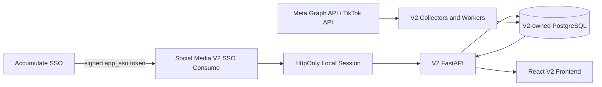
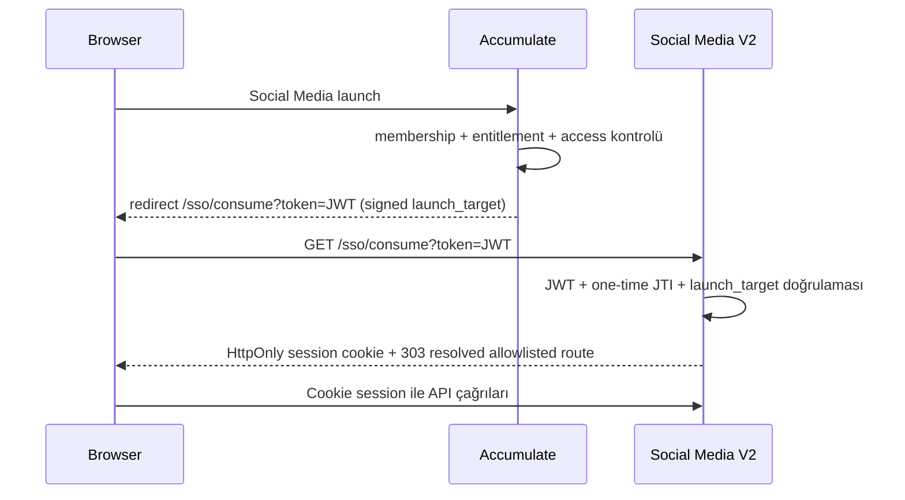

# Social Media V2 Downstream Master Plan

| Alan | Değer |
|---|---|
| Tarih | `2026-08-10` |
| Durum | Revizyon 6 — R27 V1 dinamik pie/donut etkileşim parity uygulanıyor; DNS/TLS/public cutover kullanıcı kararıyla bloklu |
| Hedef proje | `/home/api/colab_scripts/SocialMediadownstream` |
| Canonical GitHub repository | `https://github.com/abbasalipanah/SocialMediaV2.git` |
| Ürün kimliği | `social_media` |
| Frontend development URL | `http://localhost:3010/` |
| Ürün tanımı | Kendi runtime ve veri sahipliğine sahip, Accumulate ile yalnız SSO üzerinden bağlanan bağımsız Social Media V2 uygulaması |

## 0. ChatGPT 5.3 uygulama protokolü

Bu dosya fikir listesi değil, Social Media V2 için **normatif uygulama sözleşmesidir**. ChatGPT 5.3 veya başka bir implementasyon ajanı aşağıdaki sırayı ve durma koşullarını değiştiremez.

### 0.0 Revizyon 6 bağlayıcı çalışma ve entegrasyon sınırı

Bu bölüm, aşağıdaki maddelerle çelişen eski webhook, outbox, V1 writer cutover veya
Accumulate kaynak değişikliği adımlarını hükümsüz kılar. Çelişki halinde her zaman bu bölüm
uygulanır.

1. Yazılmasına izin verilen tek proje
   `/home/api/colab_scripts/SocialMediadownstream` dizinidir.
2. `/home/api/colab_scripts/SocialMedia`, `/home/api/colab_scripts/Accumulate` ve
   `/home/api/colab_scripts/performance_marketing` canlı sistemlerdir; yalnız gerektiğinde
   salt-okunur referans olarak incelenebilir.
3. Bu canlı projelerde kod, config, `.env`, Git state, DB/schema/data, media, build artifact,
   systemd, timer, cron, process, port, Nginx, routing veya secret değişikliği yapılamaz;
   servis restart/stop/start/enable/disable işlemi uygulanamaz.
4. Kaynak projelerde build, format, migration veya dosya/DB/cache üreten test çalıştırılamaz.
   Salt-okunur kontrol dahi mevcut canlı davranışı etkileyebilecekse yapılmaz.
5. Başka bir projeye yazma veya canlı servise müdahale gerektiren her görev otomatik stop
   koşuludur; işlem yapılmadan kullanıcıya ihtiyaç ve hedef açıkça raporlanır.
6. V2; kendi backend, frontend, DB/schema, DB role, session store, credential vault, media root,
   provider adapter, worker/scheduler, log, health, deploy ve rollback artifact'lerine sahip olur.
   V1 runtime, DB writer, timer veya media sürecini kapatmak V2 çalışma kapsamı değildir.
7. Accumulate ile izin verilen tek runtime entegrasyonu SSO launch/token sözleşmesidir.
   Accumulate provisioning webhook, outbox, shared runtime import, shared filesystem, shared
   process veya V1 proxy bağımlılığı V2 final mimarisinde bulunamaz.
8. V2 önce Accumulate değişikliği olmadan disposable/local ve ardından V2'ye ait staging
   ortamında uçtan uca çalışır hale getirilir.
9. `STANDALONE_RUNTIME_COMPLETE` sonrasında Accumulate ekibine yalnız dokümante edilmiş SSO
   contract'ı, launch/callback adresleri, health kanıtı ve rollback beklentisi e-posta/handoff
   olarak iletilir. Accumulate tarafındaki kod, config, routing ve deploy işlemlerini yalnız
   Accumulate/Operations ekibi uygular.
10. E-posta/handoff hazırlamak bu repository'nin kapsamındadır; kullanıcı ayrıca istemeden
    mesaj gönderilmez ve dış sistemde değişiklik yapılmaz.

Revizyon 6 aşağıdaki ek kuralları bağlayıcı hale getirir ve bunlarla çelişen önceki frontend,
TikTok, baseline veya faz-kapanış ifadelerini hükümsüz kılar:

11. Uygulama başlangıcında salt-okunur olarak yakalanacak güncel
    `/home/api/colab_scripts/SocialMedia` çalışma ağacı, V2 backend davranışı ve frontend ürün
    parity'sinin canonical kaynağıdır. Eski `2026-07-14` baseline'ı güncel kabul kanıtı değildir.
12. Canonical frontend referansı güncel `/home/api/colab_scripts/SocialMedia/frontend` çalışma
    ağacıdır. Görünür kartlar, sekmeler, başlıklar, alt başlıklar, KPI'lar, grafikler, tablolar,
    sıralama, empty/partial/unavailable durumları ve responsive yerleşim ürün kararı olmadan
    eklenemez, kaldırılamaz, yeniden adlandırılamaz veya yeniden sıralanamaz.
13. V2 frontend kodunun bağımsız mimarisi korunabilir; ancak yalnız SSO, route, Brand scope,
    same-origin V2 API transportu, capability güvenliği ve erişilebilirlik için görünmez iç
    uyarlamalar yapılabilir. Bu uyarlamalar canonical render çıktısını değiştiremez.
14. Güncel kaynak davranışı körlemesine kopyalanmaz veya runtime'da import edilmez. Her davranış
    V2-owned model, API, collector, persistence ve testlerle bağımsız olarak uygulanır.
15. TikTok artık yalnız net-new tasarım değildir. Güncel SocialMedia çalışma ağacındaki TikTok
    OAuth, dashboard, collector, comment, audience, history ve runtime-guard davranışları
    salt-okunur parity girdisidir; provider gerçeği ve fail-closed kurallar yine otoritedir.
16. YouTube veya başka bir dördüncü platform Revizyon 6 kapsamına girmez. Ayrı kullanıcı kararı
    olmadan canonical platform seti genişletilemez.
17. V2'de `2026-07-29` tarihli commitlenmemiş çalışma korunacak fakat doğrulanmış sayılmayacaktır.
    Snapshot, diff envanteri ve V2-only test/build kanıtı olmadan bu çalışma silinemez,
    commitlenemez veya parity tamamlandı diye raporlanamaz.
18. `docs/fase0`–`docs/fase9` altındaki eski kapanış raporları tarihsel kanıttır. Revizyon 6'nın
    güncel kaynak baseline'ı ve §22 kalite kapıları tamamlanmadan hiçbir eski rapor güncel
    `STANDALONE_PRODUCT_COMPLETE` sertifikası oluşturmaz.
19. 2026-08-07 tarihli açık kullanıcı kararı yalnız Instagram Stories ana içeriği için R1
    görünür parity'sini geçersiz kılan dar bir product override'dır. Sidebar, topbar, footer,
    diğer platformlar ve typed Stories API sözleşmesi korunur. Makine-okunur karar
    `docs/revision6/overrides/instagram_stories_main_2026-08-07.json` dosyasındadır.
20. 2026-08-09 tarihli açık kullanıcı kararı Settings ve Integrations yüzeyleri için
    Performance Marketing ürünündeki aktif bilgi mimarisi ve erişim modelini dar, normatif
    referans yapar. Social Media navigation ağacında Settings bulunamaz; yalnız sidebar'ın alt
    bölümünde tek bir Settings bağlantısı bulunur. Integrations da aynı alt bölümde ayrı bir
    bağlantı ve ayrı route olarak bulunur.
21. Settings sayfası Social Media domain verisini gösterir fakat sayfa iskeleti, başlık/aksiyon
    düzeni, özet kartları, sekmeli table-first çalışma alanı ve responsive davranışı Performance
    Marketing Settings yüzeyiyle uyumlu olur. Bu karar sidebar, topbar veya footer'ın genel
    tasarımını değiştirme yetkisi vermez.
22. Settings frontend route'u ve bütün `/api/settings/*` backend yüzeyi yalnız canonical rolü
    `super_admin` veya `agency_admin` olan aktif SSO session'larına açıktır. `is_internal_staff`,
    frontend görünürlüğü veya request parametresi tek başına Settings yetkisi veremez.
23. Integrations frontend route'u ve entegrasyon liste/durum/bağlantı backend yüzeyi
    `super_admin` ve `agency_admin` rollerine; ayrıca yalnız Accumulate kaynaklı `viewer` rolünün
    signed `app_role` değeri `admin` veya `operator` olduğunda açılır. Diğer roller ve app-role
    birleşimleri fail-closed reddedilir. Yetki hem route görünürlüğünde hem her backend isteğinde
    zorlanır; yalnız UI gizlemek kabul edilmez.
24. Settings ve Integrations aynı backend verisini kullanabilse bile Viewer/Operator erişimi
    `/api/settings/*` üzerinden verilmez. Integrations kendi yetkili read yüzeyine sahip olur;
    bağlantı mutation'ları exact session Brand, non-rollup scope, runtime write policy, OAuth
    state ve mevcut güvenlik kapılarından geçmeye devam eder.
25. Maddeler 20-24 başka bir ajan veya uygulama turunda kendiliğinden yeniden yorumlanamaz.
    Sidebar'a ikinci Settings eklemek, Settings rollerini genişletmek ya da Integrations'ı yalnız
    Settings yetkisine bağlamak için yeni ve açık kullanıcı kararı gerekir. Makine-okunur karar
    `docs/revision6/overrides/settings_integrations_rbac_2026-08-09.json` dosyasındadır.
26. Instagram Cover; Page, Content, Stories ve Audience bölümlerini birlikte gösterir. Stories
    yalnız odak sekmesinde bırakılarak Cover'dan tekrar çıkarılamaz.
27. Facebook, Instagram ve TikTok takipçi akış grafikleri aynı seçili tarih aralığında üç gerçek
    seri gösterir: `follows`, `unfollows`, `followers_net`. `new_followers` tek başına bu grafiğin
    yerine kullanılamaz.
28. Stories üst KPI yüzdeleri seçili hikâyeyi galerideki hemen önceki kronolojik hikâyeyle
    karşılaştırır. Views/Reach/Interactions göreli yüzde değişim; Completion Rate yüzde-puan
    (`pp`) farkıdır. Önceki hikâye veya geçerli payda yoksa oran uydurulmaz.
29. Stories üst aksiyon alanı yalnız seçili hikâyenin Replies, Shares, Profile Visits, Follows,
    Sticker Taps ve Saves değerlerini; Behaviour alanı ise seçili tarih aralığındaki aynı altı
    metriğin toplamını gösterir. Provider'ın vermediği değer `Not provided`, raporladığı gerçek
    sıfır `0` olarak ayrıştırılır.
30. All Performing Content ve Stories History tabloları sayfayı sınırsız uzatamaz; sabit azami
    yükseklik, tablo içi dikey scroll ve scroll sırasında görünür kalan başlık satırı kullanır.
    All Performing Content sırası `#, Content, Type, Date, Views, Reach, Likes, Comments, Shares,
    Interactions` sütunlarını kullanır. Type yalnız typed `content_type` alanından, içerik hedefi
    yalnız gerçek `permalink` alanından gelir. Yalnız credential içermeyen `http/https`
    permalink yeni sekmede `noopener noreferrer` ile açılır; eksik/geçersiz permalink için URL
    tahmin edilmez ve içerik hücresi tıklanabilir gösterilmez.
31. TikTok Performance Trends seçili Date Period ile aynı başlangıç/bitiş günlerini kapsar;
    Last 30 Days seçiliyken yedi/ondan az günlük cumulative content fallback'i kullanılamaz.
32. Maddeler 26-31 veri completeness ürün kararıdır ve yeni açık kullanıcı kararı olmadan geri
    alınamaz. Makine-okunur karar
    `docs/revision6/overrides/dashboard_data_completeness_2026-08-09.json` dosyasındadır.
33. Facebook, Instagram ve TikTok Page/Account, Content ve Audience bölümlerinin her biri tam
    veri halinde tam altı KPI kartı gösterir. Sahte `Frequency`, sabit demo sayı veya unavailable
    metriği sıfır kabul eden placeholder bu sayıyı tamamlamak için kullanılamaz.
34. Facebook ve Instagram altıncı Page/Audience KPI'sı backend-derived `engagement_rate`
    değeridir ve seçili dönemin `interactions / views` oranı olarak recompute edilir. TikTok
    kendi `video_engagement_rate` sözleşmesini korur; oranlar API'de `ratio`, frontend'de yüzde
    olarak gösterilir.
35. Frontend tarafından tüketilen her canonical metric literal, dimension hint ve typed content/
    Story alanı `docs/contracts/social-media-v2-frontend-data-matrix.json` içinde tek bir backend
    route, producer/derivation/snapshot statüsü ve API yüzeyiyle eşleşir. Katalogda bulunmak native
    collector desteği anlamına gelmez; `snapshot_compatible`, `provider_unavailable` ve
    `demo_only_unavailable_runtime` durumları açıkça korunur.
36. Overview API, Overview frontend'inin doğrudan tükettiği Followers, New Followers, Reach,
    Views, Interactions, Website Clicks ve Reactions metriklerini toplar. TikTok Video
    Engagements nested platform dashboard'dan okunur. Bu sözleşme ve altı KPI kararı yeni açık
    kullanıcı kararı olmadan değiştirilemez; makine-okunur karar
    `docs/revision6/overrides/frontend_backend_data_contract_2026-08-09.json` dosyasındadır.
37. 2026-08-09 tarihli son kullanıcı düzeltmesiyle Home, Overview çalışma alanının tek görünür
    navigation girişidir. Social Media ağacına ayrıca `Overview` satırı eklenemez. `/overview`
    yalnız doğrudan deep-link olarak aynı çalışma alanını açabilir. Bu madde önceki R14 görünür
    Overview satırı kararını geçersiz kılar.
38. Overview ana içerik bilgi mimarisi beş KPI ve yedi bölüm kullanır. `Overall Organic Health`
    kaldırılmıştır ve geri eklenemez. Sidebar, topbar ve footer'ın genel tasarımı değiştirilemez.
39. Overview KPI sırası tam olarak Total Audience, Total Reach, Total Impressions, Total
    Interactions ve Avg. Engagement'dır. Total Impressions mevcut normalize `views` slotunun
    görünür aliasıdır; yeni provider gerçeği olarak sunulamaz.
40. Overview bölümleri What Changed?, Channel Health, Performance Trend, Content Snapshot,
    Top Performing Content, AI Summary ve Platform Summary sırasını korur. Platform Summary
    bağlı Instagram, Facebook ve TikTok yanında planlanan LinkedIn, X ve YouTube slotlarını da
    en altta gösterir. Planlanan slot gerçek bağlantı eklendiğinde aynı platformun canlı kartıyla
    otomatik yer değiştirir; duplicate kart üretilemez. Channel Health en fazla üç bağlı kartı
    aynı anda gösterir; bağlı platform sayısı üçü aşınca her `4500 ms` bir platform ileri kayan,
    wrap-around çalışan ve kullanıcı etkileşiminde duran carousel olur. Üç veya daha az platformda
    otomatik hareket bulunmaz.
41. Avg. Engagement `interactions / reach` formülüdür. Geçersiz payda veya eksik veri sıfır olarak
    uydurulmaz.
42. Overview kartının canonical adı `AI Summary`'dir. Tamamlanmış geçmiş özetler Brand kapsamında
    okunur. Yeni özet üretme yetkisi yalnız Accumulate kaynaklı exact `viewer` + signed
    `app_role=operator`, exact session Brand ve non-rollup scope içindir; agency/super admin veya
    başka app role bu üretme yetkisini devralmaz. Backend rolling 7x24 saat içinde Brand başına
    yalnız bir tamamlanmış üretime izin verir; active pending istek concurrent üretimi engeller,
    başarısız deneme haftalık hakkı tüketmez. POST same-origin ve backend-authoritative'dir.
43. V2 AI provider yapılandırması bağımsız kalır. 2026-08-10 açık kullanıcı kararıyla mevcut
    onaylı OpenRouter credential'ı yeniden kullanılabilir; yeni key zorunlu değildir. Credential
    yalnız V2'nin Git-ignored, `0600` runtime secret dosyasına inject edilir; source code, Git
    veya dokümana yazılmaz ve korunan projenin dosya/runtime'ı değiştirilmez. Provider'a
    yalnız privacy-minimized aggregate metrikler ve kimliksiz sayısal top content verisi gönderilir;
    kullanıcı yorumları/mesajları/permalink veya raw prompt snapshot'ı persist edilmez. Provider
    yapılandırılmadığında geçmiş okunur, yeni üretim dürüstçe unavailable kalır. Stored çıktı
    strategic summary, channel analysis, anomalies, recommended actions, platform evaluations ve
    model alanlarını kapsar.
44. 2026-08-10 kullanıcı düzeltmesiyle Overview mini trend ve Performance Trend çizgilerinin
    ikisi de `1.25` SVG stroke width ve non-scaling stroke kullanır; önceki `1.15/1.35` ayrımı
    geçersizdir. Grid çizgileri `0.55` ve düşük kontrastlıdır. Mini trendlerde ve Performance
    Trend'in her platform serisinde üstte `0.22`, altta `0` opacity'ye inen seri-rengi gradient
    alan dolgusu bulunur. Performance palette Instagram `#ec4899`, Facebook `#2563eb`, TikTok
    `#111827` olarak sabittir. Çizgi ve alan sınırı platform dashboard'larındaki `monotone` görsel
    eğriyle eşleşir; bu yalnız presentation interpolasyonudur ve API/DB sample değerlerini
    değiştiremez veya yeni veri noktası üretemez.
45. Maddeler 37-44 yeni açık kullanıcı kararı olmadan geri alınamaz. Makine-okunur karar
    `docs/revision6/overrides/overview_platform_scaling_2026-08-10.json` dosyasındadır ve eski
    `overview_surface_2026-08-09.json` KPI/platform sınırlamasını geçersiz kılar.
46. V2 full-data migration kapsamı tek müşteri değildir. Kaynakta bulunan 67 Brand, 91 social
    asset, 1.493.502 metric row, 6.234 content, 3.362 comment, 6.101 DB-referenced media file,
    97 linked account, 71 platform connection, 358 Meta account ve 6 mevcut AI summary ayrı
    V2-owned shadow DB/media alanına taşınır. Kaynak DB ve medya salt-okunur kalır.
47. Ham legacy reporting verisi migration DB'sinde birebir korunur. Dashboard okuma sınırı 168
    platform/metric çifti, 124 benzersiz ham metric id ve 15 breakdown dimension için açıkça
    sınıflandırılmış olmalıdır. Yeni/bilinmeyen metric dashboard'u çökerterek 500 üretemez;
    kanonik olmayan değer sessizce başka bir anlama da çevrilemez.
48. Facebook, Instagram ve TikTok'un her Page/Account, Content ve Audience KPI grid'i provider
    değeri eksik olsa da altı kartlık sabit bilgi mimarisini korur. Eksik değer `—` gösterilir;
    kartın gizlenmesi veya sahte sıfırla doldurulması yasaktır.
49. Full-data runtime kabulü en az viewer+app-role operator, agency admin parent rollup, super
    admin, verili Brand, boş Brand, üç platform, Instagram Stories, AI geçmişi/rolling haftalık
    limit ve local media endpoint E2E kanıtlarını; ayrıca 67 Brand için 201 platform dashboard'u
    ve 67 Overview read-only kapsam taramasını içerir.
50. DNS, TLS, shared Nginx veya herhangi bir public route işlemi; bütün ürün yüzeyleri, full-data
    migration/parity, credential re-encryption, 67-Brand kapsam testi, izole V2 release,
    rollback ve soak kapıları bitmeden başlatılamaz. Bu kapılar geçse bile public trafik değişimi
    ayrı ve açık kullanıcı onayı gerektirir. Onay verilene kadar canlı SocialMedia, Accumulate ve
    diğer projeler kesintisiz ve değişmeden çalışır.
51. Facebook, Instagram ve TikTok dashboard veri-görselleştirmeleri tek ortak V1 palette
    sözleşmesini kullanır. Followers `#38bdf8`; Follows `#3b82f6`; Unfollows `#f59e0b`; Net
    `#14b8a6`; Views `#5eead4`; Reach `#ec4899`; Organic `#8357f6`; Paid `#f59e0b`;
    Organic Views `#3b82f6`; Organic Reach `#6366f1`; Likes `#ef5da8`; Comments `#3b82f6` ve
    Shares `#22c55e` değerlerinden ürün kararı olmadan sapamaz.
52. Platform dashboard ana trend çizgileri V1 gibi `1.25` stroke width kullanır. Alan dolgusu
    ilk seri için üstte `0.22` opacity'den altta `0` değerine iner; bar opacity `0.82` olur.
    Followers flow legend sırası tam olarak `Follows`, `Unfollows`, `Net` kalır.
53. Provider/persistence katmanındaki `unfollows` günlük sayımı pozitif ham count olarak korunur;
    yalnız grafik sunumunda `-abs(value)` ile sıfırın altında çizilir. Subtitle'da Unfollows
    mutlak toplamı, Net ise gerçek `followers_net` toplamı gösterilir. Frontend bu amaçla API
    payload'ını veya V2 DB verisini mutasyona uğratamaz.
54. Maddeler 51-53 bütün üç platform ve hem Cover hem Audience tekrarları için bağlayıcıdır.
    Platforma özel pembe/kırmızı Unfollows, kalın çizgi veya farklı legend sırası ancak yeni ve
    açık kullanıcı kararıyla değiştirilebilir.
55. 2026-08-10 kullanıcı kararıyla dashboard indirme yüzeyi PNG yanında gerçek veri taşıyan
    profesyonel XLSX üretir. Verilen `Accumulate_Instagram_Report_Prototype_v2.xlsx` yalnız
    görünür yapı/tasarım referansıdır; demo değeri, formülü, grafik teması veya hatalı hücresi
    runtime kaynak kabul edilemez.
56. XLSX üretimi aynı yetkili Brand/account/range/tab dashboard query sözleşmesinden yapılır;
    frontend payload'ı, demo veri, ikinci SQL hesaplama yolu veya uydurulmuş availability değeri
    kaynak olamaz. Overview, Facebook, Instagram ve TikTok raporları aktif sayfa/sekme kapsamına
    özel görünür sheet'ler üretir; Cover ilgili platformun bütün canonical bölümlerini kapsar.
57. Küçük her KPI/kart için ayrı sheet üretilmez. İlk `Report Info` sheet'i standart gömülü
    Accumulate logosu, Brand/account, platform, aktif tab, tarih ve karşılaştırma dönemi,
    generated/last-sync zamanı, freshness, coverage ve export sürümünü taşır. Bölüm sheet'leri
    kartları aynı sayfada bloklar halinde; büyük content/history/community tabloları ayrı,
    filtrelenebilir ve freeze-pane'li data sheet'lerinde gösterir.
58. XLSX grafik ve KPI görünümü frontend'in canonical palette, legend, sayı/yüzde formatı,
    unavailable/partial semantiği ve metodolojisini kullanır. Özellikle follower flow sırası
    `Follows → Unfollows → Net`, çizgi kalınlığı `1.25` ve maddeler 51-54'teki renklerdir. Export
    hesaplaması dashboard ile aynı typed projection'dan gelir; Excel formülüyle ikinci kez
    türetilmez.
59. XLSX üretimi kısa ömürlü, kullanıcı oturumuna bağlı bir in-process job kuyruğudur. UI
    `queued/running/ready/failed` durumu ile `0-100` ilerleme yüzdesini gösterir. Hazır workbook
    yalnız memory'de, dar boyut/job sınırı ve en fazla on dakikalık TTL ile tutulur; ilk indirme
    cevabı tamamlandıktan sonra silinir. Runtime XLSX dosyası DB'ye, repository'ye veya kalıcı
    filesystem'e yazılmaz.
60. Job ID tek başına yetki taşımaz. Status/download istekleri aktif session, aynı session hash'i
    ve yeniden doğrulanan Brand scope ile fail-closed korunur. Workbook macro, external link veya
    formül enjeksiyonu içeremez; kullanıcı/provider metni literal string olarak yazılır.
61. Export endpoint'i provider çağrısı, collection, sync, DB write veya AI generation tetiklemez.
    Mevcut AI özeti rapora eklenirse yalnız daha önce tamamlanmış kayıt okunur ve haftalık AI
    hakkı tüketilmez. Maddeler 55-61 yeni açık kullanıcı kararı olmadan kalıcı artifact depolama,
    senkron üretim veya ayrı metrik hesaplama yoluna çevrilemez. Makine-okunur karar
    `docs/revision6/overrides/xlsx_reporting_2026-08-10.json` dosyasındadır.

### 0.1 Zorunlu çalışma sırası

1. Bu planın tamamını okumadan kod değişikliğine başlama.
2. Yalnız `/home/api/colab_scripts/SocialMediadownstream` içinde write yap; §0.0 kapsamındaki canlı projeleri ve operasyonel yüzeyleri salt-okunur tut.
3. Revizyon 6 çalışmasını §22 sırasıyla uygula; §14 eski Faz 0–9 kayıtlarını tarihsel bağlam olarak
   korur fakat güncel uygulama sırası değildir. Bir §22 çıkış kapısı yeşil olmadan sonraki faza geçme.
4. V2'ye ait production DB, secret, provider authorization veya service/timer üzerinde bu planın açık final gate'i olmadan işlem yapma; kaynak projelerin production yüzeylerine hiçbir gate altında doğrudan müdahale etme.
5. Provider/schema/runtime gerçeği planla uyuşmazsa fallback uydurma, kapsam genişletme veya legacy yolu sessizce kullanma; dur ve kanıtla birlikte kullanıcı kararı iste.
6. Secret, OAuth code, access/refresh token veya signed activation intent'i Markdown'a, source code'a, Git'e, test fixture'a, komut çıktısına veya log'a yazma.
7. Her faz sonunda aynı çalışma oturumunun salt-okunur kaynak başlangıç/bitiş snapshot'ını, architecture boundary, vocabulary guard ve ilgili V2 testlerini yeniden çalıştır.
8. Son durum `READY_FOR_OWNER_TIKTOK_ACTIVATION` olana kadar production TikTok bağlantısı başlatma.
9. Bu duruma gelince kullanıcı adına OAuth'u açma veya linki takip etme; yalnız §3.7'de tanımlanan sabit, secretsız owner activation URL'sini kullanıcıya ver ve dur.
10. Accumulate veya SocialMedia repository'sinde patch hazırlama, uygulama, commit, push veya deploy yapma; gerekli entegrasyonu yalnız handoff sözleşmesi olarak tarif et.
11. V2 bağımsız çalışmadan Accumulate ekibinden SSO veya canlı routing değişikliği isteme.

### 0.2 Ajanın değiştiremeyeceği ürün kararları

- Canonical platform seti tam olarak `facebook | instagram | tiktok`.
- Platform label'ları tam olarak `Facebook | Instagram | TikTok`.
- TikTok production bağlantısı yalnız hesap sahibi tarafından, son aşamada verilen manual activation linkiyle yapılır.
- TikTok advertiser flow kapalıdır; ayrı kullanıcı onayı olmadan açılamaz.
- V1 cronjob/orchestrator/data writer sahipliği V2 çalışma kapsamı dışında ve değişmeden kalır.
- V1 canlı runtime'ı V2 çalışması boyunca değişmeden çalışır; V2 kendi runtime ve veri sahipliğini kurar.
- Accumulate runtime entegrasyonu yalnız SSO'dur; provisioning webhook/outbox bağımlılığı final üründe yasaktır.
- Güncel `SocialMedia/frontend` görünür ürün sözleşmesi kart-kart korunur; parity yalnız dosya adı
  veya yaklaşık görsel benzerlik ile değil, render envanteri ve desktop/mobile görsel kanıtla ölçülür.
- İlk standalone runtime V2-owned DB/schema kullanır; `/api/v2`, event bus veya gereksiz microservice eklenmez.
- Eksik/unsupported provider verisi `0` olarak uydurulmaz.
- YouTube ve başka yeni platformlar ayrı plan/onay olmadan kapsama alınmaz.
- Sidebar'da yalnız alt bölümde bir Settings bulunur; Social Media navigation ağacında ikinci
  Settings bulunmaz. Integrations alt bölümde ayrı bir navigation öğesidir.
- Settings yalnız `super_admin | agency_admin`; Integrations ise bunlara ek olarak Accumulate
  `viewer` + `app_role in {admin, operator}` için kullanılabilir. Backend enforcement zorunludur.
- Instagram Cover Stories içerir; üç platformun takipçi akışı Follows/Unfollows/Net serileridir;
  Stories seçili-hikâye aksiyonları ile dönem toplamları birbirine karıştırılmaz.
- Stories ve content uzun tabloları iç scroll kullanır; TikTok trend ekseni seçili dönemle
  birebir eşleşir. Eksik provider değeri sıfır olarak uydurulmaz.
- Bu planda açıkça ertelenen hiçbir karar “uygulamayı tamamlamak için gerekli” gerekçesiyle otomatik kapsam içine alınmaz.

### 0.3 Tamamlandı iddiasının biçimi

ChatGPT 5.3 işi tamamladığını söylemeden önce şu sonuçları ayrı ayrı raporlar:

1. `STANDALONE_PRODUCT_COMPLETE`
2. `STANDALONE_RUNTIME_COMPLETE`
3. `READY_FOR_ACCUMULATE_SSO_HANDOFF`
4. Accumulate/Operations uygulaması sonrasında `SSO_LIVE_VERIFIED`
5. Owner aktivasyonu sonrasında `TIKTOK_CONNECTION_VERIFIED`

Bu sonuçlar aynı şey değildir. SSO handoff yalnız standalone runtime kanıtlandıktan sonra
hazırlanır; canlı SSO doğrulaması Accumulate/Operations ekibinin kendi tarafındaki değişikliği
uygulamasından sonra yapılır. TikTok doğrulaması ise ancak hesap sahibi consent akışını kendisi
tamamladıktan ve callback/readiness kanıtı yeşil olduktan sonra verilebilir.

## 1. Yönetici kararı

`SocialMediadownstream`, runtime ve veri sahipliği açısından mevcut SocialMedia uygulamasının
bir kopyası değildir; tamamen bağımsız **Social Media V2** projesidir. Buna karşılık görünür
frontend ürün sözleşmesi güncel SocialMedia çalışma ağacıyla birebir parity gösterecektir.

V2'nin kaynakları ve görevleri şöyledir:

| Kaynak | V2'deki rolü |
|---|---|
| `/home/api/colab_scripts/SocialMedia` | Güncel çalışma ağacı backend/collector/worker davranışının ve görünür frontend parity'sinin canonical salt-okunur kaynağı |
| `/home/api/colab_scripts/Accumulate` | Yalnız salt-okunur SSO contract ve dış launch referansı; V2 tarafından değiştirilmez ve runtime data bağımlılığı oluşturmaz |
| `/home/api/colab_scripts/performance_marketing` | Yalnız SocialMedia canonical frontend'inin açıkça kullanmadığı iç shell davranışında ikincil salt-okunur referans; görünür SocialMedia UI'ını override edemez |
| `/home/api/colab_scripts/SocialMediadownstream` | Yazılmasına izin verilen tek proje; V2'nin bütün runtime sahipliği burada olacaktır |

Temel ürün kararı:

- Accumulate yalnız SSO tokenı üzerinden user, seçili Brand, rol ve app-access authority sağlar.
- Social Media V2; kendi session'ını, SSO claim snapshot'ını, Social Media domain verisini, dashboard API'lerini, frontend'ini ve bütün runtime'ını sahiplenir.
- V2 tamamlanana kadar production cronjob, orchestrator, scheduler veya data-collection işi V2'de çalışmaz.
- Social Media V1 bütün mevcut production cronjob/orchestrator/data-collection işlerinin tek sahibi ve tek writer'ı olarak kesintisiz devam eder.
- V2'nin çalışır hale getirilmesi V1 writer freeze, V1 timer değişikliği veya V1 routing değişikliği gerektirmez.
- Facebook/Instagram/TikTok collector ve worker davranışının V2 kod karşılığı yalnız
  offline/diferansiyel testlerle hazırlanır; standalone runtime onayına kadar aktive edilmez.
- TikTok V2'nin üçüncü canonical platformudur; güncel SocialMedia TikTok implementasyonu
  Revizyon 6 parity girdisi olarak karakterize edilir ve V2-owned mimariye taşınır.
- V2 frontend, Settings ve public API sözlüğünde yalnız `Brand` kullanılır; `client` eski terimi kullanılmaz.
- V2 yeni kod, env, route, header, log ve ürün metinlerinde `ARS` terimi kullanılmaz.
- V2 production verisi V2'ye ait ayrı PostgreSQL DB/role/schema üzerinde tutulur; V1 `socialmedia_adv` runtime DB'si kullanılmaz.
- Standalone production onayından önce V2 production DB'ye **bağlantı dahil hiçbir temas yapılmaz**.
- Mevcut ve yıllardır çalışan veri toplama davranışı, karakterizasyon ve diferansiyel testler yeşil olmadan değiştirilmez.

Repository kararı:

- `origin`, yalnız `https://github.com/abbasalipanah/SocialMediaV2.git` olacaktır.
- V1 SocialMedia repository'si canonical remote değildir; yalnız read-only migration/parity kaynağıdır.
- `git rev-parse --show-toplevel` sonucu tam olarak `/home/api/colab_scripts/SocialMediadownstream` olmalıdır; parent workspace Git repository'sine bağlı çalışma kabul edilmez.
- V1 geçmişi gerekiyorsa yalnız fetch yapılabilen `v1-source` remote/bundle üzerinden alınır; `v1-source` push URL'si devre dışıdır.
- SocialMedia, Accumulate veya parent workspace repository'sine giden hiçbir push target bulunamaz.
- Target repository'nin mevcut durumu ilk uygulama adımında doğrulanır; remote boşsa bu master plan korunarak initialize edilir ve generic rehber repository-dışı migration input'a ayrılır, doluysa önce clone/fetch edilip içerik çakışması raporlanır.
- Remote push, branch publish veya PR işlemi ayrıca açık publishing onayı olmadan yapılmaz.

## 2. Değiştirilemez sınırlar

### 2.1 Salt-okunur kaynak projeler

Aşağıdaki klasörlerde dosya oluşturulmayacak, düzenlenmeyecek, silinmeyecek; build, format, migration veya write üreten test çalıştırılmayacaktır:

- `/home/api/colab_scripts/SocialMedia`
- `/home/api/colab_scripts/Accumulate`
- `/home/api/colab_scripts/performance_marketing`

Bu yasak yalnız repository dosyalarını değil, bu projelere ait canlı DB, media, secret,
servis, timer, cron, process, port, Nginx ve routing yüzeylerini de kapsar. V2 doğrulaması için
bu sistemler restart edilmez, durdurulmaz, yeniden build edilmez veya farklı bir kaynağa
yönlendirilmez.

Her V2 milestone'u öncesinde ve sonrasında bu üç projenin aşağıdaki bilgileri karşılaştırılacaktır:

- branch ve HEAD
- `git status --short`
- tracked diff hash'i
- untracked dosya listesi

Kaynak projelerin başlangıçta zaten dirty olması, yeni değişiklik yapıldığı anlamına gelmez. Başarı ölçütü başlangıç snapshot'ının birebir korunmasıdır.

### 2.2 Production DB ve servis güvenliği

V2 standalone production aktivasyon penceresine kadar:

- production DB URL'si V2 geliştirme/CI ortamına verilmeyecek;
- V2, SocialMedia veya Accumulate `.env` dosyalarını fallback olarak okumayacak;
- production Meta token dosyaları kopyalanmayacak;
- Alembic, `create_all`, autogenerate veya schema inspection production'da çalıştırılmayacak;
- V2 servis/timer unit'leri production secret olmadan, disabled/masked ve V2 standalone activation sentinel'i olmadan başlatılamayacak;
- `SOCIAL_WRITES_ENABLED` varsayılan olarak `false` olacak;
- mutation endpoint'leri ve worker entrypoint'leri write flag'i yoksa fail-closed davranacak.

### 2.3 Secret ve artifact yasağı

Yeni projeye şunlar taşınmayacaktır:

- `.env` ve credential/token dosyaları
- `.venv`, `venv`, `node_modules`
- `dist`, cache, `__pycache__`, `.pytest_cache`
- log, tmp, rapor çıktıları, XLSX/CSV/PDF runtime artifact'leri
- mevcut media volume'un kopyası

Yalnız eksiksiz ama secretsız `.env.example` dosyaları üretilecektir.

### 2.4 V2 dormant-development modu

V2 tamamen bitene kadar çalışır bir production alternatifi olarak konumlandırılmayacaktır.

- Production traffic V1'e gitmeye devam eder.
- V1 cronjob/orchestrator/collector/timer tanımları değiştirilmez.
- V2 production service ve timer'ları kurulsa bile disabled/masked kalır ve production secret almaz.
- V2'de schedule tanımı, worker code'u veya orchestrator parity çalışması yapılabilir; bunlar yalnız disposable local ortamda test edilir.
- V2 frontend/API geliştirmesi fixture ve disposable PostgreSQL ile yapılır.
- Production DB üzerinde shadow read, shadow write veya dual write yapılmaz.
- V2 mutation/sync/backfill kontrolleri production-dark modda backend capability ile kapalıdır; UI bu aksiyonları aktifmiş gibi göstermez.
- Aktivasyon yalnız bütün Definition of Done maddeleri, standalone deploy provası ve Accumulate ekibine SSO handoff onayı tamamlandıktan sonra mümkündür.

Önerilen runtime state modeli:

| Mode | DB | Mutation | Worker/schedule | Kullanım |
|---|---|---|---|---|
| `development` | disposable local DB | local-only | manual/local-only | geliştirme ve test |
| `dormant` | production bağlantısı yok | kapalı | kapalı/masked | production'a karanlık deploy |
| `staging` | yalnız V2'ye ait staging DB | canary/allowlist | manual ve kontrollü | standalone SSO/provider/browser E2E |
| `standalone_ready` | yalnız V2'ye ait production DB | varsayılan kapalı | kapalı/masked | SSO handoff öncesi deploy/readiness |
| `active` | yalnız V2'ye ait production DB | capability + write guard | onaylı V2 worker aileleri | Accumulate SSO sonrası bağımsız V2 runtime |

Runtime geçişleri tek yönlü ve auditlidir: `development → dormant → staging → standalone_ready → active`.
Her mode merkezi `WritePolicy` içinde yalnız tabloda yazan command family'lerini açar; farklı
bir command veya sıra fail-closed olur. Bu model V1 writer state'ini değiştirmez ve Accumulate
provisioning/outbox aşaması içermez.

### 2.5 Canonical terminoloji ve vocabulary guard

V2 ürün/domain sözlüğü:

- `Brand`
- `Parent Brand`
- `Child Brand`
- `Brand Family`
- `Social Account`
- `Facebook Page`
- `Instagram Profile`
- `TikTok Account`
- `Platform`

Canonical platform ID'leri yalnız:

- `facebook`
- `instagram`
- `tiktok`

Canonical platform matrisi:

| ID | Product label | Account entity | Frontend route | Dashboard API |
|---|---|---|---|---|
| `facebook` | `Facebook` | `Facebook Page` | `/facebook` | `/api/dashboards/facebook` |
| `instagram` | `Instagram` | `Instagram Profile` | `/instagram` | `/api/dashboards/instagram` |
| `tiktok` | `TikTok` | `TikTok Account` | `/tiktok` | `/api/dashboards/tiktok` |

Case-insensitive yasak platform-suffix tokenı `organic`'dir. `Facebook Organic`, `Instagram Organic`, `TikTok Organic`, `facebook_organic`, `instagram-organic`, `tiktokOrganic`, `/organic`, `organic_*`, `*_organic` ve başka separator/case varyantları yeni runtime/config/artifact yüzeyinde üretilemez.

Yasak kapsamı:

- frontend navigation, page title, Settings label, table, modal ve kullanıcı metni;
- route/slug/test ID, TypeScript/Python type, enum, constant ve package adı;
- domain/platform/capability ID;
- request/response DTO değeri, OpenAPI enum/example/tag;
- metric ID/name/tag/label ve structured log/telemetry/job/stage/key;
- provider registry/mapping output'u;
- environment/header/config key'i, deployment manifest'i ve generated build artifact'i.

Legacy istisnası yalnız consume-only `infrastructure/persistence/legacy_socialmedia` adapter'ıdır. Eski DB/migration/source değerleri `facebook_organic`, `instagram_organic` veya `tiktok_organic` içeriyorsa adapter çıkışı anında canonical ID'ye çevrilir; raw değer domain'e, API'ye, log'a veya UI'a taşınmaz. Bunun dışında suffix strip ederek sessiz alias kabul etmek yasaktır; canonical olmayan system metadata `unsupported_platform` ile fail-closed reddedilir ve raw yasak değer response/log içinde echo edilmez.

Provider veya kullanıcı tarafından oluşturulan caption, comment, Brand adı ve başka opaque free-text bu platform-metadata guard'ının hedefi değildir; gerçek içerik değiştirilmez. Bu free-text hiçbir zaman platform label/ID, metric ID veya telemetry metadata olarak yeniden kullanılmaz ve secrets/PII içerebileceği için ham biçimde loglanmaz.

Yasak yeni terimler:

- `client`
- `ARS`
- `Media Planner` ve ona özel role/capability adları

TikTok'un dış protokolünde zorunlu `client_key`, `client_id` ve `client_secret` wire alanları ürün/domain terminolojisi değildir. Bunlar yalnız `infrastructure/providers/tiktok/accounts` içinde exact serialized request-key/field-alias olarak dar allowlist edilir; internal property/config adı sırasıyla App ID/App secret sözlüğünü kullanır. Wire anahtarları DTO, OpenAPI, UI, log, metric veya domain type olarak publish edilemez. Bu istisna genel `client*` identifier kullanımına izin vermez.

Mevcut production şemasında eski identifier'lar bulunabileceği için, birebir kolon/tablo adı yalnız `infrastructure/persistence/legacy_socialmedia` uyumluluk adapter'ında ve historical migration'larda görülebilir. Bu isimler domain modeline, API DTO'suna, frontend type'larına, route'lara, log alanlarına veya kullanıcı metinlerine sızamaz. CI vocabulary testi reference dokümanları, historical migration'ları ve bu tek adapter sınırını hariç tutarak yasağı uygular.

### 2.6 Canonical vocabulary guard — feature geliştirmeden önce

ChatGPT 5.3 ilk feature kodundan önce tek bir `tools/check_canonical_vocabulary` guard'ı kurar. Guard şu yüzeyleri tarar:

- `backend/app` — yalnız legacy consume adapter'ın raw-input fixture'ı dar allowlist;
- `frontend/src`, `frontend/public`, config/env templates ve deploy manifest'leri;
- generated OpenAPI, generated frontend API type'ları ve provider mapper contract'ları;
- system-produced structured log/metric registry ve job isimleri;
- `npm build` sonrası frontend `dist`, Python package/wheel ve container build context'i.

Guard'ın kendi negative fixture'ı, bu master plan, repository-dışı reference dokümanları, historical migrations ve §2.5'teki üç exact TikTok wire alias'ı dosya/AST alanı bazında dar allowlist olabilir. Bütün `tests/`, bütün `infrastructure/` veya bir directory-wide skip kabul edilmez.

Enforcement:

- backend `PlatformId` enum/value object exact-set kontrolü;
- provider mapper: canonical input → canonical output, legacy adapter raw alias → canonical output, unknown → error;
- frontend page catalog exact-set testi;
- OpenAPI JSON içinde system metadata enum/example/tag taraması;
- rendered sidebar/topbar/Settings/heading Playwright testi;
- final artifact scan.

Bir violation non-zero exit üretir ve feature implementation, CI merge, release candidate ile production aktivasyonunu bloklar. Ajan eşleşmeyi raporlayıp canonical modele düzeltmeden ilerleyemez.

## 3. Bugünkü gerçek durum ve çözülmesi gereken boşluklar

### 3.1 Mevcut SocialMedia backend bağımsız değildir

Bugünkü kod aşağıdaki yollarla Accumulate runtime'ına bağlıdır:

- `backend/app/__init__.py`, Accumulate `backend/app` yolunu package path'e ekler.
- `backend/app/_accumulate_base.py`, Accumulate kaynaklarını runtime'da dinamik yükler.
- Facebook adapter ve `legacy/{collector,meta_graph,metrics_store}.py` dosyaları gerçek implementasyonu Accumulate'dan alır.
- Model registry, Accumulate-only modelleri dinamik olarak metadata'ya ekler.
- DB/env, media, tmp, metric registry, venv, `PYTHONPATH` ve systemd tanımları Accumulate yollarına fallback eder.

V2 kabul kriteri: runtime import graph'ında veya deployment tanımında üç kaynak projeden hiçbirine dosya yolu bağımlılığı kalmayacaktır.

Mevcut SocialMedia route/service yüzeyi V2'ye olduğu gibi mount edilmez. Bazı görünürdeki GET/settings query akışları setup state'i ensure/recalculate edip commit edebilir. V2 için sert HTTP invariant'ı:

- Dashboard, Settings, health, readiness ve activation-handoff gibi **safe query GET/HEAD** yolları DB/filesystem/provider mutation yapamaz.
- Safe query path'i `ensure`, `upsert`, `commit`, token refresh, media fetch-persist veya job enqueue çağıramaz.
- Dış protokol nedeniyle GET olmak zorunda kalan yalnız `/sso/consume` ve exact TikTok OAuth callback route'u `protocol-command GET` olarak ayrı endpoint-semantics registry'de listelenir; bunlar query değildir ve merkezi `WritePolicy`, one-time claim, replay guard, `no-store`, audit ile daraltılır.
- `/settings/tiktok/connect` her durumda safe GET'tir; activation intent consume/lease etmez, provider state üretmez ve provider egress yapmaz.
- Registry dışındaki hiçbir GET command/mutation yapamaz; yeni `protocol-command GET` eklemek ayrı architecture review ister.
- Bütün command/mutation yolları merkezi dormant/write policy kontrolünden geçer; side-effect audit testi bu sınırı statik ve integration testleriyle doğrular.

### 3.2 Dashboard ve frontend parity kaynağı güncellenmiştir

Önceki revizyon canlı Social Media UX'ini Accumulate render zinciri üzerinden tanımlıyordu.
Revizyon 6 ürün kararı farklıdır: uygulama başlangıcında salt-okunur snapshot'ı alınacak güncel
`/home/api/colab_scripts/SocialMedia/frontend` çalışma ağacı görünür ürünün canonical kaynağıdır.
Repository içeriği ile canlı deploy aynı kabul edilmez; bu plan repository working-tree parity'sini
hedefler ve canlı runtime üzerinde kaynak doğrulaması yapmaz.

V2'de:

- SocialMedia veya Accumulate frontend/backend modülü runtime'da import edilmez, proxy edilmez
  veya shared filesystem üzerinden kullanılmaz;
- görünür SocialMedia kart/sekmeleri yaklaşık olarak yeniden tasarlanmaz; §22'de üretilecek
  route → tab → section → card/table envanteri birebir uygulanır;
- V2 API; canonical frontend'in kullandığı `source_breakdown`, structured Stories,
  `audience_capabilities`, content-level metric ve honest availability alanlarını bağımsız typed
  contract olarak sağlar;
- dashboard query, aggregation, content, audience, community ve media servisleri V2-owned küçük
  modüller olarak kalır;
- browser, SSO consume sonrasında Accumulate veya V1 SocialMedia API'sine runtime data çağrısı
  yapmaz; yalnız same-origin V2 API'sini kullanır.

### 3.3 Eski baseline güncel çalışma ağacı davranışını kaybeder

Eski Faz 0 baseline'ı SocialMedia `main/e69fc5c` durumunu ve 10 dirty dosyayı kaydetmiştir.
Revizyon 6 ön incelemesinde kaynak `feature/tiktok-integration/d871dde` durumundadır; 23 tracked
değişiklik ve 22 untracked dosya içerir. Buna TikTok, Facebook audience, Instagram Stories,
media/cover onarımları ve demo geliştirmeleri dahildir. Bu sayılar yalnız ön inceleme bilgisidir;
uygulama başlangıcında yeniden salt-okunur yakalanarak otorite kazanır.

Bu nedenle:

1. Güncel branch, HEAD, remote, tracked diff hash'i, untracked liste ve artifact hariç content
   manifesti yeni immutable kaynak baseline olarak kaydedilir.
2. Eski baseline ve Faz 0–9 raporları silinmez; `superseded_by_revision_6` olarak tarihsel kalır.
3. Dirty diff körlemesine uygulanmaz ve kaynak projede hiçbir normalize/cleanup yapılmaz.
4. Her davranış characterization/differential test ile doğrulanarak temiz V2 modülüne aktarılır.
5. Geçici raw patch final runtime artifact'i olarak tutulmaz; davranış envanteri ve hash kanıtı
   V2 dokümantasyonunda korunur.
6. V2'nin mevcut 12 modified + 1 untracked dosyalık çalışması ayrıca snapshot'lanır ve önce
   doğrulanır; kullanıcı çalışması olduğu varsayılarak resetlenmez veya üzerine yazılmaz.

### 3.4 TikTok güncel parity ve bağımsızlaştırma kapsamıdır

Güncel SocialMedia çalışma ağacında TikTok OAuth, token lifecycle, account linking, dashboard,
collector, comments, audience, history ve rollout guard davranışları bulunmaktadır. V2'de de
Business Accounts v1.3 OAuth, vault, profile/video collector, Settings ve dashboard yüzeyleri
mevcuttur; ancak bunlar eski baseline'a göre ve bağımsız olarak geliştirilmiştir. İki tarafın
eşdeğer olduğu varsayılamaz.

Revizyon 6 TikTok çalışması şu parity kapsamını zorunlu kılar:

- OAuth/token lifecycle;
- TikTok account discovery ve Brand linking;
- permission/scope health;
- Profile/account metrics;
- Content/video metrics;
- video insights, comments ve audience verisi yalnız provider ve granted-scope capability'si
  gerçekten desteklediği ölçüde;
- daily history, paging, request-budget/rate-limit ve retry davranışı;
- sync freshness, error ve backfill state;
- Overview aggregation;
- canonical SocialMedia TikTok platform sayfasının kart-kart render parity'si;
- Settings ve Brand Setup entegrasyonu.

TikTok UI güncel SocialMedia TikTok sayfasıyla aynı kart/grid/KPI/tab yapısını kullanır; fakat
desteklenmeyen metriği `0` veya sahte KPI olarak göstermez. Kaynak ekran honest-unavailable
davranışıyla provider gerçeği arasında uyuşmazlık bulunursa uygulama durur ve kullanıcı kararı
istenir. Backend platform capability sözleşmesi hangi kartların `available`, `unavailable` veya
`partial` olduğunu açıkça döndürür.

TikTok platform kuralları:

- Canonical internal platform ID `tiktok` olur; TikTok Ads/paid kimliğiyle birleştirilmez.
- OAuth `state` zorunlu, tek kullanımlık ve Brand/user/session'a bağlıdır; secret yoksa doğrulama fail-closed olur.
- Token exchange, refresh, revoke, granted-scope validation ve encrypted persistence tamamlanmadan platform `connected` sayılmaz.
- İlk gerçek data kapsamı onaylı TikTok ürün/scope'larının sağladığı profile ve public-video verileriyle sınırlıdır.
- Follower/following/likes/video-count snapshot'ları ile video view/like/comment/share sayaçları capability varsa kullanılabilir.
- Comment body/reply, mentions, audience demographics veya geçmişe dönük günlük profile history onaylı API capability olmadan vaat edilmez.
- Historical series, collection başladıktan sonra günlük snapshot'lardan oluşur; geçmiş veri varmış gibi backfill edilmez.
- Kısa ömürlü provider cover URL'leri kalıcı URL kabul edilmez; media store'a güvenli cache/persistence yapılır.
- Development/app-review TikTok Sandbox ve ayrı staging PostgreSQL ile yapılır; production DB kullanılmaz.

Seçilen canonical provider family:

```text
tiktok_business_accounts_v1_3
```

Paylaşılan App ID, TikTok account-holder authorization URL'si, `auth_code` callback'i ve scope adları TikTok API for Business Accounts sözleşmesine aittir. Bu nedenle standart TikTok for Developers Login Kit token endpoint'leri bu credential profile ile **karıştırılmaz**. `open.tiktokapis.com/v2/oauth/token/` bu app contract'ının account-holder token endpoint'i değildir.

Canonical resmi referanslar:

- [TikTok API for Business — Accounts authorization](https://business-api.tiktok.com/portal/docs?id=1738083939371009)
- [TikTok API for Business — Accounts authentication](https://business-api.tiktok.com/portal/docs?id=1738084387220481)
- [TikTok account-holder redirect URL rules](https://business-api.tiktok.com/portal/docs?id=1832209711206401)
- [TikTok API for Business v1.3 endpoint catalog](https://business-api.tiktok.com/gateway/docs/index?doc_id=1735713875563521&language=ENGLISH)
- [TikTok Marketing API authorization](https://business-api.tiktok.com/portal/docs?id=1738373141733378) — yalnız ertelenmiş advertiser flow referansı
- [TikTok Marketing API authentication](https://business-api.tiktok.com/portal/docs?id=1738373164380162) — yalnız ertelenmiş advertiser flow referansı

### 3.5 Paylaşılan TikTok app registration contract'ı

Aşağıdaki non-secret değerler V2 implementasyonuna doğrudan girer; tahmin edilmez veya başka App ID ile değiştirilmez:

| Alan | Exact değer / hüküm |
|---|---|
| Provider product | `TikTok API for Business — Accounts API v1.3` |
| Provider profile ID | `tiktok_business_accounts_v1_3` |
| App ID | `7657818426198474768` |
| Consent/app display name hedefi | `Accumulate TikTok` |
| App logo | V2'ye kopyalanan mevcut onaylı Accumulate logo asset'i |
| Account-holder authorization base | `https://www.tiktok.com/v2/auth/authorize/` |
| Advertiser authorization base | `https://business-api.tiktok.com/portal/auth` — kayıtlı fakat disabled |
| Provider console'da gözlenen redirect URI | `https://social.theaccumulate.com/api/social/tiktok/oauth/callback` |
| Owner activation link base | `https://social.theaccumulate.com/settings/tiktok/connect` |
| App secret | **Plana yazılmaz**; paylaşılan değer exposed kabul edilir ve rotate edilmiş değer secret injection ile verilir |

App ID type invariant:

- `7657818426198474768` bütün config, Python/TypeScript domain, state binding, JSON ve provider wire katmanlarında opaque ASCII decimal **string**'dir.
- Regex/length contract'ı `^[0-9]{19}$`; leading/trailing whitespace, sign, exponent veya decimal kabul edilmez.
- JavaScript `number`, Python `int/float` veya JSON number'a parse/serialize edilemez; frontend'e numeric value olarak publish edilmez.
- Backend config `StrictStr`/eşdeğeri, frontend type `string` kullanır. Authorization `client_key`, token `client_id` ve declarative future advertiser `app_id` exact string equality testinden geçer.

Provider consent ekranında görülebilen app display name de canonical ürün sözlüğüne uyar. Production aktivasyonundan önce TikTok panelindeki ad tam olarak `Accumulate TikTok` olmalıdır; forbidden suffix içeren eski console adıyla owner activation gate'i açılmaz ve sabit link kullanıcıya ready olarak teslim edilmez.

Ekran görüntüsünde paylaşılan account scope inventory'si ve V2 kararı:

| Scope | V2 kararı |
|---|---|
| `user.info.basic` | Required read baseline |
| `user.info.stats` | Required read baseline |
| `user.insights` | Required read baseline |
| `video.list` | Required read baseline |
| `video.insights` | Required read baseline |
| `user.info.username` | Optional read capability |
| `user.info.profile` | Optional read capability |
| `user.account.type` | Optional read capability |
| `comment.list` | Optional; yalnız read-comments capability/provider approval varsa |
| `discovery.search.words` | Deferred; ayrı ürün kararı olmadan request edilmez |
| `biz.brand.insights` | Deferred; ayrı ürün kararı olmadan request edilmez |
| `comment.list.manage` | Forbidden; V2 read-only reporting kapsamına girmez |
| `video.publish` | Forbidden; V2 content publishing yapmaz |
| `video.upload` | Forbidden; V2 content upload yapmaz |
| `biz.spark.auth` | Forbidden; ad/Spark authorization V2 kapsamına girmez |

Requested scope set şu formülle üretilir:

```text
requested_scopes = provider_portal_approved_scopes
                   ∩ (v2_required_read_scopes
                      ∪ (v2_optional_read_scopes ∩ enabled_capability_scopes))
```

Deferred/forbidden scope'lar bu formüle hiçbir koşulda girmez. Required baseline scope'lardan biri yoksa connection `connected` sayılmaz. Optional scope eksikse platform capability registry ilgili kartı `partial` veya `unavailable` yapar. Token response scope'ları ve `/tt_user/token_info/get/` sonucu yeniden karşılaştırılır; console URL'sindeki scope stringi tek authority değildir.

### 3.6 Env, endpoint ve wire contract

V2 `.env.example` aşağıdaki exact non-secret değerleri ve boş secret alanlarını taşır:

```dotenv
SOCIAL_TIKTOK_PROVIDER_PROFILE=tiktok_business_accounts_v1_3
SOCIAL_TIKTOK_BUSINESS_APP_ID=7657818426198474768
SOCIAL_TIKTOK_BUSINESS_APP_SECRET=
SOCIAL_TIKTOK_SECRET_ROTATED_AT=

SOCIAL_TIKTOK_ACCOUNT_ENABLED=false
SOCIAL_TIKTOK_ACCOUNT_OAUTH_MODE=disabled
SOCIAL_TIKTOK_COLLECTION_ENABLED=false
SOCIAL_TIKTOK_ACCOUNT_AUTHORIZATION_URL=https://www.tiktok.com/v2/auth/authorize/
SOCIAL_TIKTOK_ACCOUNT_TOKEN_URL=https://business-api.tiktok.com/open_api/v1.3/tt_user/oauth2/token/
SOCIAL_TIKTOK_ACCOUNT_REFRESH_URL=https://business-api.tiktok.com/open_api/v1.3/tt_user/oauth2/refresh_token/
SOCIAL_TIKTOK_ACCOUNT_REVOKE_URL=https://business-api.tiktok.com/open_api/v1.3/tt_user/oauth2/revoke/
SOCIAL_TIKTOK_ACCOUNT_TOKEN_INFO_URL=https://business-api.tiktok.com/open_api/v1.3/tt_user/token_info/get/
SOCIAL_TIKTOK_ACCOUNT_PROFILE_URL=https://business-api.tiktok.com/open_api/v1.3/business/get/
SOCIAL_TIKTOK_ACCOUNT_VIDEO_LIST_URL=https://business-api.tiktok.com/open_api/v1.3/business/video/list/
SOCIAL_TIKTOK_ACCOUNT_REQUIRED_SCOPES=user.info.basic,user.info.stats,user.insights,video.list,video.insights
SOCIAL_TIKTOK_ACCOUNT_OPTIONAL_SCOPES=user.info.username,user.info.profile,user.account.type,comment.list

SOCIAL_TIKTOK_ADVERTISER_ENABLED=false
SOCIAL_TIKTOK_ADVERTISER_AUTHORIZATION_URL=https://business-api.tiktok.com/portal/auth
SOCIAL_TIKTOK_ADVERTISER_TOKEN_URL=https://business-api.tiktok.com/open_api/v1.3/oauth2/access_token/
SOCIAL_TIKTOK_ADVERTISER_REVOKE_URL=https://business-api.tiktok.com/open_api/v1.3/oauth2/revoke_token/
SOCIAL_TIKTOK_ADVERTISER_DISCOVERY_URL=https://business-api.tiktok.com/open_api/v1.3/oauth2/advertiser/get/

SOCIAL_TIKTOK_REDIRECT_URI=https://social.theaccumulate.com/api/social/tiktok/oauth/callback
SOCIAL_TIKTOK_ACTIVATION_LINK_BASE=https://social.theaccumulate.com/settings/tiktok/connect
SOCIAL_TIKTOK_OAUTH_STATE_SECRET=
SOCIAL_CREDENTIAL_ACTIVE_KEY_ID=
SOCIAL_CREDENTIAL_KEYRING_JSON=
```

Secret contract:

- Screenshot'ta görünen secret artık geçerli production secret kabul edilmez; TikTok panelinden rotate edilir.
- Tek Business app credential profile kullanılır. Accounts runtime adapter'ı ve declarative disabled advertiser metadata'sı aynı App ID/rotated secret source'u için iki bağımsız env secret kopyası oluşturmaz.
- Gerçek secret yalnız Git dışındaki local development secret'ı veya production secret-manager/environment injection üzerinden sağlanır.
- Production repository, artifact, health response, exception, log, test fixture veya documentation içinde plaintext secret bulunamaz.
- `SOCIAL_TIKTOK_SECRET_ROTATED_AT` secretsız operator attestation metadata'sıdır; tek başına yeterli değildir, provider readiness probe ve audit kaydıyla doğrulanır.

Provider-family wire ayrımı:

| Operation | Endpoint/response | Exact wire |
|---|---|---|
| Account authorize | `https://www.tiktok.com/v2/auth/authorize/` → callback `auth_code`, `state` | `client_key`, `response_type=code`, `scope`, exact `redirect_uri`, signed opaque `state` |
| Account token | `/tt_user/oauth2/token/` | `client_id`, `client_secret`, `auth_code`, `grant_type=authorization_code`, exact same `redirect_uri` |
| Account refresh | `/tt_user/oauth2/refresh_token/` | `client_id`, `client_secret`, `grant_type=refresh_token`, latest `refresh_token` |
| Account revoke | `/tt_user/oauth2/revoke/` | `client_id`, `client_secret`, current `access_token` |
| Advertiser future metadata — disabled | `/portal/auth` → `auth_code`; `/oauth2/access_token/` | `app_id`, `secret`, `auth_code`; V2 runtime'da implement edilmez |

- İlk V2'de yalnız account-holder wire mapper/runtime adapter'ı bulunur. Advertiser satırı paylaşılan provider registration bilgisini koruyan declarative future metadata'dır; adapter, route, DTO veya capability üretmez.
- Account mapper Login Kit veya advertiser field/endpoint fallback'i yapamaz.
- Seçilen Business v1.3 contract PKCE `code_challenge/code_verifier` alanı tanımlamaz; Login Kit PKCE davranışı bu flow'a eklenmez.
- `state`; flow, provider profile/version, App ID, Accumulate user, somut Brand, local session, activation-intent ID, redirect URI, nonce, issued-at ve expiry'ye bağlı signed + server-side one-time claim'dir.
- Browser'a verilen `state` opaque değerdir; raw user/Brand/session kimliği veya PII taşımaz.
- State claim atomik consume edilmeden `auth_code` exchange edilmez. Flow/App ID/redirect/session/Brand uyuşmazlığı fail-closed olur.
- Provider URL parametreleri backend tarafından oluşturulur; screenshot'taki `state=your_custom_params` veya tam authorization URL'si runtime'a kopyalanmaz.
- `active` production account flow host allowlist'i yalnız `www.tiktok.com` ve `business-api.tiktok.com`, path allowlist'i yalnız §3.6'da kayıtlı exact endpoint'lerdir. `open.tiktokapis.com` bu provider profile için egress deny'dır; custom host yalnız disposable development/Sandbox fixture'ında kullanılabilir.

Redirect URI blocker gate'i:

- Gözlenen console değeri slash'siz `/callback` olarak plana kaydedilmiştir; sessiz slash ekleme/çıkarma veya 301/307/308 redirect yapılmaz.
- Güncel provider kuralı trailing slash gerektiriyorsa provider console ve backend/env aynı change set içinde `/callback/` değerine geçirilir.
- Backend router `redirect_slashes=False` kullanır ve yalnız seçilen tek callback path'ini register eder; slash'li/slash'siz iki alias birlikte açılamaz.
- Final readiness; TikTok console'da gerçekten kayıtlı/accepted URI, backend route registry, §10 canonical route contract'ı ve `SOCIAL_TIKTOK_REDIRECT_URI` değerini byte-for-byte karşılaştırır.
- Bu doğrulama geçmeden status `blocked_configuration` olur; activation gate açılamaz ve sabit owner linki ready olarak teslim edilemez.

### 3.7 Yalnız owner tarafından yapılacak son TikTok aktivasyonu

Global V2 `active` modu TikTok OAuth'u otomatik açmaz. TikTok account-holder gate'i ayrı kalır:

```text
SOCIAL_TIKTOK_ACCOUNT_ENABLED=false
SOCIAL_TIKTOK_ACCOUNT_OAUTH_MODE=disabled
SOCIAL_TIKTOK_COLLECTION_ENABLED=false
SOCIAL_TIKTOK_ADVERTISER_ENABLED=false
```

Production için izin verilen tek account OAuth mode'u `manual_intent_only`'dir; genel/public connect modu yoktur. `development`, `dormant`, `staging` ve `standalone_ready` modlarında owner onayı öncesinde mode kesinlikle `disabled` kalır. Disabled durumda start/callback; state üretmeden, provider egress yapmadan ve persistence çalıştırmadan fail-closed döner.

Effective enable yalnız şu conjunction ile oluşur:

```text
ACCOUNT_ENABLED == true
and OAUTH_MODE == manual_intent_only
and activation_gate_sentinel.status == active
and activation_gate_sentinel.config_version == loaded_provider_config_version
```

Sentinel `v2:tiktok:activation-gate` key'i altında `enabled_at`, config version, approved scope hash, callback hash, operator/owner approval IDs ve expiry taşır; secret taşımaz. Env/config önce deploy edilebilir fakat sentinel aktif değilken start/callback kapalı kalır. Signed operator command readiness'i tekrar doğrulayıp sentinel'i son adımda açar; böylece env + DB arasında unsafe yarı-açık durum olmaz.

Kullanıcıya verilecek final link sabit ve secretsızdır:

```text
https://social.theaccumulate.com/settings/tiktok/connect
```

Bu URL bearer capability, OAuth state, activation token, user veya Brand kimliği taşımaz; chat/Markdown içinde güvenle paylaşılabilen tek link budur. GET safe-query'dir: intent consume/lease etmez, durable state yazmaz, provider URL/state üretmez ve provider egress yapmaz. Mail/chat preview, prefetch veya link scanner bu URL'yi açsa bile aktivasyonu etkileyemez.

Fresh SSO exact contract:

- Mevcut 12 saatlik local session tek başına kabul edilmez; owner linki her zaman yeni Accumulate SSO round-trip'i ister.
- Accumulate launch contract'ında arbitrary `return_to` yerine server allowlist'indeki fixed target `tiktok_owner_activation` kullanılır.
- `/sso/consume` sonrası `sso_consumed_at >= tiktok_activation_gate_enabled_at` ve SSO yaşı en fazla 5 dakika olmalıdır.
- Yeni SSO `jti`si yalnız oluşturulacak activation intent'e bağlanır; local session consume sonrasında rotate edilir.
- Eski local session + doğru owner hesabı bile fresh SSO olmadan Connect POST'unu açamaz.

Fresh SSO sonrasında backend şu eşitlikleri doğrular:

```text
contract.app_id == social_media
social_media in contract.allowed_apps
contract.launch_target == tiktok_owner_activation
contract.user_id == local_session.user_id
contract.brand_id == selected_concrete_brand_id
local_session.sso_jti == contract.jti
brand + entitlement + access_window are active
access_mode == write
capabilities includes tiktok.connection.manage
```

Bu plan owner `user_id` veya hedef Brand ID tahmin etmez ve hardcode etmez. Fresh Accumulate context somut Brand'i çözemezse sayfa OAuth başlatmaz; kullanıcıyı Accumulate'a dönüp doğru Brand'i seçmeye yönlendirir.

Parent `All child brands` rollup için bağlantı kurulamaz. URL/query Brand değeri authority değildir; activation summary sırasında Brand selector kilitlidir. Arbitrary `return_to` ve open redirect reddedilir.

Activation intent browser linkinde bulunmaz. Yalnız owner'ın same-origin + CSRF korumalı explicit `Connect TikTok` POST'u sırasında server-side oluşturulur:

- en az 256-bit yüksek entropili internal reference, tek kullanımlık ve 15 dakika TTL;
- owner user, somut Brand, fresh SSO JTI, local session, `app_id=social_media`, flow=`account_holder`, requested scopes ve exact redirect URI'ye bağlı;
- raw reference browser URL'sine, response body'ye, application log'una veya audit payload'ına yazılmaz;
- issuer, reason, created-at, expires-at, leased-at ve consumed-at secretsız audit edilir;
- POST intent'i atomik lease eder ve aynı transaction boundary'sinden sonra opaque OAuth state üretir.

Owner aktivasyon sırası:

1. `STANDALONE_RUNTIME_COMPLETE` ve `SSO_LIVE_VERIFIED` yeşil; kaynak canlı projelerin başlangıç/bitiş snapshot'ları değişmemiş.
2. TikTok hâlâ disabled; production provider call/token yok.
3. Provider app approval, display name `Accumulate TikTok`, logo, exact callback, required scopes ve rotated secret doğrulanır.
4. Business Accounts Sandbox/staging auth → token → refresh → revoke ve capability testleri yeşil.
5. TokenVault, secret leak scan ve callback/state replay testleri yeşil.
6. Kullanıcının ayrıca verdiği manual activation onayı audit edilir.
7. Account env/config `enabled=true` + `manual_intent_only` olarak deploy edilir; ardından signed operator command readiness'i tekrar doğrulayıp version-matched activation-gate sentinel'ini açar. Internal intent creation bundan önce fail-closed, advertiser disabled kalır.
8. ChatGPT 5.3 kullanıcıya yalnız sabit `https://social.theaccumulate.com/settings/tiktok/connect` linkini verir ve açmadan durur: `READY_FOR_OWNER_TIKTOK_ACTIVATION`.
9. Kullanıcı linki açar; safe GET hiçbir intent/state/write/provider egress üretmeden fresh Accumulate SSO'yu zorlar.
10. Fresh SSO consume local session'ı rotate eder; kullanıcı target Brand, account-holder flow ve requested scopes özetini görür.
11. Kullanıcı `Connect TikTok` butonuna basar. Same-origin + CSRF korumalı POST güncel authorization'ı tekrar doğrular, internal intent'i create+lease eder ve one-time opaque OAuth state ile TikTok consent'e yönlendirir.
12. Callback token exchange'den önce account gate, provider profile, state, intent, fresh SSO JTI, session, Brand, access ve **requested-scope allowlist** değerlerini tekrar doğrular.
13. Token exchange sonrası access/refresh token yalnız kısa ömürlü process memory'deyken — DB/file staging yapmadan — response scope'ları ve `/tt_user/token_info/get/` active scope'ları normalize edilip exact-set karşılaştırılır. İki provider cevabı uyuşmazsa, required scope eksikse veya forbidden scope beklenmedik biçimde grant edilmişse token revoke/discard edilir; CredentialStore, connection ve Brand link yazılmaz.
14. Scope gate yeşilse token encrypted `CredentialStore`'a yazılır; TikTok account kimliği owner'a gösterilir, exact Brand-account linki idempotent oluşturulur ve connection `pending_verification` olur.
15. Owner bağlantıyı onayladıktan sonra yalnız `tiktok_connection_canary` WritePolicy ile bu connection için manual ilk sync yapılır; başka Brand/account write'ı olmadığı kanıtlanır.
16. Canary checksum, readiness, metric capability ve audit zinciri yeşilse connection `connected` olur ve `TIKTOK_CONNECTION_VERIFIED` verilir. Ayrı post-connection acknowledgement sonrasında automated collection config+sentinel açılır ve yalnız bu linked connection worker selection'a alınabilir.

`SOCIAL_TIKTOK_COLLECTION_ENABLED=false` automated timer/worker selection'ını kapatır; §3.7 adım 15'teki dar manual canary command'ını ifade etmez. `tiktok_connection_canary`:

- yalnız `pending_verification` durumundaki yeni connection ID + intent'teki exact Brand + tek onaylı tarih/window için çalışır;
- explicit signed operator/owner acknowledgement ve merkezi `WritePolicy` ister;
- timer/scheduler/normal worker entrypoint'inden çağrılamaz, one-shot'tır;
- ayrı canary checkpoint/lock namespace'i, row/media sınırı ve before/after checksum taşır;
- başka connection/Brand seçmeye çalışırsa fail-closed olur;
- hata halinde automated collection kapalı kalır ve canary etkileri reconcile edilmeden tekrar çalışmaz.

Automated collection ancak `SOCIAL_TIKTOK_COLLECTION_ENABLED=true` **ve** version-matched `v2:tiktok:collection-gate` sentinel'i active olduğunda açılır. Sentinel yalnız verified connection allowlist'i, config version, canary checksum, enabled-at ve approval audit ID'lerini taşır; global “bütün TikTok hesapları” seçimi yapamaz.

Start ile callback arasında access kaldırılırsa token/link persist edilmez; exchange olmuşsa token güvenli biçimde revoke/discard edilir. Kill switch account gate'i `enabled=false`, OAuth mode'u `disabled` yapar, kullanılmamış intent/state'leri invalidate eder ve yeni start/callback'i kapatır. `SOCIAL_TIKTOK_COLLECTION_ENABLED` ayrı kill switch'tir; owner OAuth gate'ini açmak collector'ı otomatik açmaz. Mevcut verified connection'ın worker selection'ı yalnız §3.7 adım 16 sonrasında bu ayrı policy ile açılabilir.

## 4. Hedef mimari



Development boyunca collector/worker hattı yalnız disposable local veya V2'ye ait staging
ortamında bulunur. V1 canlı runtime'ı değişmeden çalışır. V2 hattı kendi DB/media/lock
namespace'iyle doğrulanmadan production'da açılmaz.

Authority sınırı:

| Veri / karar | Owner |
|---|---|
| User kimliği ve durumu | Accumulate |
| Brand ve parent/child hierarchy | Accumulate |
| Membership, role, entitlement, access window | Accumulate |
| SSO assertion üretimi | Accumulate |
| Local session ve replay koruması | Social Media V2 |
| SSO claim snapshot ve Brand scope enforcement | Social Media V2 |
| Linked social accounts ve sync selection | Social Media V2 |
| Metrics, content, comments, media, health ve backfill | Social Media V2 |
| Dashboard aggregation ve API DTO'ları | Social Media V2 |
| Frontend shell ve Social Media sayfaları | Social Media V2 |
| V1 production cron/orchestrator/collector işleri — değişmeden | Social Media V1 |
| V2 collector/worker işleri — yalnız V2 DB/runtime üzerinde | Social Media V2 |

## 5. Hedef repository yapısı

```text
SocialMediadownstream/
├── backend/
│   ├── app/
│   │   ├── core/
│   │   │   ├── config.py
│   │   │   ├── security.py
│   │   │   ├── permissions.py
│   │   │   └── time.py
│   │   ├── domain/
│   │   │   ├── authority/
│   │   │   ├── brands/
│   │   │   ├── platforms/
│   │   │   ├── social_accounts/
│   │   │   ├── metrics/
│   │   │   ├── reporting/
│   │   │   ├── sync/
│   │   │   └── insights/
│   │   ├── application/
│   │   │   ├── commands/
│   │   │   ├── queries/
│   │   │   ├── services/
│   │   │   └── ports/
│   │   │       ├── persistence/
│   │   │       ├── credentials/
│   │   │       ├── checkpoints/
│   │   │       └── platforms/
│   │   │           ├── profile.py
│   │   │           ├── content.py
│   │   │           ├── comments.py
│   │   │           └── audience.py
│   │   ├── infrastructure/
│   │   │   ├── persistence/
│   │   │   │   └── legacy_socialmedia/
│   │   │   ├── credentials/
│   │   │   ├── checkpoints/
│   │   │   └── providers/
│   │   │       ├── meta/
│   │   │       │   ├── facebook/
│   │   │       │   └── instagram/
│   │   │       └── tiktok/
│   │   │           └── accounts/
│   │   ├── api/
│   │   │   ├── auth/
│   │   │   ├── dashboards/
│   │   │   ├── settings/
│   │   │   ├── insights/
│   │   │   └── internal/
│   │   ├── capabilities/
│   │   │   └── registry.py
│   │   └── workers/
│   ├── alembic/
│   ├── tests/
│   └── pyproject.toml
├── frontend/
│   ├── src/
│   │   ├── app/
│   │   ├── api/
│   │   ├── auth/
│   │   ├── layout/
│   │   ├── routes/
│   │   ├── ui/
│   │   └── features/
│   │       ├── overview/
│   │       ├── facebook/
│   │       ├── instagram/
│   │       ├── tiktok/
│   │       ├── settings/
│   │       └── insights/
│   ├── tests/
│   └── package.json
├── deploy/
├── docs/
└── tools/
```

Bu yapı §19.1'de onaylanan canonical package sınırıdır; ikinci bir alternatif backend ağacı tutulmaz.

Kurallar:

- Route dosyaları orchestration yapar; business logic, SQL veya provider detaylarını taşımaz.
- Domain katmanı ORM, FastAPI, provider SDK/HTTP wire modeli veya eski DB entity'si import etmez.
- Application command ve query'leri portlara bağımlıdır; infrastructure implementasyonlarına doğrudan bağlanmaz.
- Tek devasa platform adapter yoktur. Profile, Content, Comments ve Audience bağımsız capability portlarıdır.
- Bir platform capability'yi desteklemiyorsa no-op/sahte `0` üretmez; registry yalnız `unsupported`, `not_approved`, `not_configured`, `blocked_configuration`, `manual_activation_required`, `partial` veya `available` döndürür.
- Eski production şema isimleri yalnız `infrastructure/persistence/legacy_socialmedia` içinde kalır.
- İlk V2 TikTok runtime adapter'ı yalnız `infrastructure/providers/tiktok/accounts` altında Business Accounts flow'udur; advertiser endpoint bilgisi config contract'ında disabled kalır, ayrı runtime adapter/route yazılmaz.

TikTok connection state exact-set'i `disconnected | pending_owner_activation | pending_verification | connected | revoked | error` olur. Capability status ile connection state aynı enum değildir; `manual_activation_required` capability cevabı kullanıcıya bağlantı varmış gibi gösterilemez.

### 5.1 Metric semantic catalog — zorunlu temel

Her metric, collector, persistence veya dashboard kodunda kullanılmadan önce versioned catalog'a kayıtlı olmak zorundadır. Serbest string metric ID üretimi kabul edilmez.

Zorunlu semantic türleri:

| Tür | Anlam | Period aggregation | Örnek |
|---|---|---|---|
| `snapshot` | Belirli andaki/gün sonundaki durum | Son geçerli değer veya açık snapshot karşılaştırması; günler toplanmaz | follower count, profile total count |
| `flow` | Bir zaman aralığında oluşan artış/azalış | Uyumlu aralıklar güvenle toplanabilir | daily followers gained/lost, günlük event sayısı |
| `cumulative` | Provider'ın yaşam boyu veya bugüne kadarki sayacı | Total metric için son geçerli değer kullanılır; dönem değişimi gerekiyorsa ayrı bir derived `flow` metric üretilir | video view/like/comment/share total counters |
| `ratio` | Pay/payda ilişkisi | Oranlar toplanmaz ve basit ortalama alınmaz; pay/payda üzerinden yeniden hesaplanır | engagement rate, completion rate |

Catalog entry en az şu alanları taşır; semantik türüne uygulanmayan conditional alanlar sessizce atlanmaz, schema'da açık `null`/`not_applicable` contract'ına uyar:

```text
metric_id
platform
entity_scope
semantic_type
unit
source_field
collection_granularity
period_aggregation
brand_rollup_aggregation
null_policy
reset_policy
derived_from_metric_ids
derivation_operator
derivation_version
derivation_window
first_sample_policy
numerator_metric_id
denominator_metric_id
zero_denominator_policy
allowed_breakdowns
required_capability
version
```

Sert kurallar:

- Missing/null değer `0` kabul edilmez.
- Snapshot metric günler arasında sum edilmez.
- Cumulative total ile dönem değişimi ayrı metric ID'leridir: örneğin `video_views_total` `cumulative`, `video_views_change` ise kaynakları catalog'da belirtilmiş derived `flow` olur. Raw cumulative metric'e delta aggregation semantiği yüklenmez.
- Derived metric, kaynak metric ID'lerini `derived_from_metric_ids`; dönüşüm kuralı, versiyonu ve pencere/timezone semantiğini ise ayrı `derivation_operator`, `derivation_version` ve `derivation_window` alanlarında taşır. Serbest ve executable formül metni kabul edilmez; versioned operator catalog'u kullanılır.
- Cumulative counter'dan flow türetilirken önceki geçerli sample yoksa sonuç `first_sample_policy` uyarınca `null`/`not_available` olur; ilk total değer flow diye yazılmaz. Eksik ara sample günlük değerlere uydurulmaz ve reset sonrası ilk sample açık reset policy olmadan delta üretmez.
- Ratio entry, `numerator_metric_id`, `denominator_metric_id` ve explicit `zero_denominator_policy` taşır; oranlar child Brand veya social-account rollup sırasında pay/payda üzerinden yeniden hesaplanır.
- `zero_denominator_policy` provider/ürün sözleşmesiyle açıkça tanımlanmadıkça `null` veya `not_available` olur; sırf payda sıfır diye sahte `0` üretilmez.
- Counter reset/decrease provider reset policy'sine göre anomaly veya reset olarak sınıflanır; negatif flow sessizce yazılmaz.
- Follower total ile gained/lost flow ayrı metric'lerdir ve birbirinin yerine kullanılmaz.
- TikTok video sayaç sample'ları ilk varsayım olarak `cumulative` counter'dır; `snapshot` türüyle karıştırılmaz ve provider contract başka semantik kanıtlamadan daily `flow` sayılmaz.
- Dashboard response metric semantic type ve data-status bilgisini taşır.
- Catalog dışı metric CI/contract testinde build'i durdurur.
- İlk cutover mevcut metric ID veya stored value'ları yeniden yazmaz; catalog önce interpretation/validation katmanı olarak eklenir.

Bu catalog; geçmişte yaşanan follower snapshot, daily flow ve cumulative counter karışıklıklarının Facebook, Instagram ve TikTok'ta tekrarlanmasını önleyen canonical authority'dir.

## 6. Frontend ürün ve UX sözleşmesi

### 6.1 Kaynak seçimi

- **Canonical görünür frontend:** uygulama başlangıcında snapshot'lanan
  `/home/api/colab_scripts/SocialMedia/frontend` çalışma ağacı
- **Canonical backend davranışı:** aynı snapshot içindeki SocialMedia API/service/collector
  davranışı; runtime import veya shared DB bağımlılığı olmadan V2'de yeniden uygulanır
- **SSO/launch referansı:** yalnız salt-okunur Accumulate SSO v1 contract'ı
- **İkincil shell referansı:** yalnız canonical SocialMedia ekranında eksik kalan bağımsız SSO
  kabuğu/Brand-scope erişilebilirliği için `performance_marketing/frontend`; görünür SocialMedia
  kartlarını veya navigasyonunu değiştiremez
- **Kopyalanmayacaklar:** paid-media/GA4 domain'i, Accumulate genel App Hub, kaynak runtime
  importları, source API proxy'si ve paylaşılan monolit state

Canonical frontend parity, kaynak component dosyasını körlemesine kopyalamak anlamına gelmez.
V2 kendi source tree, API transport, SSO/session ve Brand authority modelini kullanır; ancak
render edilen ürün aşağıdaki boyutlarda birebir korunur:

- route ve görünür navigation sırası;
- platform başına tab adları ve sırası;
- section, kart, grafik, tablo ve KPI adları/sırası;
- kart içi legend, kolon, açıklama ve aksiyonlar;
- loading, empty, partial, unavailable, error ve capability-gated durumlar;
- desktop/mobile grid, card span, responsive kırılım ve scroll davranışı;
- gerçek veri ile `—`/unavailable gösterimi arasındaki semantik.

Kaynak snapshot sonrasında bu boyutlardan herhangi birini değiştirmek yeni ürün kararı ve plan
revizyonu gerektirir. İç refactor, component bölme, typed DTO, query cache veya erişilebilirlik
düzeltmesi ancak görünür parity kanıtını değiştirmiyorsa uygulanabilir.

Modern frontend mimarisi V2'nin onaylı temelidir:

- React 19 + TypeScript strict + Vite 7;
- React Router ile declarative route ve nested Settings routing;
- TanStack Query ile server-state cache, cancellation, dedupe, polling ve scope-aware invalidation;
- OpenAPI-derived TypeScript DTO'ları ve feature-level mapper'lar;
- API boundary'de runtime response validation;
- `AuthProvider` ve `BrandScopeProvider`; dev bir global `App.tsx` state monoliti yok;
- route-level lazy loading ve Error Boundary;
- Vitest + React Testing Library + Playwright smoke;
- accessible modal/popover primitives: focus trap, Escape ve focus return;
- ilk sürümde PWA/service worker yok; stale auth/dashboard cache riski alınmaz.

Frontend `App.tsx` yalnız provider ve route composition yapar. Fetch, parent-rollup, Settings business logic veya platform KPI mapping'i taşımaz.

Frontend development server:

```text
http://localhost:3010/
```

Vite `server.port=3010` ve `strictPort=true` kullanır. Port doluysa sessizce başka porta geçmez.

### 6.2 Sidebar

Sidebar'ın görünür yapı ve sırası canonical SocialMedia snapshot'ından alınacaktır. Aşağıdaki
teknik davranışlar snapshot ile çelişmediği ölçüde korunur:

- desktop fixed sidebar;
- `<1024px` responsive drawer ve backdrop;
- active row, ikon, connector çizgisi ve locked state;
- alt sabit bölümde Settings, Support, Back to Accumulate ve Sign Out;
- route değişiminde mobil drawer'ın kapanması;
- beyaz/blur yüzey, slate zemin, violet/indigo active state, rounded kartlar.

Social Media navigation route, label, ikon, platform görünürlüğü ve Settings konumu §22'deki
frontend envanterinde exact olarak kaydedilir. V2 yalnız SSO consume/login ve owner activation
gibi normal navigasyonda görünmeyen güvenlik rotalarını ekleyebilir. Görünür platform veya
Settings satırı kaynak snapshot'ta yoksa eklenmez; varsa kaldırılmaz. Overview için §0.0 madde
37-43'teki açık kullanıcı kararı yalnız Home içeriği ve gizli `/overview` deep-link'i için dar
istisnadır; ikinci görünür navigation satırı üretmez.

Paid-media platformları, GA4 ve spend tabanlı kilit mantığı taşınmaz. Kanal availability backend'in linked-account/capability cevabından gelir.

### 6.3 Topbar

Topbar'ın görünür içeriği canonical SocialMedia snapshot'ından alınır. Aşağıdaki Brand/account
scope davranışları snapshot ile çelişmediği ve görünür parity'yi değiştirmediği ölçüde uygulanır:

- parent/single/child brand araması;
- parent ve child için ayrı selector;
- parent seçiliyken `All child brands` rollup;
- kanal sayfasında `All accounts` + page/profile account selector;
- popover outside-click ve birbirini kapatma davranışı;
- mobile grid ve full-width selector davranışı;
- profile menüsünde user, email, role, SSO source ve logout.

Social uyarlamaları:

- currency/spend bilgisi gösterilmez;
- account metni `Social Account`, `Page`, `Profile` veya `TikTok Account` olarak domain'e uygun kullanılır;
- account meta alanı handle/page ID, network, sync state ve last-sync bilgisini gösterir;
- sahte alert veya kırmızı notification dot'u bulunmaz;
- UI yetkileri role string'inden türetilmez, backend permission/capability cevabından gelir.

### 6.4 Parent/child seçim semantiği

Başlangıç önceliği:

1. SSO session `brand_id`
2. kullanıcıya özel local selection
3. ilk aktif ve erişilebilir brand/parent

Kurallar:

- Storage key V2 namespace'iyle kullanıcı bazlı olacaktır: `social-media-v2:selected-brand:<user>`.
- Parent değişince child ve bütün kanal-account seçimleri resetlenir.
- Child değişince doğal parent korunur ve account seçimleri resetlenir.
- Kanal account seçimi kanal bazında memory'de korunur.
- Seçili account yeni brand scope'ta yoksa otomatik `all` olur.
- Parent rollup sırasında frontend child dashboardlarını tek tek fetch edip merge etmez; aggregation backend'de yapılır.
- Her response, resolved scope'u ve kullanılan child brand ID'lerini meta alanında döndürür.

### 6.5 Gerçek rotalar

Aşağıdaki tablo V2'nin güvenlik ve deep-link ihtiyaçları için izin verilen route yüzeyini gösterir;
görünür navigation veya varsayılan landing-page kararı değildir. R1 canonical snapshot'ta olmayan
SSO/owner/audit route'ları normal navigation'da gizli kalır.

| Route | Sayfa |
|---|---|
| `/` | Social Media Overview (Home) |
| `/overview` | Social Media Overview deep-link |
| `/facebook` | Facebook workspace |
| `/instagram` | Instagram workspace |
| `/tiktok` | TikTok workspace |
| `/settings` | Social Media Settings |
| `/settings/tiktok/connect` | Owner-only, fresh-SSO-gated TikTok activation handoff; normal navigation'da görünmez |
| `/settings/audit` | Settings altında capability-gated internal audit/manual repair yüzeyi |
| `/sso/consume` | SSO consume yüzeyi |
| `/login` | SSO-first signed-out ekranı |

Facebook, Instagram ve TikTok ayrı gerçek URL'lerdir; refresh sonrasında Settings fallback'ine
düşmez. `/settings/audit` ve `/settings/tiktok/connect` ayrı ürün/platform sayfası veya sidebar
öğesi değildir; Settings'in yalnız explicit backend capability ve fresh owner SSO ile açılan
nested internal yüzeyleridir.

### 6.6 Social Media sayfaları

Bu alt bölüm minimum domain kapsamını açıklar; kart veya yerleşim tasarım yetkisi vermez.
Uygulamadaki kesin tab, section ve kart matrisi §22 Revizyon 6 envanteridir. Aşağıdaki listelerle
envanter çelişirse canonical SocialMedia snapshot'ı ve honest provider capability kuralı uygulanır.

#### Overview

- KPI bandı
- audience/follower growth
- reach, impressions ve engagement trends
- platform health
- content intelligence
- community/comments özeti
- recent/top content
- AI Insights
- PNG export

#### Facebook

- Cover
- Page
- Content
- Audience

#### Instagram

- Cover
- Page
- Content
- Stories
- Audience

#### TikTok

- Profile header
- Overview
- Content / Videos
- Audience — yalnız API capability varsa

TikTok sayfası canonical SocialMedia TikTok sayfasındaki KPI card, trend card, content card,
table, loading, empty, partial ve error state sistemini birebir kullanır. KPI mapping TikTok data
contract'ına göre yapılır; reklam metrikleri veya desteklenmeyen platform metrikleri taşınmaz.

Mevcut ürün davranışı ve görünür render çıktısı korunur. Kaynak monolitlerin runtime importu veya
V1 API proxy'si yasaktır; V2 isterse her bölümü küçük feature component ve hook'lara ayırabilir,
fakat component mimarisi görünür parity'yi değiştiremez.

### 6.7 Settings

Settings'in görünür tab, tablo, drawer ve aksiyonları canonical SocialMedia snapshot'ından
alınacaktır. Aşağıdaki domain yüzeyleri yalnız snapshot'ta bulunduğu biçim ve sırayla korunur:

- Brands
- Social Accounts
- Brand Links / Mappings
- Sync & Backfill

Davranışlar:

- parent/child hierarchy satırları ve indent/pill görünümü;
- search, sort, filter, result count ve sticky header;
- linked brands ve manual sync modalları;
- setup drawer;
- queued/running job varken polling;
- completion toast ve ilgili query'lerin refresh edilmesi;
- readiness, linked account count, last sync ve failed/pending durumları;
- super-admin audit ve manual repair.

GA4, currency, campaign, spend veya paid-media kolonları taşınmaz.

Brand Setup drawer/popup canonical SocialMedia snapshot'ındaki layout ve interaction modelini
kullanır. Aşağıdaki adımlar snapshot envanterinde mevcutsa adları ve sıraları korunur:

1. Brand Information
2. Social Accounts
3. Sync Settings
4. Readiness Summary

`Social Accounts` yalnız şu platformları gösterir:

- Facebook
- Instagram
- TikTok

Google Ads, Meta Ads, GA4, DV360, CM360, Yandex, Taboola, Weborama veya Performance Marketing'e ait başka platformlar, filtreler, ikonlar, mapping türleri ve API çağrıları V2 Settings'e girmez.

## 7. SSO tasarımı

### 7.1 Akış



### 7.2 Zorunlu doğrulamalar

- algorithm yalnız beklenen HS256;
- imza;
- SSO v1 issuer bugün `iss` üretmediği için absence kabul edilir; claim mevcutsa yalnız `accumulate` kabul edilir;
- `aud = social_media`;
- `token_type = app_sso`;
- contract version `v1`;
- `app_id = social_media`;
- `allowed_apps` içinde `social_media`;
- `jti`, `exp`, issued-at ve one-time consume;
- optional signed `launch_target`: yoksa/default normal launch → R1 canonical `/settings`; exact `tiktok_owner_activation` → `/settings/tiktok/connect`;
- owner activation flow'unda `launch_target=tiktok_owner_activation` zorunludur; browser query/form değeri claim'i override edemez;
- unknown/unauthorized target fail-closed; absolute URL, arbitrary path veya open redirect yok;
- brand status;
- entitlement status;
- role/access-mode tutarlılığı;
- `access_start_at` / `access_expires_at`;
- settings visibility ve internal staff claim'leri.

Canonical V2 SSO role invariant'ı:

```text
role ∈ {super_admin, agency_admin, agency_operator, viewer}
platform_role == role
effective_role == role
```

Active Brand ve write-capable canonical role için `access_mode=write`; diğer durumlarda `access_mode=read` beklenir. Bilinmeyen veya deprecated role değeri `viewer` fallback'ine çevrilmez; token fail-closed reddedilir.

### 7.3 Local session

- Cookie opaque olacaktır; browser'da Accumulate JWT tutulmayacaktır.
- Cookie: `HttpOnly`, `Secure`, `SameSite=Lax`, path `/`.
- Session tokenının yalnız hash'i persistence katmanında tutulur.
- Session süresi 12 saati ve contract `access_expires_at` değerini aşamaz.
- Production'da local password/bootstrap login kapalıdır.
- SSO consume sonrasında token query-string'den 303 redirect ile hemen temizlenir.
- SSO ve auth response'ları `Cache-Control: no-store` ve sıkı referrer policy kullanır.
- Mutation endpoint'lerinde origin/CSRF koruması uygulanır.
- User, membership, entitlement veya brand access iptalinde ilgili session'lar anında revoke edilir.

### 7.4 Entegrasyon rehberinin kullanım sınırı

`accumulate-alt-uygulama-teknik-entegrasyon-rehberi.md` V2 planlama aşamasında yalnız generic SSO, Brand scope ve access-window ilkeleri için salt-okunur migration girdisidir. HMAC webhook ve provisioning bölümleri Revizyon 6 gereği ürün sözleşmesine alınmaz. Rehberin tamamı canonical V2 repository'sine/runtime artifact'ine dahil edilmez.

V2'ye **alınmayacak** rehber bölümleri/örnekleri:

- `5.3 Legacy rol adları` listesinin tamamı;
- legacy role alias/normalization tabloları;
- `Media Planner`, `media_planner`, MedPlan role veya app-role örnekleri;
- `client` role, entity veya activation semantiği;
- `X-ARS-*` legacy HMAC header'ları;
- başka downstream ürünlere özel endpoint, webhook veya capability davranışları.

V2 authorization kararı:

- Frontend role adına bakarak yetki üretmez.
- Backend, doğrulanmış SSO contract'ından `access_mode`, `settings_visible`, app entitlement, brand access ve server-produced capability setini kullanır.
- `role` yalnız contract doğrulaması/audit/display bağlamında tutulur; V2 içinde legacy isim mapping'i yapılmaz.
- `platform_role` compatibility business rule kaynağı değildir.
- `app_role` Social Media'ya özel ayrı bir contract açıkça onaylanmadıkça authorization için kullanılmaz.
- Accumulate SSO handoff testleri V2'ye deprecated/legacy role değeri gelmediğini doğrular; gelirse sessiz normalize etmek yerine contract hatası üretilir.
- V2'ye özel normatif SSO-only sözleşme `docs/contracts/social-media-v2-sso-only.md` olarak yazılır; generic entegrasyon rehberi bu belgenin yerine geçmez.
- Zorunlu `iss` kontrolü istenirse mevcut SSO v1'e sessizce eklenmez; Accumulate ve V2'nin birlikte geçeceği versioned contract değişikliği olarak ayrıca onaylanır.

## 8. SSO-only authority tasarımı

### 8.1 Tek entegrasyon endpoint'i

Canonical authority girişi yalnız şudur:

```text
GET /sso/consume?token=<signed-app-sso>
```

V2 final runtime'ında `/internal/provisioning/events`, provisioning alias'ı, HMAC header/secret,
event inbox, outbox consumer veya background authority sync bulunamaz. Mevcut implementasyondaki
bu yüzeyler Revizyon 6 kapsamında kaldırılacak migration borcudur; canlıya alınamaz.

### 8.2 SSO claim ve local session kuralları

- Token signature, issuer, audience=`social_media`, expiry, JTI ve app entitlement doğrulanır.
- User, seçili Brand, rol, access mode ve gerekli app izinleri yalnız imzalı claim'den alınır.
- Raw SSO token kalıcı saklanmaz; JTI hash/replay kaydı ve hash-only local session üretilir.
- Local session kısa ömürlüdür; süresi dolunca fresh Accumulate SSO zorunludur.
- Browser query, header veya local storage Brand/rol/izin authority'si değildir.
- Mevcut SSO contract yalnız launch Brand'ini taşıyorsa V2 güvenli tek-Brand modunda çalışır;
  parent/child selector ve rollup capability kapalı kalır.
- Parent/child deneyimi isteniyorsa versioned SSO contract, kullanıcının açıkça erişebildiği Brand
  ID'lerini ve parent ilişkilerini imzalı bir scope claim'i olarak taşır. Claim yoksa V2 bu
  bilgiyi tahmin etmez, Accumulate API'sine çağrı veya webhook fallback'i yapmaz.
- Access revoke, kısa token/session süresi ve yeniden SSO doğrulaması sınırında uygulanır.

### 8.3 Accumulate ekibine final SSO handoff'u

V2 `STANDALONE_RUNTIME_COMPLETE` olmadan Accumulate tarafında değişiklik istenmez. Sonrasında
Accumulate/Operations ekibine yalnız şu sözleşme teslim edilir:

- Social Media launch profile ve V2 public base URL;
- `launch_app_id=social_media`, exact issuer/audience ve versioned claim şeması;
- seçili Brand ve gerekiyorsa açık Brand-scope claim'i;
- sabit `tiktok_owner_activation` target'ının yalnız `/settings/tiktok/connect` yoluna map'i;
- arbitrary `return_to`, absolute URL ve browser-provided Brand override yasağı;
- health/readiness URL'leri, cookie/domain beklentisi ve rollback adresi.

V2 ekibi Accumulate kodu/config'i/routing'i üzerinde işlem yapmaz. Accumulate/Operations ekibi
kendi değişikliğini uyguladıktan sonra iki ekip browser SSO E2E yapar ve ancak bundan sonra
`SSO_LIVE_VERIFIED` verilir.

## 9. Parent/child brand projection ve authorization

### 9.1 Projection kuralları

- `brand_id`, doğrulanmış SSO authority kimliği olarak local session snapshot'ında saklanır.
- Seçili Brand her zaman claim içinde bulunmalıdır; browser değeri kabul edilmez.
- Parent/child ilişkisi yalnız versioned, imzalı SSO scope claim'i içindeyse kullanılır.
- Scope claim'i yoksa yalnız launch Brand aktiftir; parent selector ve rollup gizlenir.
- Parent entitlement, child'ı otomatik active yapmaz; her child ID claim'de açıkça bulunmalıdır.
- Brand/user access değişikliği kısa session süresi sonunda fresh SSO ile uygulanır.

### 9.2 Query scope kuralları

- Her dashboard, settings ve mutation isteği backend'de brand-access kontrolünden geçer.
- Child seçimi yalnız o child'ın linked account ve verisini döndürür.
- Parent `All child brands` seçimi yalnız kullanıcının erişebildiği active child'ları aggregate eder.
- Parent rollup backend'de yapılır; frontend sayı toplamaz.
- Account filter, resolved brand family scope'unun dışına çıkamaz.
- Super-admin global settings davranışı açık bir capability gerektirir; yalnız `role=admin` yeterli değildir.
- Cross-brand erişim testleri hem GET hem mutation endpoint'lerinde zorunludur.

## 10. V2 API yüzeyi

Önerilen canonical API grupları:

```text
/api/health
/api/auth/me
/api/auth/logout
/api/workspace/brands
/api/workspace/capabilities
/api/dashboards/overview
/api/dashboards/facebook
/api/dashboards/instagram
/api/dashboards/tiktok
/api/media/instagram/{content_id}
/api/platforms/facebook/accounts
/api/platforms/instagram/accounts
/api/platforms/tiktok/accounts
/api/settings/tiktok/oauth/account/start
/api/social/tiktok/oauth/callback
/api/settings/tiktok/connection
/api/settings/brands
/api/settings/social-accounts
/api/settings/brand-links
/api/settings/sync-jobs
/api/settings/audit
/api/insights
/api/operations/sync
/api/operations/backfill
/api/operations/readiness
/sso/consume
```

TikTok connection route semantics:

- `POST /api/settings/tiktok/oauth/account/start`: yalnız `manual_intent_only` mode, fresh SSO ve exact user/Brand/capability ile server-side activation intent'i create+lease eder; account-holder authorization URL/state üretimi bu explicit CSRF-korumalı command içinde olur.
- Advertiser start endpoint'i ilk V2 public API'sinde bulunmaz. Provider config'in kayıtlı olması route/capability açmaz; eklenmesi ayrı ürün kararıdır.
- `GET /api/social/tiktok/oauth/callback`: şu an provider console'da gözlenen callback candidate'ıdır. §3.6 gate `/callback/` seçerse bu satır ve backend route aynı change set'te slash'li exact path ile değiştirilir; iki alias/redirect yoktur. Handler yalnız Business Accounts `auth_code` + signed one-time state kabul eder, Login Kit `code` fallback'i yapmaz.
- `GET /api/settings/tiktok/connection`: scope/token/health/readiness durumunu secretsız döndürür.
- `DELETE /api/settings/tiktok/connection`: açık write capability ile revoke/disconnect command'ıdır.
- `disabled` OAuth mode veya `development` dışında `dormant`, `staging` ve `standalone_ready`
  runtime'larında explicit time-boxed activation gate/write policy yoksa start/callback/disconnect
  mutationları state/write/provider egress üretmeden fail-closed olur. Safe owner-link GET yalnız
  secretsız disabled/readiness ekranı veya fresh-SSO redirect'i üretebilir. `active` mode bile
  provider/account/activation gate'leri açık değilse kendi başına OAuth yetkisi vermez.

Dashboard request scope:

- selected brand ID;
- `rollup=true/false`;
- date range/range key;
- optional social account ID;
- optional content type/tab.

Dashboard response meta:

- requested scope;
- resolved brand IDs;
- resolved account IDs;
- freshness/last-sync;
- data coverage;
- partial/unavailable metric uyarıları;
- permission/capability flags.

Platform dashboard contract'ı `facebook | instagram | tiktok` dışındaki domain platform değerlerini kabul etmez. Public `/tiktok` route ve `/api/dashboards/tiktok` path'i domain'deki `tiktok` kimliğini kullanır. TikTok response'u ortak card/layout DTO'sunu kullanabilir; ancak platforma özgü availability/capability alanları desteklenmeyen KPI ve breakdown'ları açıkça belirtir.

Dormant geliştirme ve dark deployment sırasında `/api/operations/sync`, `/api/operations/backfill` ve bütün account-link mutationları `runtime_mode` capability'sine göre kapalıdır. V1'e proxy edilmez ve production işi tetiklemez.

## 11. Production DB'ye sıfır temas stratejisi

### 11.1 Gate 0 — geliştirme ve CI

- Yalnız disposable PostgreSQL kullanılır; SQLite primary compatibility testi değildir.
- Production hostname/DB name runtime guard ile reddedilir.
- Gerçek Meta ve TikTok production hostları CI network policy ile kapatılır; provider tests deterministic fake server/Sandbox contract fixture kullanır.
- Sabit saat ve `Europe/Istanbul` business-day testleri kullanılır.
- Production media path'i mount edilmez.

### 11.2 Gate 1 — offline schema compatibility

- Alembic `0001 -> 0009` ile sıfırdan PostgreSQL kurulur.
- Model registry'nin tablo/kolon/type/nullability/FK/index yapısı migration-built DB ile karşılaştırılır.
- JSONB, partial unique index, composite PK, `ON CONFLICT`, sequence ve timezone davranışları test edilir.
- Automatic migration execution tamamen kapalıdır.

### 11.3 Gate 2 — production-clone rehearsal

Production'a bağlanmadan, yetkili ekip tarafından sağlanan offline snapshot/clone üzerinde:

- schema fingerprint;
- manual drift;
- FK ve sequence health;
- mevcut platform/status/stage değerleri;
- metric/content/media coverage;
- migration head;
- query/response parity

doğrulanır.

### 11.4 İlk canlı sürümün bağımsız DB kararı

V2 yalnız kendisine ait PostgreSQL database/role/schema üzerinde çalışacaktır:

- V1 `socialmedia_adv` production DB'sine runtime bağlantısı kurulmaz;
- V1 DB üzerinde migration, DDL, write, cleanup, token scrub veya schema değişikliği yapılmaz;
- V2 migration head'i yalnız V2 repository'sinde tanımlanır ve yalnız V2 DB'ye uygulanır;
- mevcut `legacy_socialmedia` persistence adapter'ları migration/parity borcudur; standalone
  runtime gate'inden önce V2-owned schema adapter'larına dönüştürülür veya runtime graph'ından çıkarılır;
- tarihsel veri gerekiyorsa ayrı kullanıcı onayıyla salt-okunur export alınır ve V2 DB'ye import
  edilir; kaynak DB ve canlı süreçler değişmeden kalır.

V2 auth/session/credential persistence repository interface'leri arkasında ve V2-owned DB'de
namespace edilmiş key'lerle başlayabilir:

```text
v2:sso-jti:<hash>
v2:session:<hash>
v2:credential:<platform>:<connection_id>:<token_kind>
v2:credential-nonce:<key_id>:<sha256_nonce>
v2:tiktok:activation-gate
v2:tiktok:activation-intent:<hash>
v2:tiktok:oauth-state:<hash>
v2:tiktok:collection-gate
```

Bu adapter'ın şartları:

- typed payload schema;
- unique projection key ile atomik claim;
- expiry/cleanup worker;
- session ve credential version kontrolü;
- Brand/user access kontrolünün her request'te doğrulanmış local SSO session snapshot'ı üzerinden yapılması.

Dedicated auth/session tablolarına geçiş ancak V2 stabilize olduktan sonra, yalnız V2 DB migration'ı ve ayrı onay ile yapılır.

V2 tamamen bitene kadar bu adapter V2 production DB üzerinde çalıştırılmaz. Development
cleanup/idempotency işleri yalnız local disposable DB'de manual test komutlarıdır; production
cronjob değildir.

## 12. Kanıtlanmış collector ve worker davranışını koruma planı

### 12.1 Dondurulacak kontratlar

Facebook ve Instagram için ilk V2 sürümünde aşağıdaki davranışlar ürün kontratıdır; fakat V2 tamamlanana kadar production'da çalıştırılmaz:

- Facebook daily sync
- Instagram daily sync
- Instagram stories
- Facebook/Instagram audience/demographics
- Facebook/Instagram follower hourly
- D-1 coverage
- rolling refresh
- staged backfill
- content/comment/media persistence
- cover repair
- linked-account/whitelist selection geçiş davranışı
- rate guard ve token-invalid state
- health/error/status sınıfları
- CLI flag, exit code, lock name ve timer cadence

TikTok da güncel Revizyon 6 SocialMedia baseline'ı üzerinden parity kaynağıdır. Kaynak davranış
parity'sine ek olarak Business Accounts provider contract'ı ayrı fixture, sandbox/approved test
account ve capability testleriyle doğrulanır; kaynak davranış provider gerçeğini override edemez.

### 12.2 Strangler + characterization yaklaşımı

Eski collector production dependency olarak taşınmaz; fakat test oracle'ı olarak kullanılır:

1. Upstream baseline ve V2 candidate ayrı subprocess'lerde çalıştırılır.
2. İki ayrı, aynı fixture ile seed edilmiş disposable PostgreSQL kullanılır.
3. Gerçek Meta yerine deterministik fake Meta HTTP server kullanılır.
4. Sabit clock/timezone ve izole media/rate/token-state yolları kullanılır.
5. Aşağıdakiler karşılaştırılır:
   - Meta request sırası, pagination ve retry;
   - normalized metric değerleri ve metric ID'leri;
   - content, comment ve media satırları;
   - linked account ve sync state;
   - health ve backfill transitions;
   - media dosya hash'leri;
   - summary JSON/log category/exit code.
6. Yalnız timestamp ve generated ID normalize edilir; metric/status farkı kabul edilmez.
7. Collector, call-graph dilimleri halinde küçük V2 modüllerine taşınır.

Fixture senaryoları:

- normal Facebook/Instagram data;
- TikTok profile/content fixture'ları;
- TikTok permission, scope, token refresh/expiry ve unavailable-metric senaryoları;
- pagination;
- unsupported metric;
- partial insights;
- story unavailable/expired;
- token expiry;
- HTTP 429 ve rate pressure;
- timeout/network failure;
- malformed payload;
- media write failure;
- crash/restart persistence sınırları;
- first follower snapshot ve history repair;
- 30d/90d backfill windows.

### 12.3 Production writer sahipliği

- V2 geliştirme ve standalone-candidate döneminde production writer değildir; V1 canlı süreçleri değişmeden sürer.
- V2 production schedule yalnız V2-owned DB/media/lock namespace'i ve standalone runtime gate'iyle açılabilir.
- V1 ve V2 aynı DB, media root, credential veya lock namespace'ini paylaşamaz.
- V2 lock path/semantics yalnız V2 dizinleri ve servis kullanıcısı altında tanımlanır.
- V2 worker'lar deploy edildiğinde disabled/masked ve writes-disabled olacaktır.
- V1 timer'ları durdurulmaz veya maskelenmez; V2 credential yalnız V2-owned secret/DB için verilir.
- Worker aileleri tek tek manual canary sonrası açılır.
- `Persistent=true` timer'ların enable anında tetiklenebileceği hesaba katılır.
- Backfill job `running` durumundayken süreç rastgele öldürülmez; gerekiyorsa açık reconciliation yapılır.
- V2'nin manual sync UI aksiyonları dahil hiçbir yolu V1 worker'ını uzaktan tetiklemez.

### 12.4 Connection pool ve transaction güvenliği

- `read_models` içindeki ikinci global engine kaldırılır; injected session/repository kullanılır.
- API ve worker pool'ları ayrı ve sınırlı olur; worker için küçük pool/NullPool değerlendirilir.
- DB connection'larında application name, statement timeout ve lock timeout bulunur.
- İlk standalone sürümde observable commit davranışı parity testleri olmadan değiştirilmez; Unit of Work sadeleştirmesi ayrı paket olur.
- Media volume DB dışındaki ikinci state store olarak backup/rollback planına dahildir.

## 13. Legacy temizleme kararı

| Sınıf | Karar |
|---|---|
| `_accumulate_base.py`, `extend_path`, dynamic source loader | V2 runtime'dan tamamen kaldır |
| Accumulate model metadata contamination | Yerel explicit model registry ile kaldır |
| Hardcoded Accumulate/SocialMedia paths | Tamamen kaldır |
| Accumulate venv/PYTHONPATH/systemd bağımlılığı | Downstream venv ve unit'lerle değiştir |
| `ARS` prefix/ad/header/env/log terminolojisi | V2 yeni kod ve contract'larından tamamen kaldır; legacy alias üretme |
| `client` public/domain terminolojisi | Brand olarak yeniden modelle; eski DB identifier'ını yalnız legacy-schema adapter'ında izole et |
| Eski SocialMedia frontend | Runtime import/shared build yapma; güncel Revizyon 6 snapshot'ının görünür render sözleşmesini V2-owned frontend içinde exact koru |
| Accumulate dead Social UI ve A/B settings | Taşıma |
| Performance paid-media/GA4 domain kodu | Taşıma |
| Performance binary asset'leri | Gerekirse yalnız onaylı logo asset'ini al |
| Integration guide legacy roles / Media Planner örnekleri | V2 contract'ına alma |
| Legacy Facebook platform alias | Yalnız legacy-schema adapter'ında `facebook` değerine normalize et; yeni output/config üretme |
| V1 `backend/app/api/routes/tiktok_oauth.py` callback stub'ı | Kopyalama; optional/unverified state, `code` fallback'i, eski env adları ve HTML-only callback davranışı V2'de yasaktır |
| V1 `0009_tiktok_organic_oauth_config.py` payload'ı | Yalnız immutable migration lineage; runtime provider config authority değildir, V2 seed/config olarak okunmaz veya yeniden üretilmez |
| V1 `SOCIAL_TIKTOK_ORGANIC_*` / `TIKTOK_ORGANIC_*` env adları | Alias verme ve fallback okuma; yalnız §3.6 canonical env contract'ı kullanılır |
| V1 `whitelist_entries` mirror | Runtime'da kullanma; V2-owned linked-account selection modeli kur |
| Historical migrations `0001–0009` | Yalnız salt-okunur parity referansı; V2 DB'ye uygulanmaz, yeniden yazılmaz veya squash edilmez |
| One-off repair/seed araçları | Operator kullanım audit'i sonrası `tools/legacy_migrations` veya kaldırma |

Eski runtime kodunun kaldırılması V1 production şemasını değiştirme yetkisi vermez. V1 DB'de
destructive cleanup yapılmaz; V2 yalnız kendi DB migration'larını yönetir.

TikTok legacy temizleme değildir; V2'nin açıkça onaylanmış üçüncü canonical platformu ve güncel
SocialMedia davranışı için Revizyon 6 parity kapsamıdır.

Historical `0009` payload'ı yalnız fixture/parity testinde kullanılabilir; V2 production DB'ye
seed edilmez ve V1 production satırı okunmaz, silinmez veya değiştirilmez.

## 14. Uygulama fazları ve çıkış kapıları

> **Revizyon 6 durumu — 2026-08-07:** Aşağıdaki Faz 0–9 tanımları ve bunlara ait raporlar
> tarihsel geliştirme kaydıdır. Eski kaynak baseline'ı, 29 Temmuz commitinden sonraki doğrulanmamış
> V2 çalışma ağacı ve güncel SocialMedia frontend/TikTok/Stories/audience davranışları nedeniyle
> kapanış sertifikaları yeniden açılmıştır. Güncel uygulama ve gate sırası §22'dir. §22 tamamlanana
> kadar “Faz 0–9 tamam” ifadesi release veya parity kanıtı olarak kullanılamaz.

### Faz 0 — Baseline ve koruma

Teslimatlar:

- üç kaynak projenin immutable snapshot raporu;
- `https://github.com/abbasalipanah/SocialMediaV2.git` canonical `origin` doğrulaması ve local repository bootstrap;
- SocialMedia V1 committed HEAD'in read-only migration baseline'i;
- dirty behavior inventory ve hash;
- generic entegrasyon rehberini repository dışı migration input olarak ayıran exclusion kaydı;
- downstream-only branch;
- source-write guard scripti.

Çıkış kapısı: kaynak Git durumları değişmemiş, downstream dışında write yok.

### Faz 1 — Güvenli bootstrap

Teslimatlar:

- fail-closed env/DB resolver;
- production host/DB guard;
- `SOCIAL_WRITES_ENABLED=false` default;
- `pyproject.toml` ve lock;
- frontend package/lock;
- secretsız env examples;
- §5 canonical package scaffold;
- §2.6 canonical vocabulary guard, exact `PlatformId` enum ve generated-artifact scanner;
- command/query boundary ve merkezi `WritePolicy`;
- dependency/import boundary tests.

Çıkış kapısı: downstream, kaynak env veya code path olmadan import/build olabilir; production DB'ye bağlanamaz.

### Faz 2 — Yalnız SSO contract ve local session

Teslimatlar:

- SSO verification/consume/local session;
- JTI replay/idempotency ve kısa ömürlü session;
- seçili Brand, rol, entitlement ve izinlerin SSO claim snapshot'ından doğrulanması;
- `SessionStore` portu;
- normatif SSO-only contract; provisioning webhook/outbox alanları final contract'tan çıkarılır;
- session revocation;
- contract ve replay testleri.

Çıkış kapısı: bütün SSO/session testleri disposable PostgreSQL üzerinde yeşil; V2 runtime'ında
Accumulate provisioning endpoint'i, HMAC secret'ı veya outbox bağımlılığı yok.

### Faz 3 — Parent/child authority projection

Teslimatlar:

- brand shell ve SSO claim tabanlı local access snapshot;
- seçili Brand ve token içinde açıkça verilen erişim kapsamı;
- parent/child/hidden-parent model;
- backend brand-family API;
- cross-brand authorization testleri.

Çıkış kapısı: parent rollup yalnız SSO claim'inde izin verilen child'ları içerir; access değişikliği
en geç kısa session süresi/fresh SSO sınırında uygulanır ve webhook gerektirmez.

### Faz 4 — Backend bağımsızlaştırma

Teslimatlar:

- local Meta transport/rate guard;
- local metric/content/comment/media persistence;
- platform adapter sınırı: Facebook, Instagram ve TikTok;
- küçük Profile/Content/Comments/Audience capability portları ve backend registry;
- exact `tiktok_business_accounts_v1_3` provider profile, account-holder wire adapter'ı ve disabled advertiser config'i;
- App ID `7657818426198474768`, Business v1.3 endpoint allowlist'i ve secretsız `.env.example` contract'ı;
- `TokenVault`/`CredentialStore` ve `CheckpointStore` portları;
- versioned metric semantic catalog;
- explicit model registry;
- dormant local worker/runtime config — production schedule yok;
- Accumulate importsuz unit/contract testleri.

Çıkış kapısı: architecture test runtime import/path bağımlılığı, devasa provider adapter, catalog dışı metric veya query-side mutation bulmaz.

### Faz 5 — Collector parity

Teslimatlar:

- fake Meta server;
- golden fixtures;
- upstream-vs-V2 DB/filesystem differential suite;
- TikTok Business Accounts auth/token/refresh/revoke/token-info/profile/video fixture suite;
- required/optional/forbidden scope, callback exact-match, state replay ve provider-family mismatch testleri;
- crash/restart ve rate-limit testleri;
- dirty working-tree davranışlarının V2 karşılıkları.

Çıkış kapısı: metric/status/request sequence farkı sıfır.

### Faz 6 — Dashboard ve operasyon API'leri

Teslimatlar:

- Overview, Facebook, Instagram ve TikTok dashboard services;
- media proxy;
- yalnız Facebook/Instagram/TikTok accounts, connections, sync, settings ve insights;
- backend parent rollup;
- response contract tests.

Çıkış kapısı: mevcut canlı Social Media UI'nin ihtiyaç duyduğu feature matrix eksiksiz.

### Faz 7 — Frontend shell

Teslimatlar:

- Performance-style responsive shell;
- sidebar/topbar/brand-child-account selectors;
- SSO loading/login/logout;
- capability-driven navigation;
- gerçek routing.
- Vite strict development port `3010`.

Çıkış kapısı: desktop/mobile shell davranışı reference ile eşleşir.

### Faz 8 — Social sayfalar ve Settings

Teslimatlar:

- Overview;
- Facebook;
- Instagram — Stories capability'si aynı platform/sayfa altında;
- TikTok;
- AI Insights/export;
- yalnız üç social platformu içeren table-first Settings ve Brand Setup drawer;
- normal navigation'da gizli, owner/fresh-SSO-gated `/settings/tiktok/connect` yüzeyi; GET intent veya provider OAuth başlatmaz;
- capability izin verirse internal audit/manual repair; public tabloda legacy `Client` alanı yok;
- loading/error/empty/partial states.

Çıkış kapısı: ürün parity checklist'i ve accessibility testleri yeşil.

### Faz 9 — Offline release rehearsal

Teslimatlar:

- full backend/frontend test turu;
- production-schema clone rehearsal;
- yalnız V2 yollarını kullanan Nginx, frontend, API ve worker systemd unit taslakları;
- dark deployment/runbook;
- standalone deploy ve rollback checklist'i;
- fake SSO issuer ile launch → consume → local session → Brand scope rehearsal;
- fake provider ile stable owner link → forced fresh SSO → explicit POST intent/start → callback → scope gate → encrypted token → Brand link rehearsal;
- production TikTok gate'lerinin `disabled` kaldığını ve gerçek provider egress olmadığını kanıtlayan test;
- Accumulate ekibine verilecek SSO-only handoff dokümanı; Accumulate patch'i veya kaynak değişikliği yok.

Çıkış kapısı: kaynak canlı projelere veya servislerine dokunmadan, V2'ye ait disposable/staging
ortamında standalone ürün ve runtime tamamen hazır.

### Standalone Product Complete gate

Bu gate, V2'nin kod/ürün olarak tamamlandığını fakat henüz Accumulate canlı SSO bağlantısına
alınmadığını ifade eder. Production aktivasyonu bu gate'in parçası değildir.

> **Durum düzeltmesi — 2026-07-17:** Bu bölüm bir gate tanımıdır; mevcut repository için
> verilmiş geçerli bir `STANDALONE_PRODUCT_COMPLETE` beyanı değildir. 2026-07-14 Faz 7 ve Faz 8
> raporlarındaki frontend parity kapanışı, gerçek Performance Marketing shell'i ve Accumulate
> aktif Social render zinciriyle eşleşmediği için supersede edilmiştir. Local parity düzeltmesi
> uygulanmıştır; global gate ancak güncel source baseline/immutability kontrolü ve tüm canonical
> kalite turu yeniden yeşil olduğunda ayrıca verilebilir.

- Tarihsel Faz 0–9 raporları mevcuttur; Revizyon 6 §22 gate'leri tamamlanmamıştır.
- V1 production DB/media, cronjob, timer, orchestrator ve servis state'i değişmeden çalışır.
- V2 production DB credential veya write secret'a sahip değildir.
- V2 production üzerinde API process, mutation, OAuth persistence, AI generation, audit repair, manual sync, shadow read/write veya dual write çalıştırmaz.
- V2 worker/timer'ları yoktur ya da deployment artifact'i olarak disabled/masked durumdadır.
- Standalone deploy/rollback ve SSO-only handoff paketi review'e hazırdır fakat uygulanmamıştır.
- Bu gate imzalanmadan Accumulate ekibinden SSO launch değişikliği talep edilemez.

Sert invariant:

> `STANDALONE_PRODUCT_COMPLETE` onayı verilene kadar kaynak canlı servis/timer state'ine dokunulmaz ve V2 production üzerinde hiçbir bağlantı veya mutation yapmaz.

## 15. Test ve doğrulama matrisi

| Alan | Zorunlu test |
|---|---|
| SSO | signature, conditional-v1 issuer, audience, app, canonical role, expiry, JTI replay, access window, signed launch-target allowlist ve resolved 303 route |
| Session | secure cookie, hash-only storage, revoke, expiry, logout, CSRF |
| SSO-only sınır | provisioning endpoint/HMAC/outbox/runtime import yokluğu; fake issuer ile launch/consume/session kanıtı |
| Projection | SSO claim tabanlı parent-child, hidden parent, empty scope, entitlement disable ve session expiry |
| Authorization | child isolation, parent rollup, arbitrary brand mutation denial |
| DB compatibility | PostgreSQL migration-built schema fingerprint |
| Collectors | old-vs-new request/DB/file differential parity |
| TikTok | exact Business Accounts provider profile, 19-digit opaque-string App ID, account-vs-advertiser wire isolation, callback exact-match, required/optional/forbidden scopes, auth/refresh/revoke/token-info, manual intent, Brand link ve honest-unavailable states |
| Credentials | V2-owned secret injection, no Git/plaintext/log leakage, AEAD/AAD isolation, nonce-reuse rejection, wrong-key fail-closed ve rotation/revoke |
| Metric catalog | snapshot/flow/cumulative/ratio aggregation, derived operator/version/window, first-sample, gap/reset, zero-denominator ve Brand rollup semantics |
| Backfill | window, transition, retry, stale job ve crash recovery |
| Media | proxy, fallback, persistence ve volume path compatibility |
| Dashboard | DTO, range, previous period, rollup, account filter, freshness |
| Frontend | route reload, selectors, capability guards, loading/error/empty, fresh-SSO-gated TikTok activation ve GET-no-side-effect |
| Vocabulary | `client`/`ARS`/legacy role/Media Planner yasağı; system-produced UI/route/domain/API/DTO/OpenAPI/log/metric/provider output'unda case-insensitive forbidden suffix sıfır; exact canonical platform seti ve built-artifact scan |
| Responsive | desktop, tablet, mobile sidebar/topbar/settings |
| Architecture | canonical §5 package boundary, forbidden import/path/env/secret, query-side write ve giant-adapter patterns |
| Deployment | port 3010, dormant mode, disabled unit, write sentinel, TikTok account/advertiser gate default-off, health/readiness ve rollback rehearsal |

### 15.1 TikTok owner-activation acceptance kapısı

| Senaryo | Zorunlu sonuç |
|---|---|
| `disabled`, `development`, `dormant`, `staging` veya `standalone_ready` mode'da onaysız direct start | Fail-closed; state, DB write ve provider egress sıfır |
| Sahte `auth_code`/state ile direct callback | Token endpoint çağrısı ve persistence sıfır |
| Stable owner URL'yi mail/link scanner veya unauthenticated prefetch açar | Intent/state/write/provider egress sıfır; owner akışı etkilenmez |
| Doğru owner/Brand'e ait fakat activation gate'ten eski local session | Connect POST reddedilir; fresh Accumulate SSO zorlanır |
| Doğru owner + doğru somut Brand + fresh SSO | Handoff özeti açılır; GET OAuth veya durable mutation başlatmaz |
| Missing/unknown/browser-overridden SSO `launch_target` | Owner activation route/start reddedilir; open redirect yok |
| Yanlış user, yanlış Brand, parent rollup veya expired/revoked SSO | Fail-closed; raw token/ID echo edilmez |
| `access_mode=read`, inactive entitlement veya eksik `tiktok.connection.manage` | Fail-closed |
| Brand/query/return URL tampering | Fail-closed; open redirect yok |
| Explicit Connect POST | Internal intent create+lease ve state üretimi yalnız same-origin CSRF doğrulamasından sonra |
| Callback state invalid/expired/replayed/wrong-session/wrong-Brand | Provider token exchange'den önce reddedilir |
| Start ile callback arasında access revoke | Credential/link persist edilmez; alınmış token revoke/discard edilir |
| İkinci callback | Duplicate token veya Brand-account link üretmez |
| Provider family/wire mismatch | Login Kit veya advertiser fallback'i yok; `blocked_configuration` |
| Required scope eksik | Connection `connected` olmaz |
| Optional scope eksik | Connection kurulabilir; ilgili capability `partial/unavailable` |
| Forbidden scope request'i | Build/contract test failure; authorization URL üretilmez |
| Advertiser start denemesi | Route/capability yok; provider egress sıfır |
| Başarılı callback | Scope gate sonrası token yalnız encrypted store'da, link yalnız internal intent'teki Brand'de, audit secretsız |
| Collection flag false iken normal worker/timer | TikTok selection ve provider egress sıfır |
| İlk manual `tiktok_connection_canary` sync | Yalnız pending-verification connection'a yazar; diğer Brand/account write sayısı sıfır |
| Canary öncesi automated collection sentinel açma | Fail-closed |
| Canary sonrası collection enable | Yalnız version/checksum eşleşen verified connection allowlist'e girer |

Test harness raw internal activation reference, state, auth code veya tokenı failure output'una yazamaz; assertion'lar presence/hash/redacted metadata üzerinden yapılır.

## 16. Tarihsel Writer Ownership Cutover taslağı — UYGULANMAZ

> **Revizyon 6 hükmü:** Bu bölüm eski paylaşımlı-writer/cutover tasarımının tarihsel kaydıdır ve
> uygulanmayacaktır. V1 writer freeze, V1 timer/service değişikliği, Accumulate webhook/outbox
> routing değişikliği ve kaynak projelerde herhangi bir operasyon §0.0 uyarınca yasaktır.
> Güncel canlıya alma modeli V2'nin kendi DB/runtime/worker'larını bağımsız kurması ve ardından
> Accumulate ekibinin yalnız SSO launch sözleşmesini kendi tarafında uygulamasıdır.

Bu bölümdeki komut/adımlar yürütme talimatı değildir.

### 16.1 Ön koşullar

- bütün faz çıkış kapıları yeşil;
- V1 bütün cronjob/orchestrator/data-collection işlerini kesintisiz yürütüyor ve cutover anına kadar sole writer;
- V2 production mode hâlâ dormant, writes disabled ve schedule'lar masked;
- V2 Release Candidate Complete gate imzalanmış;
- source projects hâlâ başlangıç snapshot'ıyla aynı;
- DB ve media backup/restore provası tamam;
- gerçek kurulu systemd unit/timer inventory'si çıkarılmış;
- Accumulate SSO/webhook/cutover patch'i review edilmiş;
- eski ve yeni writer lock/timer çakışma analizi tamam;
- rollback sorumluları ve observation window belirlenmiş.
- Query/write audit'i bütün GET/dashboard/settings query yollarının side-effect ve commit içermediğini kanıtlamış.

V1 writer kapsamı yalnız SocialMedia klasöründeki unit'ler değildir. Production social DB veya media volume'a yazabilen Accumulate tabanlı timer, manual CLI, backfill, repair ve one-shot süreçlerinin tamamı inventory'ye dahildir.

### 16.2 İlk production DB teması

V1 writer'lar çalışmaya devam ederken, final cutover penceresinde:

1. Gerçek unit/timer/process/manual-writer/lock inventory'sini tekrar doğrula.
2. Online-consistent DB backup ve media-volume snapshot al.
3. Salt-okunur credential ile schema fingerprint ve data invariant preflight çalıştır.
4. V2 API'yi writes-disabled ve read-only başlat.
5. Health, SSO, projection preview, GET dashboard ve Settings query smoke yap.
6. Final V1 high-water mark, queue state ve metric/media checksum kaydet.
7. Uyuşmazlık varsa cutover'ı iptal et; V1 kesintisiz devam eder.

Yalnız bu kontroller yeşilse kısa writer freeze başlar:

8. Onaylı writer inventory manifest'indeki **bütün** V1 mutation ingress'lerini global writer fence ile kapat: timer/trigger, API command, provider/provisioning webhook writer, manual CLI, backfill, repair ve one-shot yolları. Public V1 traffic yalnız kanıtlanmış side-effect-free query/read-only modda kalabilir.
9. Çalışan V1 one-shot/job'larını öldürmeden tamamlanmalarını bekle.
10. Hiçbir V1 writer process/lock/transaction kalmadığını; global fence generation'ını, shared lock'ları ve final checkpoint/high-water mark'ı doğrula. Bu kanıt oluşmadan V2 credential açılamaz.
11. Migration-only writer credential/sentinel ile `cutover_credential_migration` moduna gir. Legacy plaintext OAuth tokenlarını loglamadan schema-compatible `CredentialStore` içindeki şifreli namespace'e kopyala; record count, decrypt-in-memory doğrulaması ve rollback restore provası yeşil değilse ilerleme.
12. Migration command'larını kapatıp `cutover_canary` moduna geç; yalnız iki ayrı allowlist scope'u aç: (a) tek Brand/social-account/date ile `social_data_canary`, (b) reserved synthetic Brand/user/event kimlikleriyle izole `control_plane_canary`. Bütün diğer command'lar fail-closed; timer'lar masked, public launch hâlâ V1 read-only'dir.
13. `control_plane_canary` namespace'inde signed internal HMAC receiver probe çalıştır; atomic claim, duplicate, replay, session ve failure-path davranışını doğrula. Sentetik kayıtlar gerçek Brand erişimine katılamaz.
14. `social_data_canary` scope'unda manual writer canary çalıştır; önce/sonra row count, metric checksum, health/job state ve media hash karşılaştır.
15. Canary saparsa V2 write'ı kapat; canary DB/checkpoint/media ve credential-mirror etkilerini manifest üzerinden reconcile/compensate veya invalid et ve sıfır aktif V2 writer doğrula. **Bu tamamlanmadan V1 mutation fence kaldırılmaz.**
16. Canary yeşilse canary command'larını kapatıp `cutover_control_plane_drain` moduna geç. Accumulate `social_media` outbox'ındaki **en eski event'ten itibaren** pending/failed inventory'yi ve current emitted watermark'ı kaydet. Failed event'ler için audit'li operator requeue command'ını çalıştır; hiçbir eski event yalnız snapshot var diye sessizce drop/skip edilmez.
17. Full `brand_access.sync` snapshot'ını Accumulate authority state'i ve outbox sequence'i aynı transaction/consistent cursor'da sabitlenen ordered event `S` olarak üret. Bu atomik cursor sağlanamıyorsa kısa authority-mutation freeze uygula. Launch yönünü henüz değiştirmeden provisioning webhook hedefini V2'ye geçir; gerçek Accumulate sender bütün requeue edilmiş eski event'leri ve `S` dahil `sequence <= S` zincirini sırayla teslim etsin. Snapshot `S`, önceki event'leri açık full-state semantiğiyle supersede eder; hepsi yine audit/ack alır.
18. `S` applied/acknowledged olduktan sonra varsa authority freeze'i kaldır ve `sequence > S` event'lerini güncel emitted watermark'a kadar drain et. Ardından kısa final authority-mutation freeze al, final barrier watermark `Hf` üret ve V2 applied watermark'ın `Hf`'ye ulaştığını doğrula. Projection lag sıfır ve pending/failed event kalmamışsa provisioning receive dışındaki drain command'larını kapatıp `cutover_activation` moduna geç; failed status yalnız explicit requeue + başarılı ack ile kapanır.
19. Final authority freeze altında legacy plaintext token alanlarını kontrollü transaction ile scrub et; V2 active sentinel/command policy geçişi ile Accumulate SSO/launch yönünü tek koordineli cutover işlemi olarak uygula. Hepsi doğrulandıktan sonra authority freeze'i kaldır. Adımlardan biri başarısızsa V1'i açmadan önce token ve routing rollback'i tamamla.
20. Freeze sonrası üretilen ilk gerçek authority event'inin V2'de applied/acknowledged olduğunu ve watermark'ın yeniden güncele geldiğini doğrula.
21. Worker/timer ailelerini tek tek aç ve her biri için başarılı cycle gözle.
22. Observation window sonunda eski unit'leri masked halde rollback için koru.

Provisioning webhook geçişi önce, SSO/launch geçişi ise yalnız V2 authority projection'ı güncel olduktan sonra yapılır. V1 writer fence ile V2 command policy birlikte sole-writer invariant'ını oluşturur; aynı production scope'unda ikisi hiçbir anda açık olamaz. Timer aileleri routing, credential scrub ve active policy geçişi tamamen başarılı olmadan açılmaz.

### 16.3 Rollback

İlk sürüm schema-compatible olduğu için rollback binary/routing ağırlıklıdır:

Rollback, forward mode'ları ters sırada serbestçe açmaz. İmzalı/auditli operator acknowledgement ile yalnız şu dar policy scope'ları sırayla kullanılabilir: `rollback_quiesce` → `rollback_credential_restore` → `rollback_control_plane_restore` → `rollback_v1_reactivate`. Her scope bir sonraki gate kanıtlanmadan diğer command family'lerini fail-closed tutar.

1. Yeni SSO launch'larını kısa süreli hold/read-only maintenance'e al; henüz V1 mutation ingress'lerini açma.
2. V2 mutationlarını kapat; aktif oneshot varsa güvenli tamamlanmasını bekle ve V2 worker/API unit'lerini stop+mask et.
3. Sıfır aktif V2 writer/process/lock/transaction olduğunu kanıtla.
4. V2'nin yazdığı canary/active DB, checkpoint ve media etkilerini manifest üzerinden reconcile et; encrypted credential store'daki güncel tokenları kontrollü olarak legacy rollback formatına restore et ve hiçbir tokenı loglama.
5. Accumulate provisioning routing'ini önceki hedefe al ve yalnız V1 `control_plane_restore` ingress'ini dar policy ile aç. Versioned full access snapshot/outbox replay'i uygula; eski hedefin applied watermark'ı emitted watermark'a ulaşana ve pending/failed sıfırlanana kadar diğer V1 writer'ları kapalı tut.
6. Control-plane restore yeşilse SSO/launch routing'ini V1'e al; ardından inventory manifest'indeki SocialMedia **ve Accumulate tabanlı** eski API mutation, manual writer, unit ve timer ingress'lerini geri aç.
7. Health, D-1 coverage, rate guard ve backfill queue smoke yap.
8. Additive V2 projection satırlarını aceleyle silme; incident sonrası kontrollü temizle.

Backfill `running` job'u yarıda bırakılırsa stale requeue süresi nedeniyle özel reconciliation gerekir; rollback sırasında bu kontrol atlanmaz.

## 17. Gözlemlenebilirlik

V2 log/metric alanları:

- request/correlation ID;
- user/brand/account ID — PII minimize edilmiş;
- SSO consume result ve failure code;
- SSO consume/JTI replay/session-expiry status;
- SSO claim scope/version ve fresh-login gereksinimi;
- session revoke reason;
- dashboard freshness/coverage;
- Meta request count, retry, rate tier ve token-invalid state;
- worker run ID, lock, selected account/date window;
- rows inserted/updated/skipped;
- media writes ve fallback source;
- DB pool usage ve timeout count.

Token, secret ve raw credential hiçbir log'a yazılmaz.

## 18. Definition of Standalone Product Complete

Social Media V2 aşağıdakilerin tamamı sağlanınca `STANDALONE_PRODUCT_COMPLETE`, yani
**ürün/kod olarak tamamlanmış fakat production'da dormant** sayılır:

- yalnız `SocialMediadownstream` değiştirilmiştir;
- kaynak projeler ilgili V2 çalışma oturumunun salt-okunur başlangıç/bitiş snapshot'ında değişmemiştir;
- V2 runtime'ında Accumulate/SocialMedia/performance_marketing filesystem importu yoktur;
- generic legacy-role/Media Planner rehberi canonical repository artifact'i değildir; normatif Social V2 contract ile değiştirilmiştir;
- backend yalnız §5 canonical package sınırını kullanır; ikinci paralel mimari veya giant platform adapter yoktur;
- canonical Git remote `https://github.com/abbasalipanah/SocialMediaV2.git` olarak yapılandırılmıştır;
- frontend, Revizyon 6 başlangıcında hash'lenen güncel `SocialMedia/frontend` snapshot'ıyla
  route/tab/section/card/table/state/responsive boyutlarında exact parity gösterir;
- frontend parity; makine-okunur kart envanteri, contract testleri ve aynı fixture'la alınmış
  desktop/mobile görsel karşılaştırma kanıtıyla doğrulanmıştır;
- frontend local development server `http://localhost:3010/` adresinde strict-port çalışır;
- Overview, Facebook, Instagram (Stories capability'si dahil), TikTok ve Settings kapsamı tamamdır; Stories ayrı route, navigation öğesi veya platform değildir;
- Settings/Brand Setup yalnız Facebook, Instagram ve TikTok gösterir;
- GA4 ve Performance Marketing paid-platform kodu/route/type/asset kalıntısı yoktur;
- V2 public/domain/UI sözlüğünde `client`, `ARS`, legacy role listesi veya Media Planner semantiği yoktur;
- Git root tam olarak `/home/api/colab_scripts/SocialMediadownstream` olur; `origin` canonical V2 remote'dur, V1 source remote fetch-only'dir ve kaynak projelere push target yoktur;
- SSO `social_media` contract'ını güvenli consume eder ve local session kurar;
- V2 runtime'ında provisioning endpoint'i, HMAC secret'ı veya outbox bağımlılığı yoktur;
- parent/child hierarchy yalnız doğrulanmış SSO claim kapsamından local snapshot olarak çözülür;
- parent rollup backend'de ve authorization-safe çalışır;
- production DB'ye hiç temas edilmemiştir;
- V2 production credential, traffic, API process, mutation, OAuth persistence, AI generation, audit repair, cronjob, timer, orchestrator veya manual sync çalıştırmaz;
- release candidate destructive schema migration gerektirmez;
- güncel SocialMedia baseline'ındaki Facebook/Instagram/TikTok collector davranışı differential
  testlerle eşleşir; güncel baseline dışındaki eski oracle tek başına yeterli değildir;
- structured Instagram Stories, source breakdown, Facebook audience capability ve TikTok
  comment/audience/history/rate-limit davranışları ya parity ile uygulanmış ya da provider
  capability gerekçesiyle canonical UI'da açıkça unavailable olarak kanıtlanmıştır;
- TikTok provider profile tam olarak `tiktok_business_accounts_v1_3`, App ID tam olarak `7657818426198474768` ve account endpoints §3.6 ile birebir eşleşir; Login Kit/Marketing wire fallback'i yoktur;
- TikTok auth/refresh/revoke/token-info/profile/video, callback exact-match, scope-diff, state replay ve manual activation-intent testleri fake provider/Sandbox üzerinde yeşildir;
- `SOCIAL_TIKTOK_ACCOUNT_ENABLED=false`, `SOCIAL_TIKTOK_ACCOUNT_OAUTH_MODE=disabled`, `SOCIAL_TIKTOK_COLLECTION_ENABLED=false` ve `SOCIAL_TIKTOK_ADVERTISER_ENABLED=false`; production activation intent, provider egress veya token yoktur;
- Facebook, Instagram ve TikTok canonical ad/ID'leri yalnız §2.5 matrisindeki değerlerdir; source, generated OpenAPI/type, rendered UI, log/metric registry ve final build artifact'inde forbidden suffix guard sıfır bulgudur;
- legacy consume adapter raw aliası hiçbir output/log/DTO'ya publish etmez;
- bütün metric'ler versioned semantic catalog'da kayıtlıdır ve snapshot/flow/cumulative/ratio testleri yeşildir;
- TokenVault/CredentialStore interface'i uygulanmış, production plaintext OAuth token ve repository secret taraması sıfır bulgu vermiştir;
- V1 production cronjob/orchestrator/data-collection süreçleri değiştirilmeden çalışmaya devam eder;
- V2 kendi DB, media, credential ve worker namespace'lerini kullanır; V1 writer'ını durdurmaz veya paylaşmaz;
- dashboard/worker/media parity ve rollback provası tamamdır;
- Accumulate ekibine daha sonra verilecek SSO-only contract taslağı hazırdır;
- V2-owned staging/deploy/rollback artifact'leri `STANDALONE_RUNTIME_COMPLETE` doğrulamasına hazırdır.

### 18.1 Standalone Runtime Complete ve SSO Live Verified ayrı durumlardır

`STANDALONE_PRODUCT_COMPLETE`, production aktivasyonu değildir.
`STANDALONE_RUNTIME_COMPLETE` yalnız şu koşullarla oluşur:

- V2 frontend, API, DB, media, credential vault ve worker'ları V2'ye ait staging runtime'da çalışır;
- fake/approved staging SSO ile launch, consume, local session ve Brand scope E2E yeşildir;
- Meta/TikTok provider akışları onaylı sandbox/canary kapsamıyla doğrulanmıştır;
- kaynak canlı projelerin Git, DB, service/timer ve routing başlangıç/bitiş snapshot'ları değişmemiştir;
- standalone deploy ve rollback provası tamamlanmıştır.

`READY_FOR_ACCUMULATE_SSO_HANDOFF` bundan sonra verilir. Accumulate/Operations ekibi kendi
tarafında yalnız SSO launch/token bağlantısını uygulayıp V2 deploy'unu onayladıktan ve browser E2E
geçtikten sonra `SSO_LIVE_VERIFIED` verilir. Bu süreçte V1 veya Accumulate kaynaklarına V2 ekibi
tarafından müdahale edilmez.

### 18.2 READY_FOR_OWNER_TIKTOK_ACTIVATION ayrı bir durumdur

Bu status yalnız §3.7'nin 1–7. adımları tamamlanınca verilir:

- V2 standalone runtime ve SSO observation window tamam;
- rotated TikTok secret secret-manager'da mevcut fakat hiçbir output'ta görünmüyor;
- provider app display name/logo/approval ve callback byte-for-byte doğrulandı;
- required scope seti provider portalında approved;
- production account gate `enabled=true` + `manual_intent_only` için auditli owner onayı aldı, advertiser hâlâ disabled;
- owner user için authorization/capability preflight'i ve en az bir somut eligible Brand mevcut;
- TikTok collection gate hâlâ `false`; activation linki data collection başlatmaz;
- safe owner route, forced-fresh-SSO return target ve CSRF POST start smoke testleri yeşil.

ChatGPT 5.3 bu noktada yalnız aşağıdaki sabit, secretsız linki kullanıcıya verir ve başka işlem yapmadan durur:

```text
https://social.theaccumulate.com/settings/tiktok/connect
```

Query tokenlı/placeholder link veya doğrudan TikTok provider URL'si teslim edilemez. Bu sabit link kendi başına yetki taşımaz; fresh SSO ve explicit owner POST'u zorunludur. Ajan linki açamaz, HTTP isteği yapamaz, consent veremez, callback'i taklit edemez veya kullanıcı adına hesabı seçemez.

## 19. Mimari kararlar

### 19.1 Onaylanmış temel mimari kararlar

| Öneri | Karar | Nasıl uygulanmalı? |
|---|---|---|
| Hexagonal platform adapters | **Evet** | Tek devasa adapter yerine Profile, Content, Comments ve Audience gibi küçük capability portları |
| Command/query + `WritePolicy` | **Kesinlikle evet** | Hafif CQRS; event bus, ayrı read DB veya gereksiz distributed karmaşıklık olmadan |
| Platform capability registry | **Kesinlikle evet** | Backend tek authority; frontend yalnız versioned capability cevabını kullanır |
| Injected session / Unit of Work | **Evet, kontrollü** | Altyapı baştan kurulur; V1 observable commit davranışı parity tamamlanmadan değiştirilmez |
| Metric semantic catalog | **Kesinlikle evet** | `snapshot`, `flow`, `cumulative`, `ratio` ayrımı zorunlu; §5.1 canonical contract |
| Canonical package sınırı | **Evet** | §5'teki tek backend ağacı kullanılır; ikinci alternatif yapı veya paralel services/repositories mimarisi bırakılmaz |

Bu kararlar artık opsiyon değildir; implementation ve code-review checklist'inin zorunlu maddeleridir.

Command/query sınırı:

- Command'lar açık `WritePolicy` kontrolü olmadan çalışamaz.
- Query'ler `commit`, `flush`, `ensure`, `upsert`, token refresh, filesystem write veya job enqueue yapamaz.
- Ayrı event bus, ayrı read database veya microservice ayrışması ilk V2 için kullanılmaz.
- Her request/job tek injected session/UoW alır; hidden global engine/session yasaktır.

### 19.2 Şimdi tasarlanıp schema-compatible adapter ile uygulanacak portlar

Bu portların contract'ı ve aşağıdaki ilk schema-compatible adapter'ları onaylanmış V2 kapsamıdır. Yalnız **Sonraki olası altyapı** sütunundaki KMS/envelope ve dedicated tablo gibi yeni altyapılar ayrıca onay ister.

| Port | Şimdi zorunlu olan | İlk schema-compatible implementasyon | Sonraki olası altyapı |
|---|---|---|---|
| `TokenVault` / `CredentialStore` | Interface, encrypted-at-rest contract, rotation/revoke API ve production plaintext token yasağı | Namespaced `social_projection_state` AEAD credential adapter'ı; app credential'ları secret-injected env | KMS/envelope encryption veya dedicated credential table — ayrıca onay |
| `CheckpointStore` | Provider cursor/checkpoint/idempotency interface'i ve typed payload | Mevcut schema-compatible `social_projection_state` adapter'ı | Dedicated checkpoint/cursor tabloları — ihtiyaç kanıtlanırsa |
| `SessionStore` | Opaque token hash, TTL, revoke ve atomic JTI claim contract'ı | `social_projection_state` namespace adapter'ı testleri geçerse | Dedicated auth/session tabloları — stabilizasyon sonrası |

Bu tablodaki ilk adapter'ların tamamı yalnız V2-owned PostgreSQL üzerinde kullanılabilir.
`ProvisioningStore` final mimarinin parçası değildir; mevcut koddan ve runtime assembly'den
kaldırılması Revizyon 6 migration işidir.

`TokenVault`/`CredentialStore` için ayrım nettir:

- Port/interface ve production'da plaintext OAuth access/refresh token yasağı şimdi zorunludur.
- Gerçek KMS/envelope altyapısı bu aşamada zorunlu değildir ve ayrıca onaylanır.
- TikTok app ID/secret process'e environment/secret injection ile verilebilir; repository veya image içinde saklanamaz.
- User/account OAuth access ve refresh tokenları plaintext DB kolonuna, log'a veya fixture'a yazılamaz.
- İlk adapter `v2:credential:<platform>:<connection_id>:<token_kind>` projection key'i kullanır. Payload yalnız `format_version`, `algorithm`, `key_id`, 96-bit nonce, authenticated ciphertext/full tag ve secretsız expiry metadata taşır.
- İlk cipher formatı versioned `AES-256-GCM` olur ve yalnız bakımı yapılan standart AEAD primitive'i kullanır; custom crypto veya tag truncation yasaktır. Full 128-bit authentication tag korunur.
- Nonce her encryption için OS CSPRNG'den tam 96 bit üretilir; timestamp, counter, ID veya deterministic input'tan türetilmez ve aynı key altında asla reuse edilmez. `v2:credential-nonce:<key_id>:<sha256_nonce>` key'i aynı transaction'da atomik claim edilir; duplicate claim bounded retry sonrası hâlâ çözülemiyorsa write fail-closed olur. Nonce claim key emekliye ayrılan key'in bütün ciphertext'leri yok edilmeden temizlenmez.
- AAD; `format_version`, ürün ID, platform, connection ID ve token kind alanlarının canonical UTF-8, length-prefixed encoding'idir. Delimiter birleştirmesi veya ambiguous serialization kullanılmaz; ciphertext başka account/field'e taşındığında doğrulama başarısız olur.
- `SOCIAL_CREDENTIAL_ACTIVE_KEY_ID` ve `SOCIAL_CREDENTIAL_KEYRING_JSON` yalnız secret-manager/environment injection ile sağlanır; `.env.example` değerleri boştur. Yeni write yalnız active key ile, read ise kontrollü rotation window'unda tanınan key ID'leriyle yapılır.
- Missing/unknown key, yanlış key, bozuk nonce/ciphertext veya authentication-tag hatası fail-closed olur; provider isteği yapılmaz, token değeri loglanmaz ve connection health secretsız hata kodu üretir.
- Key rotation eski key ile decrypt + active key ile re-encrypt command'ıdır; atomik update, dry-run count ve rollback testi olmadan production'da çalışmaz.
- V1'in mevcut tokenları değiştirilmez, scrub edilmez veya V2 runtime tarafından okunmaz. Tarihsel
  connection migration'ı ayrıca onaylanırsa kaynak sistemden salt-okunur, secretsız manifestli
  export hazırlanır; credential taşıma yalnız yetkili secret sahibi/Operations prosedürüyle V2
  vault'a yapılır ve V1 runtime'ına dokunulmaz.

V2-owned adapter'lar şu testleri geçmeden ilk standalone runtime'da kullanılamaz:

- concurrent atomic claim;
- unique key/idempotency;
- TTL expiry ve deterministic cleanup;
- crash/retry recovery;
- revoke sonrası access denial;
- bounded payload ve index/query maliyeti;
- credential cipher round-trip, AAD isolation ve nondeterministic ciphertext;
- injected duplicate nonce ile atomic reuse rejection ve bounded fail-closed;
- missing/wrong/retired key ile fail-closed davranış;
- key rotation ve legacy-token scrub/rollback restore provası.

Bu adapter'lardan biri test kapısını geçemezse otomatik olarak farklı lock/KMS altyapısına
geçilmez; `STANDALONE_RUNTIME_COMPLETE` bloklanır ve yeni altyapı için ayrı plan/onay gerekir.

### 19.3 V2 stabilizasyonundan sonraya bırakılan kararlar

| Karar | Şimdiki hüküm |
|---|---|
| Dedicated auth/session tabloları | **Şimdilik hayır**; V2-owned DB içindeki namespace adapter testleri geçerse ilk standalone sürümde kullanılabilir |
| Dedicated credential/vault tablosu | **Şimdilik hayır**; V2-owned namespaced AEAD adapter testleri geçerse ilk standalone sürümde kullanılır, dedicated tablo ayrıca migration/onay ister |
| Gerçek KMS/envelope altyapısı | **Ayrıca onaylanacak**; interface, direct AEAD adapter ve plaintext yasağı şimdi mevcut |
| Dedicated provider cursor/checkpoint tabloları | **Şimdilik hayır**; ihtiyaç ve query/load verisi kanıtlanırsa değerlendirilir |
| Signed provider webhook inbox | **Ertelendi**; gerçek provider product/event ihtiyacı ve onayı doğarsa yalnız V2-owned runtime'a eklenir; Accumulate provisioning akışı yoktur |
| DB advisory lock / execution lease | **Şimdilik yapılmaz**; ilk standalone sürümde V2-owned filesystem `flock` semantiği kanıtlanır |
| `/api/v2` URL prefix | **Yapılmaz**; uygulamanın kendisi ayrı Social Media V2 ürünüdür, gereksiz URL versioning eklenmez |
| PWA/service worker | **Ertelendi**; auth ve dashboard cache contract'ı stabilize olmadan açılmaz |

## 20. Bu planın dışında kalanlar

- Production DB'de legacy tablo/kolon drop işlemleri
- Migration history squash/rewrite
- `whitelist_entries` kaldırılması
- Dedicated credential/session tablolarına migration
- TikTok dışındaki yeni sosyal network ekleme
- Mevcut `docs/YOUTUBE_IMPLEMENTATION_AND_ROLLOUT_PLAN.md` veya başka bir kaynak projedeki
  YouTube hazırlığını V2 kapsamına alma; YouTube için ayrı ürün kararı ve plan revizyonu gerekir
- Mevcut metrik tanımlarını ürün kararı olmadan değiştirme
- Canlı service restart, DNS veya reverse-proxy değişikliği
- Git push/PR/release publish işlemi

Bunların her biri V2 stabilizasyonundan sonra ayrı plan ve onay gerektirir.

## 21. Uygulamaya başlama sırası

Revizyon 6 plan güncellemesi uygulama başlatma onayı değildir. Kullanıcı ayrıca “başla” veya
eşdeğer açık talimat vermeden kod, baseline, test artifact'i, build, DB, provider veya deploy
işlemi yapılmaz.

Uygulama başladığında §22/R0 tek izinli ilk fazdır. R0 tamamlanıp raporlanmadan frontend,
backend contract, collector, runtime veya deploy değişikliği yapılamaz.

## 22. Revizyon 6 — Güncel parity tamamlama programı

Bu bölüm Revizyon 6'nın normatif uygulama sırasıdır. R0–R8 sıralı uygulanır; bir gate
kapanmadan sonraki faza geçilmez. Her fazda yalnız V2 repository'sine write yapılır ve kaynak
projelerin başlangıç/bitiş salt-okunur snapshot'ı karşılaştırılır.

### 22.0 Başlangıçta bilinen durum

2026-08-07 salt-okunur ön incelemesi aşağıdaki başlangıç risklerini göstermiştir. Bunlar R0
snapshot'ı yerine geçmez ve uygulama başladığında yeniden doğrulanır:

- V2 `main/11e73bd` üzerindedir ve `origin` canonical V2 repository'sidir.
- V2 çalışma ağacında 12 modified ve 1 untracked dosya; yaklaşık 1.563 ekleme ve 269 silme vardır.
- Bu çalışma Facebook/Instagram/TikTok dashboard kartları, demographics/map, Stories ve local
  demo verilerini değiştirir; son build/test artifact'leri bu değişikliklerden daha eskidir.
- Kayıtlı SocialMedia baseline'ı `main/e69fc5c`, 10 dirty dosya ve 215 tracked dosyadır.
- Ön incelemedeki güncel SocialMedia durumu `feature/tiktok-integration/d871dde`, 23 modified,
  22 untracked ve 327 tracked dosyadır.
- Güncel kaynak; committed TikTok entegrasyonu, dirty Facebook audience, structured Instagram
  Stories, media/cover ve demo davranışları içerir.
- V2 dashboard contract'ı güncel kaynakta bulunan structured `stories`, `source_breakdown` ve
  `audience_capabilities` yüzeylerini henüz doğrudan yayımlamaz.
- V2 gerçek worker'ı Meta audience reader'ını çağırmaz; TikTok'ta profile/video toplar fakat
  güncel kaynak comment/audience/history kapsamıyla parity kanıtı yoktur.
- V2 config'de tarihsel `cutover_*` runtime modları kalmıştır; master runtime modeliyle
  `staging`/`standalone_ready` geçişi birebir uygulanmamıştır.

Bu maddelerin hiçbiri kaynak projede düzeltme yetkisi vermez.

### R0 — Kaynak ve V2 WIP koruma baseline'ı

Teslimatlar:

1. `SocialMedia`, `Accumulate` ve `performance_marketing` için branch, HEAD, remote, status,
   tracked diff hash'i, untracked liste ve artifact hariç content manifesti;
2. V2 mevcut dirty çalışma için branch/HEAD/status, binary-safe diff hash'i, untracked liste ve
   dosya bazlı davranış envanteri;
3. eski baseline'a `superseded_by_revision_6` ilişkisi; eski kanıt silinmez;
4. source-write guard'ın yalnız yeni açıkça onaylanmış baseline'ı doğrulaması;
5. başlangıç ve bitiş kaynak snapshot'larının birebir eşleştiği rapor.

Kurallar:

- Kaynak repo test/build/format/migration komutu çalıştırılmaz.
- V2 dirty çalışma resetlenmez, stash edilmez, silinmez veya otomatik formatlanmaz.
- Baseline capture kaynak repository'lerin Git index/working tree'sini değiştiremez.

Çıkış kapısı: Yeni immutable baseline ve V2 WIP snapshot'ı kullanıcıya raporlanmış; üç kaynak
projenin başlangıç/bitiş state'i değişmemiştir.

### R1 — Canonical frontend ve davranış envanteri

Teslimatlar:

1. Güncel `SocialMedia/frontend` için makine-okunur route → navigation → platform → tab →
   section → card/chart/table/KPI/state envanteri;
2. desktop ve mobile için grid/span/order, görünür metin, kolon, legend, empty/partial/unavailable
   davranışı ve capability gate matrisi;
3. canonical fixture sözleşmesi; aynı fixture V1 source adapter test oracle'ında ve V2 render
   testinde kullanılır, kaynak frontend build edilmez;
4. source component → V2 component → gerekli API alanı mapping'i;
5. görünür parity dışında kalması onaylı tek farkların listesi: SSO consume/login, V2 Brand
   authority, same-origin API transport, hidden owner activation ve erişilebilirlik altyapısı.

Çıkış kapısı: Her görünür öğenin tek canonical karşılığı vardır; “benzer”, “yaklaşık” veya
yoruma açık kart tanımı kalmamıştır. Kullanıcı kart matrisi değişikliğini ayrıca istemedikçe
envanter dondurulur.

### R2 — Mevcut V2 WIP doğrulama ve güvenli ara kapanış

Teslimatlar:

1. R0'da dondurulan mevcut 13 tracked + 1 untracked dosyalık WIP için diff review; hangi R1
   öğesini karşıladığı ve hangi öğede yanlış varsayım yaptığı kaydedilir;
2. yalnız V2 üzerinde dependency lock tutarlılığı, TypeScript typecheck, Vitest, backend testleri,
   local demo contract ve production build;
3. WIP'nin Facebook provider-unavailable, Instagram Stories ve TikTok capability davranışında
   oluşturduğu sahte/boş/derived veri risklerinin düzeltilmesi;
4. geçmeyen WIP silinmez; minimal patch ile doğrulanır ve kullanıcı onayı olmadan unrelated
   refactor yapılmaz;
5. doğrulanan WIP için ayrı commit önerisi; commit/push yalnız kullanıcı talimatıyla.

Çıkış kapısı: V2 WIP korunmuş ve bütün V2-only statik/test/build kontrolleri yeşildir; eski build
artifact'i kanıt olarak kullanılmamıştır.

### R3 — Dashboard API ve veri sözleşmesi parity'si

Teslimatlar:

1. Güncel canonical frontend'in ihtiyaç duyduğu typed response alanları: structured Stories,
   `source_breakdown`, `audience_capabilities`, content-level views/reach/navigation/actions ve
   honest availability metadata;
2. Facebook, Instagram ve TikTok için exact metric semantic mapping; snapshot/flow/cumulative/
   ratio ayrımı ve previous-period davranışı;
3. kart başına source-of-truth mapping; frontend toplam/seri türetmesi yalnız semantik catalog
   açıkça izin veriyorsa yapılır;
4. eksik provider verisi için `null`/`unavailable`/`partial`; sahte `0` yasaktır;
5. backward compatibility gerekmiyorsa paralel legacy response üretmeden tek V2 contract;
6. OpenAPI, generated TypeScript, runtime Zod validation ve contract tests.

Çıkış kapısı: R1 envanterindeki her veri-bağımlı öğe exact typed alana veya açık honest-
unavailable capability'sine sahiptir; frontend placeholder ile gerçek veri taklidi yapmaz.

### R4 — Collector, persistence ve media parity

Teslimatlar:

- Facebook: güncel geo audience country/city davranışı, provider-unavailable age/gender/activity,
  allowlist/capability ve canonical metric projection;
- Instagram: posts/reels/stories collection, story content metrics, durable cover/media,
  previous-period summary ve audience breakdownları;
- TikTok: OAuth/token lifecycle yanında profile, paged videos, video insights, optional-scope
  comments, provider-supported audience, daily history, request budget/rate-limit/cooldown,
  retry/checkpoint ve media persistence;
- bütün platformlarda crash/replay, idempotency, pagination, partial provider response, token
  refresh ve secret-redaction testleri;
- V2-owned DB/schema/role/media/vault; V1 DB, media veya token kopyası/fallback'i yok;
- provider gerçekten desteklemiyorsa capability `unavailable/partial`; fixture uydurarak parity
  sağlanmaz.

Çıkış kapısı: Güncel source davranış envanteriyle request sequence, persisted semantic row,
status ve dashboard projection farkı sıfırdır veya provider-gerekçeli explicit exception olarak
kullanıcı tarafından onaylanmıştır.

Durum (2026-08-07): R4 kodu ve yerel/disposable sertifikasyon tamamlandı. Canlı provider canary,
gerçek TikTok connection doğrulaması ve dış secret/consent işlemleri R8'e bırakıldı. Kanıt:
`docs/revision6/r4/REVISION6_R4_COLLECTOR_PERSISTENCE_REPORT.md`.

### R5 — Exact frontend render parity

Teslimatlar:

1. R1 envanterindeki bütün route/tab/section/card/table/state'lerin V2 render karşılığı;
2. Facebook, Instagram ve TikTok kartlarında ad, sıra, span, KPI, grafik, tablo, legend, kolon,
   copy ve empty/unavailable davranışının exact korunması;
3. Settings, account mapping/connect/disconnect, sync/readiness ve Brand setup yüzeylerinin
   canonical görünür parity'si;
4. SSO/Brand scope/same-origin V2 API uyarlamaları görünür kart sözleşmesini değiştirmeden;
5. desktop/mobile screenshot comparison, DOM inventory comparison, keyboard/focus ve responsive
   overflow testleri;
6. screenshot toleransı yalnız font rasterization/anti-aliasing gibi piksel düzeyi çevresel farklar
   içindir; öğe, ölçü, renk, sıra veya metin farkını saklayamaz.

Çıkış kapısı: Makine-okunur DOM/card envanteri exact eşleşir; desktop/mobile görsel diff onaylı
tolerans içindedir; tek bir görünür kart eklenmemiş, kaldırılmamış veya değiştirilmemiştir.

Durum (2026-08-07): R5 exact frontend render parity ve yerel sertifikasyon tamamlandı. R1'deki
51 canonical card/section ID'sinin tamamı eşleşti; 35 benzersiz görünür kart başlığı, dokuz
platform/tab render dizisi ve altı desktop/mobile Chromium baseline'ı doğrulandı. Canlı kaynak
projeler değişmedi. Kanıt: `docs/revision6/r5/REVISION6_R5_FRONTEND_PARITY_REPORT.md`.

### R6 — Standalone runtime ve SSO-only temizlik

Teslimatlar:

1. runtime state modeli `development → dormant → staging → standalone_ready → active` ile
   master plan arasında tek sözleşme; tarihsel `cutover_*` modları runtime surface'inden çıkarılır;
2. production env örneği doğrudan aktif writer başlatmaz; `standalone_ready`/writes-off/provider-
   off/schedule-off güvenli başlangıç sağlar;
3. provisioning endpoint/outbox/shared DB/shared filesystem/V1 proxy/import yüzeyi sıfır;
4. SSO v1 consume, local hash-only session, Brand scope, parent/child rollup, logout/revocation ve
   fresh owner launch contract testleri;
5. ayrı V2 migration, worker, timer, Nginx, health/readiness, log ve rollback artifact'leri;
6. tarihsel cutover/provisioning belgeleri açıkça archived/superseded işaretlenir; güncel runbook
   yalnız standalone SSO modelini anlatır.

Çıkış kapısı: Runtime/import/path scan kaynak bağımlılığı bulmaz; bütün mutation/provider/schedule
kapıları fail-closed; yalnız SSO runtime sınırı mimari testle kanıtlanmıştır.

Durum (2026-08-07): R6 standalone runtime ve SSO-only temizlik yerel olarak sertifikalandı. Beş
tarihsel `cutover_*` modu runtime surface'inden çıkarıldı; production env güvenli
`standalone_ready` başlangıcına alındı; canonical SSO-only contract, ayrı migration/API/worker/
timer/Nginx/rollback artifact'leri ve archive marker'ları doğrulandı. Gerçek staging runtime
oluşturulmadığı için `STANDALONE_RUNTIME_COMPLETE` verilmedi. Kanıt:
`docs/revision6/r6/REVISION6_R6_STANDALONE_RUNTIME_REPORT.md`.

### R7 — Standalone Product Complete yeniden sertifikasyonu

Tek canonical doğrulama turu:

- yeni source-write guard başlangıç/bitiş;
- Python lint/type/syntax ve bütün backend testleri;
- disposable PostgreSQL migration iki kez/idempotency ve full integration suite;
- fake Meta/TikTok servers, collector differential ve secret/redaction testleri;
- OpenAPI export + generated frontend types için temiz diff;
- temiz frontend install, typecheck, unit/component tests, desktop/mobile Playwright, visual parity,
  production build ve dependency security audit;
- V2 package/build artifact'inde kaynak path, source API URL, forbidden platform/terminology,
  secret ve stale generated file taraması;
- standalone deploy/rollback rehearsal yalnız V2-owned disposable/staging yüzeyinde.

Çıkış kapısı: §18 bütün maddeler güncel kanıtla yeşildir. Ancak bundan sonra
`STANDALONE_PRODUCT_COMPLETE` verilebilir.

Durum (2026-08-07): R7 tek canonical, V2-only disposable sertifikasyon turuyla tamamlandı.
PostgreSQL migration/idempotency, `138` backend testi (skip yok), Ruff/compile/mypy, güvenli
`standalone_ready` başlangıç/rollback smoke, deterministic OpenAPI, temiz frontend kurulumu,
`23` Vitest, production build, `0` dependency vulnerability ve desktop/mobile Playwright
matrisi (`16 passed`, `4` bilinçli project skip) yeşildir. Altı canonical Cover baseline'ına
ek olarak kullanıcı-onaylı Instagram Stories desktop/mobile baseline'ları geçmiştir. Release taraması `16` frontend
artifact'i ile `134` wheel üyesinde source path/API, yasak runtime/terminoloji ve secret bulgusu
bulmamıştır. Kaynak canlı projelerin başlangıç/bitiş guard'ları eşleşmiştir.

Bu kanıtla `STANDALONE_PRODUCT_COMPLETE=true` verilmiştir. Bu yalnız ürün/kod ve release-candidate
tamamlanmasıdır; staging/production aktivasyonu değildir. `STANDALONE_RUNTIME_COMPLETE`,
`READY_FOR_ACCUMULATE_SSO_HANDOFF`, `SSO_LIVE_VERIFIED` ve `TIKTOK_CONNECTION_VERIFIED` hâlâ
`false` durumundadır. Kanıt:
`docs/revision6/r7/REVISION6_R7_STANDALONE_PRODUCT_CERTIFICATION_REPORT.md`.

### R8 — Staging runtime, provider canary ve Accumulate SSO handoff

R8 kod tamamlama fazından ayrıdır ve dış sahip/onay gerektirir:

1. Operations yalnız V2'ye ait staging DB/user/TLS/secret/media/runtime oluşturur;
2. exact Meta/TikTok callback ve rotated secret provider panellerinde sahiplerce doğrulanır;
3. V2 standalone staging deploy + rollback provası yapılır;
4. approved staging SSO ile browser login/logout, Brand scope ve platform dashboard E2E;
5. Meta/TikTok sandbox/canary; TikTok owner consent'i yalnız §3.7 kapısından sonra sahibi yapar;
6. `STANDALONE_RUNTIME_COMPLETE` kanıtından sonra Accumulate/Operations ekibine yalnız SSO link/
   token handoff'u verilir;
7. Accumulate tarafı kendi değişikliğini yaptıktan sonra canlı SSO browser E2E ile
   `SSO_LIVE_VERIFIED` değerlendirilir;
8. worker schedule platform bazında ayrı onayla ve en son açılır.

Çıkış kapısı: V2 kendi runtime'ında bağımsız çalışır; Accumulate ile tek bağ SSO'dur; kaynak V1
runtime/DB/worker/timer/media ve Accumulate runtime'ı V2 ekibi tarafından değiştirilmemiştir.

Durum (2026-08-07): R8 secretsız host/repository preflight'i ve V2-only disposable staging
deploy/health/rollback provası tamamlandı. Geçici PostgreSQL üzerinde migration/idempotency,
temiz wheel kurulumu, `standalone_ready` health/readiness, schedule fail-closed ve `8026` port
kapanışı geçti. Kullanıcı current hostu hedef seçtikten sonra ayrı V2 Linux user, release,
PostgreSQL DB/role, config/media, migration, `8026` API ve shared Nginx'e dokunmayan `3026` web
servisi kuruldu. Web+API stop/start rollback geçti; collection/timer disabled kaldı. Runtime
`staging`, yalnız SSO session mutation'ı için writes açık olacak şekilde V2 root-owned sentetik
secret ile doğrulandı. Browser consume → `/settings`, kullanıcı/Brand scope, secure cookie,
JTI replay rejection ve logout/revocation E2E geçti. Authenticated
`/instagram?tab=stories` dashboard API `200`, doğru başlık/aktif tab ve sıfır browser error ile
geçti; test state'i V2 DB'den temizlendi. API/web access log secret taraması temizdir. Mevcut
canlı V1 Nginx route'u ve `52120` servisi
değiştirilmedi. Public origin/TLS, onaylı Accumulate staging issuer'ı, provider owner/callback,
canary scope ve change window henüz sağlanmadığından `STANDALONE_RUNTIME_COMPLETE=false` kalır.
Kanıt:
`docs/revision6/r8/REVISION6_R8_STAGING_PREFLIGHT_REPORT.md`.

### R9 — Settings/Integrations parity ve kesin RBAC

2026-08-09 kullanıcı kararıyla R8'den sonra eklenen V2-only ürün düzeltme fazıdır:

1. Social Media navigation ağacındaki Settings kaldırılır; sidebar alt bölümünde yalnız bir
   Settings bağlantısı bırakılır ve Integrations ayrı alt bağlantı olarak eklenir;
2. Settings sayfası Performance Marketing'in aktif başlık/aksiyon, altı summary kartı, sekmeli
   table-first ve responsive workspace düzeniyle Social Media domain verisini kullanır;
3. Integrations ayrı route ve kendi yetkili status API'leriyle çalışır; Viewer/Operator için
   Settings endpoint'leri yeniden kullanılmaz;
4. SSO/local session `app_role` değerini korur; Settings yalnız
   `super_admin|agency_admin`, Integrations bunlara ek olarak Accumulate
   `viewer + app_role in {admin, operator}` için backend ve frontend'de fail-closed zorlanır;
5. Viewer/Operator bağlantı komutları exact session Brand, non-rollup scope ve mevcut runtime,
   OAuth-state, same-origin ve write-policy kapılarından geçmeye devam eder;
6. backend/frontend unit-integration testleri, deterministic OpenAPI/generated types, production
   build, vocabulary/secret scan ve source-write guard yeniden çalıştırılır.

Çıkış kapısı: Render edilmiş sidebar'da bir Settings vardır; üç RBAC ailesinin route/API matrisi
testlidir; Settings ve Integrations gerçek backend contract'larıyla çalışır ve üç canlı kaynak
projenin baseline'ı değişmemiştir.

Durum (2026-08-09): tamamlandı. Sidebar render testinde tek Settings ve ayrı Integrations
doğrulandı. Settings admin-only; Viewer/Operator Integrations erişimi ve Settings API reddi
backend integration testleriyle sabitlendi. Deterministic OpenAPI/generated types güncel;
`124 passed, 16 environment-gated skipped` backend, `25 passed` frontend, Ruff, wheel,
production frontend build, vocabulary/secret scan ve source-write guard yeşildir. Kanıt:
`docs/revision6/r9/REVISION6_R9_SETTINGS_INTEGRATIONS_REPORT.md`. Bağlayıcı karar:
`docs/revision6/overrides/settings_integrations_rbac_2026-08-09.json`.

### R10 — Pine Beach Belek V2-local gerçek veri snapshot'ı

2026-08-09 kullanıcı kararıyla yerel demo fixture'ının yerine gerçek Brand verisini görsel
olarak incelemek için eklenen, yalnız V2 development runtime'ına ait veri fazıdır:

1. Kaynak `SocialMedia` DB bağlantısı PostgreSQL `default_transaction_read_only=on` ile açılır;
   kaynak repository, DB, media, servis, worker ve timer üzerinde hiçbir write çalıştırılmaz;
2. yalnız `pine-beach-belek` Brand'i ve canonical `facebook|instagram|tiktok` hesapları alınır;
   DB'de aynı Brand'e bağlanmış Social Media dışı asset'ler kapsam dışıdır;
3. hedef yalnız `social-media-v2-postgres` konteynerindeki
   `social_media_v2_local` DB'sidir; kaynak ve hedef endpoint eşitliği ile V2-owned DB prefix'i
   import aracı tarafından fail-closed doğrulanır;
4. credential, OAuth state, access/refresh token, provider secret ve connection security
   tabloları okunmaz veya taşınmaz;
5. canonical dashboard metrikleri, içerik, yorum ve non-secret hesap durumu V2 şemasına
   idempotent tek target transaction ile yazılır; TikTok content snapshot'ları V2 metric
   semantiğine açık mapping ile çevrilir;
6. yalnız bu Brand'e ait doğrulanmış media dosyaları kaynak klasörden salt okunur alınır,
   size+SHA-256 kontrolüyle V2 `.local/media` alanına kopyalanır ve authenticated V2 media
   endpoint'inden servis edilir;
7. `.local/` bütünü Git dışıdır. Bu işlem production/staging data migration, V1 cutover,
   sürekli replikasyon veya provider collection aktivasyonu değildir; yenileme yalnız
   `scripts/dev/import_pine_beach.sh` ile manuel snapshot olarak yapılır;
8. §2.3'teki mevcut media volume'unu ürüne/repository'ye kopyalama yasağı devam eder. Buradaki
   dar istisna yalnız kullanıcı tarafından istenen Brand'in yerel, Git-dışı görsel doğrulama
   kopyasıdır ve production artifact'i olamaz.

Çıkış kapısı: Pine Beach Belek tek workspace Brand'i olarak açılır; üç platform dashboard API'si
`available`, Facebook/Instagram/Stories/TikTok tarayıcı render'ları hatasız, test edilen yerel
media yanıtları `200`, import tekrar çalıştırılabilir ve kaynak guard başlangıç/bitişte eşittir.

Durum (2026-08-09): tamamlandı. V2-local DB'ye `3` canonical hesap, `78.276` allowlisted/mapped
metrik, `395` içerik, `611` yorum ve `389` checksum-doğrulanmış media kaydı aktarıldı. Gerçek
Chromium doğrulamasında Pine Beach Belek seçildi; Facebook, Instagram, Instagram Stories ve
TikTok ekranları doğru başlıklarla açıldı, connection error oluşmadı ve test edilen bütün yerel
media yanıtları `200` döndü. İlk import sertifikasyonunda backend sonucu
`128 passed, 16 environment-gated skipped`, frontend sonucu `25 passed` idi. Eski localStorage
Brand kapsamının yeni session
kapsamına taşınması ayrıca fail-closed temizlendi; güncel frontend sonucu `26 passed` ve
typecheck pass'tir. Kanıt:
`docs/revision6/r10/REVISION6_R10_PINE_BEACH_LOCAL_SNAPSHOT_REPORT.md`. Bağlayıcı yerel-snapshot
kararı: `docs/revision6/overrides/pine_beach_local_snapshot_2026-08-09.json`.

### R11 — Dashboard veri bütünlüğü ve dönem tutarlılığı

2026-08-09 kullanıcı kararıyla Pine Beach gerçek veri incelemesinde bulunan görünür veri
boşluklarını düzeltmek için eklenen V2-only ürün fazıdır:

1. Instagram Cover'a Stories bölümü eklenir; Page, Content, Stories ve Audience birlikte kalır;
2. üç platformun takipçi akışı Follows, Unfollows ve Net olmak üzere üç günlük seri kullanır;
3. Pine Beach'te mevcut organic/paid views/reach ve TikTok günlük account metrikleri canonical
   V2 catalog/import sözleşmesine alınır; unsupported veri uydurulmaz;
4. Stories üst alanında seçili hikâye aksiyonları, Behaviour alanında seçili tarih aralığının
   aksiyon toplamları gösterilir;
5. Story KPI karşılaştırmaları önceki kronolojik hikâyeye göre açık etiketlenir; Completion Rate
   farkı yüzde-puan, diğer KPI farkları göreli yüzde olarak hesaplanır;
6. All Performing Content ve Stories History tablolarına azami yükseklik, iç scroll ve sticky
   header uygulanır;
7. TikTok Performance Trends günlük views/reach serilerini ve Date Period ile aynı tarih
   uçlarını kullanır;
8. importer/migration/OpenAPI/generated types, backend/frontend testleri, build ve gerçek Pine
   Beach tarayıcı doğrulaması birlikte tamamlanır.

Çıkış kapısı: Cover Stories görünür; üç follower-flow serisi her platformda seçili dönemle
eşleşir; seçili Story ve dönem aksiyonları ayrıdır; uzun tablolar sayfa yerine kendi içinde
kayar; TikTok trend ekseni tam seçili dönemdir; browser console temiz ve kaynak projeler
değişmemiştir.

Durum (2026-08-09): tamamlandı. Pine Beach snapshot'ı genişletilmiş allowlist ile `80.519`
metriğe yenilendi. Instagram follower-flow ve TikTok daily views/reach serileri son 30 günün
tamamını kapsadı. Stories seçili-hikâye ve dönem aksiyonları ayrı gösterildi; Sticker Taps için
provider verisi bulunmadığı açıkça belirtildi, gerçek Saves sıfırları korundu. Backend
`128 passed, 16 environment-gated skipped`, frontend `27 passed`, TypeScript, production build,
Ruff, `git diff --check` ve hatasız headless Chromium doğrulaması geçti. Kanıt:
`docs/revision6/r11/REVISION6_R11_DASHBOARD_DATA_COMPLETENESS_REPORT.md`. Bağlayıcı karar:
`docs/revision6/overrides/dashboard_data_completeness_2026-08-09.json`.

### R12 — Altı KPI ve frontend/backend veri sözleşmesi

2026-08-09 kullanıcı kararıyla canonical dashboard'daki altı KPI düzenini geri yüklemek ve
frontend'in tükettiği metrik/dimension alanlarının backend tarafından gerçekten karşılanıp
karşılanmadığını tek tek kanıtlamak için eklenen V2-only fazdır:

1. Facebook ve Instagram'daki sahte/null `Frequency` kartı kaldırılır; Page ve Audience altıncı
   KPI'sı gerçek, dönemsel backend `engagement_rate` metriği olur;
2. tam veri fixture'ında üç platformun Page/Account, Content ve Audience yüzeyleri tam altı KPI
   render eder; unavailable değer sırf kart sayısını tamamlamak için görünür sıfıra çevrilmez;
3. `engagement_rate` catalog, aggregation, OpenAPI, generated TypeScript ve frontend yüzde
   formatı boyunca aynı ratio semantiğini taşır;
4. Overview backend aggregation'ı frontend'in doğrudan tükettiği yedi metric ID'yi eksiksiz
   döndürür;
5. frontend platform dosyalarındaki canonical metric literal'lar otomatik taranır; her biri
   catalog metric, açık alias, Overview aggregate veya nested platform metriğiyle eşleştirilir;
6. native provider, backend-derived, V2-local/legacy snapshot-compatible ve açık unavailable
   durumları birbirine karıştırılmaz;
7. audience dimension'ları ile content/community/Stories typed alanları provider → persistence
   → reporting → API katmanlarında test edilir;
8. sonuç matrisi `docs/contracts/social-media-v2-frontend-data-matrix.json` içinde tutulur ve
   frontend/backend drift'i CI testini kırar.

Çıkış kapısı: tam veri render testinde dokuz section'ın her biri altı KPI gösterir; sahte
`Frequency` yoktur; bütün frontend metric literal'ları tek backend route'a sahiptir; Overview
frontend metrikleri API'de bulunur; bütün dimension/typed alan tüketimleri kanıtlı veya açıkça
unavailable statüsündedir; Pine Beach API/browser doğrulaması ve kaynak-write guard yeşildir.

Durum (2026-08-09): tamamlandı. Kanıt:
`docs/revision6/r12/REVISION6_R12_FRONTEND_BACKEND_DATA_CONTRACT_REPORT.md`. Bağlayıcı karar:
`docs/revision6/overrides/frontend_backend_data_contract_2026-08-09.json`.

### R13 — Native collector producer closure (tamamlandı)

R12 auditinde katalog/API desteği bulunduğu halde yeni standalone provider collection tarafından
henüz native üretilmeyen alanları kapatma fazıdır. R13, mevcut Pine Beach snapshot verisini
silmez/değiştirmez ve protected kaynak projelere yazmaz.

1. Üç platformda Follows, Unfollows ve Followers Net üretiminin direct provider verisi varsa onu,
   yoksa açıkça versioned snapshot-delta metodolojisini kullanması sağlanır; yöntem API'de
   `provider` gibi yanlış etiketlenmez;
2. TikTok Business account insight penceresinden günlük Views, Unique Views/Reach, Profile Views
   ve interaction bileşenleri V2-owned reader/persistence ile toplanır;
3. Facebook `page_media_view` için doğrulanmış `is_from_ads` breakdown'ı V2 adapter'ına alınır;
   provider'ın vermediği paid/organic Reach veya Instagram paid split uydurulmaz;
4. Instagram Best Time to Engage ve Facebook Page Like Types için güncel provider capability
   fixture/official-contract kanıtı aranır; destek yoksa mevcut honest unavailable/snapshot
   statüsü korunur;
5. her metric/dimension producer için provider fixture → collector → V2 persistence → dashboard
   API → frontend test zinciri ayrı ayrı geçer;
6. disposable PostgreSQL ve fake-provider testleri tamamlanmadan production provider egress,
   production DB, worker schedule veya activation gate açılmaz.

Çıkış kapısı: R12 matrisindeki `snapshot_compatible` alanların her biri ya test edilmiş native/
versioned-derived producer'a taşınmış ya da provider limitation olarak açıkça onaylanmıştır;
fresh-DB collection provasında frontend'in zorunlu kart/seri alanları boş kalmaz ve hiçbir eksik
değer sıfır/organic/paid olarak uydurulmaz.

Durum (2026-08-09): tamamlandı. Takipçi akışları üç platform için direct provider öncelikli,
yalnız ardışık UTC follower snapshot'larından versioned directional-delta fallback'li hale
getirildi. TikTok Business günlük account reader/worker/persistence zinciri ve Facebook
`page_media_view` / `is_from_ads` breakdown üreticisi V2 içinde uygulandı. Provider'ın
doğrulanmamış organic/paid reach, Instagram paid split, Facebook Page Like Types/Best Time ve
Instagram Best Time alanları uydurulmadı; capability sözleşmesinde açıkça sınırlandı. Fake
provider ve disposable PostgreSQL sertifikasyonunda tam paket `156 passed` sonucu verdi;
production egress, DB, schedule ve activation gate kapalı kaldı. Kanıt:
`docs/revision6/r13/REVISION6_R13_NATIVE_COLLECTOR_PRODUCER_REPORT.md`. Makine-okunur sözleşme:
`docs/contracts/social-media-v2-provider-capabilities.json`.

### R14 — Executive Overview + stored AI opportunities (tamamlandı)

2026-08-09 kullanıcı kararlarıyla V2 Overview, Accumulate shell'i değiştirmeden executive
Social Media bilgi mimarisine dönüştürülmüştür:

1. `/overview` navigation'da gizli deep-link olur; `/` Home route'u aynı Overview içeriğini
   render eder ve sidebar'da yalnız tek görünür Home bağlantısı bulunur;
2. yalnız main layout değiştirilir; mevcut sidebar/topbar/footer tasarımı korunur;
3. altı KPI `Overall Organic Health`, `Total Audience`, `Total Reach`, `Total Impressions`,
   `Total Interactions`, `Avg. Engagement` sırasıyla render edilir;
4. yedi yüzey `What Changed?`, `Channel Health`, `Performance Trend`, `Content Snapshot`,
   `Top Performing Content`, `Alerts & Opportunities`, üç platform summary kartı sırasıyla
   render edilir;
5. Overview mevcut typed `/api/dashboards/overview` ve `/api/insights` read contract'larını
   tüketir; yeni mutation, provider egress veya demo metric üretilmez;
6. `views` yalnız Total Impressions görünür aliasıdır; Avg. Engagement
   `interactions / reach`, health ise comparable audience/reach/interaction/engagement
   sinyallerinin belgeli durum özetidir; eksik değerler sıfır yapılmaz;
7. Performance Trend; Performance, Reach, Engagement ve Audience modlarında seçili dönemin tam
   backend serisini gösterir; son yedi güne sessizce kırpılmaz;
8. `What Changed?` her kanaldaki en güçlü gerçek period delta'sını gösterir. Channel Health
   status'ları ve Content Snapshot payları deterministik backend verisinden türetilir;
9. mevcut SocialMedia AI akışı salt-okunur incelenmiştir. V2 sayfa açılışında AI üretmez;
   `Alerts & Opportunities`, yalnız V2-local DB'ye read-only snapshot ile alınmış stored
   `action_recommendations` kayıtlarını ve kayıt dönemini gösterir. Dialog stored summary ve tüm
   aksiyonları erişilebilir biçimde açar;
10. component, route, desktop/mobile Playwright, Pine Beach local API/browser, typecheck/build ve
    source guard kanıtları birlikte tamamlanır.

Çıkış kapısı: `/` ve `/overview` Overview açar; sidebar'da Home/Overview için yalnız tek görünür
Home bağlantısı bulunur; altı KPI, yedi yüzey ve üç platform kartı vardır; Pine Beach gerçek
V2-local verisi görünür; uygulama API/console hatası yoktur; protected kaynak projelerin baseline'ı
değişmemiştir.

Durum (2026-08-09): tamamlandı. Pine Beach local snapshot'ına kaynak DB'deki tek completed AI
raporunun yalnız strategic summary ve action recommendation alanları eklendi; kaynak bağlantı
PostgreSQL `transaction_read_only=on` kaldı. Frontend component/route testleri `28 passed`;
desktop Overview Playwright geçti ve mobile proje expected skip kaldı. 1680px/390px Pine Beach
tarayıcı doğrulamasında altı KPI, yedi yüzey, üç platform kartı, üç gerçek stored-AI fırsatı,
sıfır console/API hatası ve sıfır yatay taşma doğrulandı. TypeScript ve production build geçti.
Kanıt: `docs/revision6/r14/REVISION6_R14_OVERVIEW_PARITY_REPORT.md`. Bağlayıcı karar:
`docs/revision6/overrides/overview_surface_2026-08-09.json`.

### R15 — Thin Overview trends + weekly V2 AI Summary (tamamlandı)

R15, kullanıcının R14 sonrasındaki açık kararıyla stored opportunities yüzeyini gerçek V2-owned
AI Summary iş akışına dönüştürür:

1. Overview mini sparkline ve Performance Trend çizgileri referans yoğunluğuna inceltilir; grid
   çizgileri düşük kontrastlı kalır;
2. `Alerts & Opportunities`/`AI Insights` adı kullanılmaz; kart ve accessible drawer canonical
   olarak `AI Summary` adını taşır;
3. drawer yalnız completed geçmiş özetleri listeler ve strategic summary, channel analysis,
   anomalies, recommended actions ve platform evaluations bölümlerini gösterir;
4. üretme yetkisi yalnız Accumulate exact `viewer` + signed `app_role=operator`, exact session
   Brand ve non-rollup scope içindir; backend aynı kuralı bağımsız uygular;
5. Brand-wide rolling 7x24 saat içinde bir completed özet sınırı PostgreSQL advisory transaction
   lock ile atomik uygulanır; active pending eşzamanlı isteği engeller, failed deneme hakkı tüketmez;
6. GET yalnız geçmiş/limit okur; generation POST same-origin'dir. Provider config V2-owned,
   allowlisted ve default kapalıdır. Açık onayla ortak credential yalnız V2 runtime secret'ına
   inject edilebilir; yeni key zorunlu değildir;
7. provider girdisi aggregate/de-identified data ile sınırlıdır; raw prompt snapshot, kullanıcı
   yorumu/mesajı ve permalink persist edilmez;
8. Pine Beach'in mevcut completed structured summary kaydı read-only kaynaktan V2-local DB'ye
   non-secret output olarak taşınır.

Çıkış kapısı: exact yetki testleri, typed OpenAPI, frontend history/generation testleri, disposable
PostgreSQL weekly-limit provası, production build, Overview Playwright, Pine Beach local browser
smoke, secret/vocabulary guard ve protected source baseline birlikte yeşildir.

Durum (2026-08-10): tamamlandı. Backend `141 passed` (`18` environment-gated skip), disposable
PostgreSQL paketi `3 passed`, frontend `29 passed`, production build ve desktop Overview
Playwright geçti. Pine Beach local browser'da completed history'nin tüm structured bölümleri,
mini/performance stroke değerleri `1.15/1.35` ve sıfır application HTTP/console hatası doğrulandı.
2026-08-10 karar güncellemesinde onaylı ortak credential V2'nin Git-ignored `0600` local runtime
secret'ına inject edildi. Pine Beach için `2026-07-11`–`2026-08-09` gerçek-provider özeti completed
oldu; 3 channel analysis, 2 anomaly, 4 recommendation ve 3 platform evaluation kaydedildi.
History iki completed kayıt gösterdi; haftalık durum `weekly_limit_reached`, kalan hak `0` oldu.
Exact signed Accumulate `viewer + app_role=operator` browser gate'inde `/sso/consume` → `/overview`,
Settings hidden, Integrations visible, Generate Summary visible/weekly-disabled, iki history kaydı,
logout `204` ve sıfır browser/API error doğrulandı. Geçici V2-only test runtime'ı kapatıldı;
production secret/deploy değiştirilmedi. Kanıt:
`docs/revision6/r15/REVISION6_R15_AI_SUMMARY_REPORT.md`.

### R16 — İzole loopback staging release ve public cutover kapısı (devam ediyor)

2026-08-10 kullanıcı onayıyla yalnız V2-owned `/opt`, `/etc`, staging DB ve systemd yüzeyleri
üzerinde kontrollü release aktivasyonu başlatılmıştır:

1. mevcut V2 release/symlink, service/timer, redacted env anahtarları ve migration seviyesi
   değişiklik öncesi snapshot'lanır;
2. güncel backend/frontend ayrı immutable release'e temiz build edilir; hash-locked backend venv,
   frontend typecheck ve production build geçmeden aktif symlink değiştirilmez;
3. kullanıcı tarafından onaylanan mevcut AI credential yalnız root-owned V2 secret env'e inject
   edilir; değer stdout, Git, docs veya release artifact'ine yazılmaz;
4. V2 migration'ları explicit one-shot ile uygulanır, symlinkler atomik değiştirilir ve yalnız
   `social-media-v2-api.service` ile `social-media-v2-web.service` restart edilir;
5. health, readiness, deployed OpenAPI/frontend, exact signed Accumulate viewer/operator rol kapısı,
   logout, journal ve test-fixture cleanup doğrulanır;
6. önceki release ve env backup rollback için korunur; collection service/timer kapalı kalır;
7. mevcut `social.theaccumulate.com` V1 upstream'i, shared Nginx ve korunan projeler değişmez;
8. public cutover yalnız ayrı V2 hostname, DNS ve TLS sağlandıktan sonra yeni bir operasyon kapısıyla
   yapılır.

Ara durum (2026-08-10): loopback staging kısmı tamamlandı. Active release
`/opt/social-media-v2/releases/20260810T072209Z`; önceki release
`/opt/social-media-v2/releases/20260810T071423Z` rollback için korunuyor. API `8026`, web `3026`
sağlıklı; `social_media_v2_staging` migration seviyesi `0001`–`0004`; AI config enabled/key-present;
imzalı viewer/operator SSO, Settings hidden, Integrations visible, AI limit/provider configured ve
logout doğrulandı. Smoke fixture tamamen temizlendi. Backend `141 passed, 18 skipped`, frontend
`29 passed`, production build, Ruff, secret/vocabulary/source guards geçti. Public adım ayrı V2
hostname/DNS/TLS olmadığı için bekliyor; canlı V1 route'u değişmedi. Ardından Pine Beach'in mevcut
V2-local snapshot'ı kaynak transaction-read-only ve hedef-empty zorunluluklarıyla staging'e taşındı:
1 Brand, 3 hesap, 80.519 metric, 395 content, 611 comment, 389 checksum-eşleşen media ve 2 AI
Summary. Çalışan release'te dört dashboard API'si, media endpoint'i ve gerçek Chromium SSO
`/overview` akışı dolu veriyle geçti; test session/JTI kayıtları temizlendi. Kanıt:
`docs/revision6/r16/REVISION6_R16_LOOPBACK_RELEASE_REPORT.md`.

### R18 — V1 renk ve tipografi parity (tamamlandı)

2026-08-10 kullanıcı kararıyla DNS/TLS/public cutover ertelenmiş ve V2 frontendinin görsel dili,
korunan V1/Accumulate kaynakları yalnız salt okunarak eşleştirme kapsamına alınmıştır:

1. Sidebar, topbar, footer ve onaylı dashboard/kart yerleşimleri yapısal olarak değiştirilmez;
2. Accumulate/V1'in kullandığı Inter `300/400/500/600/700` font ailesi V2 document seviyesinde
   açıkça yüklenir; böylece sistem-font fallback'inden doğan tipografi farkı kaldırılır;
3. canonical Social Media çekirdek tokenları `#f8fafc` arka plan, `#ffffff` kart,
   `rgba(226, 232, 240, .75)` sınır, `#172033` ana metin, `#78849a` ikincil metin,
   `#5b4cf0` primary ve `#f1efff` primary-soft olarak sabitlenir;
4. ana metinlerde saf `#000000`/`black` kullanılmaz. Siyah görünen UI metinleri V1'in
   yumuşak lacivert-siyah `#172033`/`#0f172a` tonlarında; TikTok marka yüzeyleri `#111827`
   tonunda kalır;
5. V1, Accumulate, Performance Marketing, production route, DNS, TLS ve shared Nginx üzerinde
   hiçbir write veya reload yapılmaz;
6. statik visual-token contract testi, mevcut frontend component testleri, typecheck/build,
   tarayıcı görsel doğrulaması, secret guard ve protected source write guard birlikte geçer.

Çıkış kapısı: V2, Inter fontunu gerçekten yükler; canonical tokenlar testle kilitlidir; saf siyah
UI rengi bulunmaz; onaylı layout ve işlevlerde regresyon yoktur; protected kaynak baseline'ı
değişmemiştir. DNS/TLS/public routing bu fazın parçası değildir ve beklemede kalır.

Durum (2026-08-10): tamamlandı. V1/Accumulate'ın Inter `300`–`700` font kaynağı ve Social Media
renk tokenları V2'ye bağlandı; saf siyah guard'ı eklendi. Sidebar/topbar/footer ve dashboard/kart
yerleşimleri yapısal olarak değişmedi. Frontend `32 passed`, production build ve Playwright
`17 passed / 5` proje-koşullu skip sonucu verdi; yenilenen desktop/mobile visual snapshot'lar
manuel incelendi. Commit `5066eb7` ile `main`e gönderilen frontend, yalnız loopback web symlink'i
üzerinden `/opt/social-media-v2/releases/20260810T104500Z-5066eb7/frontend` release'ine alındı.
Artifact parity, frontend-only rollback/forward recovery ve 5/5 API/web probu geçti. Backend
release'i, V2 DB/media, collector/timer, protected projeler, DNS, TLS, shared Nginx ve public route
değişmedi. Kanıt: `docs/revision6/r18/REVISION6_R18_VISUAL_PARITY_REPORT.md`.

### R19 — V1 veri-görselleştirme palette parity (tamamlandı)

2026-08-10 kullanıcı düzeltmesiyle R18'in yalnız sayfa tokenları değil; trendline, area fill,
legend, bar ve donut veri-serisi renkleri de güncel V1'in salt-okunur davranışına bağlanmıştır:

1. Facebook, Instagram ve TikTok için tek V2-owned `visualPalette.ts` kaynağı kullanılır;
2. Follows mavi, Unfollows turuncu, Net turkuazdır; Unfollows yalnız presentation katmanında
   negatif eksende çizilir ve legend sırası `Follows → Unfollows → Net` olur;
3. Followers, Performance, Views/Reach, organic/paid source ve engagement görselleri §0.0
   maddeler 51-54'teki canonical renklere bağlanır;
4. platform dashboard çizgileri `1.25`, ilk-seri alan dolgusu `0.22 → 0`, bar opacity `0.82`
   değerlerinde sabitlenir;
5. contract/unit testi, üç platform desktop/mobile DOM palette testi, gerçek Pine Beach görsel
   incelemesi, production build ve full Playwright regression birlikte geçer;
6. yalnız V2 loopback frontend release'i değiştirilir; backend, DB/media, provider gate,
   collector/timer, korunan projeler, DNS, TLS, shared Nginx ve public route değişmez.

Durum (2026-08-10): tamamlandı. Kod commit `e7f74bb` ile `main`e gönderildi ve yalnız V2 frontend
`/opt/social-media-v2/releases/20260810T111200Z-e7f74bb/frontend` release'ine atomik alındı.
Frontend `33 passed`; typecheck/build `2.536` modül ve `24` artifact ile geçti; Playwright
`17 passed / 5` beklenen project-conditional skip verdi. Build/release SHA parity, imzalı full-data
SSO browser kontrolü, frontend-only rollback/forward ve son `5/5` API/web probu geçti; web journal
warning sayısı sıfırdı. Aktif backend aynı
`/opt/social-media-v2/releases/20260810T090500Z-4fb9529/backend` release'inde kaldı; collection
service/timer inactive/disabled kaldı. Kanıt:
`docs/revision6/r19/REVISION6_R19_CHART_PALETTE_PARITY_REPORT.md`.

### R20 — Overview trend/area görsel parity (tamamlandı)

2026-08-10 kullanıcı kararıyla Overview grafiklerinin R19 platform dashboard görsel diliyle aynı
tip, renk, çizgi yoğunluğu ve area-fill davranışını kullanması bağlayıcı hale gelmiştir:

1. Overview KPI mini sparklines ve Channel Health mini trendleri kendi seri renginde `0.22 → 0`
   gradient alan dolgusu kullanır;
2. Performance Trend'de görünür her Instagram, Facebook ve TikTok serisinin altında kendi
   renginde gradient alan bulunur;
3. mini ve büyük Overview çizgileri aynı `1.25` non-scaling stroke kullanır; eski `1.15/1.35`
   ayrımı geçersizdir;
4. Performance renkleri Instagram `#ec4899`, Facebook `#2563eb`, TikTok `#111827` olarak ortak
   palette contract'ında testle kilitlenir;
5. mevcut Inter tipografisi, near-black metinler, kart yerleşimi, sekmeler, sidebar, topbar ve
   footer yapısal olarak değişmez;
6. yalnız V2 frontend release'i değişir; backend, DB/media, provider gate, collector/timer,
   korunan projeler, DNS, TLS, shared Nginx ve public route değişmez.

Durum (2026-08-10): tamamlandı. Kod commit `c2dd2fc` ile `main`e gönderildi ve yalnız V2 frontend
`/opt/social-media-v2/releases/20260810T112200Z-c2dd2fc/frontend` release'ine atomik alındı.
Frontend `33 passed`; typecheck/build `2.536` modül ve `24` artifact ile geçti; Playwright
`17 passed / 5` beklenen project-conditional skip verdi. Gerçek Pine Beach Performance Trend
görseli manuel incelendi; üç platform çizgi rengi, seri altı gradient ve `1.25` stroke DOM
contract'ı doğrulandı. Build/release SHA parity, imzalı full-data SSO browser kontrolü,
frontend-only rollback/forward ve son `5/5` API/web probu geçti; web journal warning sayısı
sıfırdı. Backend release, V2 DB/media ve collection service/timer değişmedi. Kanıt:
`docs/revision6/r20/REVISION6_R20_OVERVIEW_TREND_PARITY_REPORT.md`.

### R21 — Kuyruklu ve geçici XLSX raporlama (tamamlandı)

2026-08-10 kullanıcı kararıyla PNG/JSON indirme davranışına ek olarak dashboard'un gerçek typed
verisini taşıyan profesyonel XLSX raporlaması zorunludur:

1. authenticated create/status/download API'leri job ID yanında aktif session ve yeniden
   doğrulanan Brand scope ile korunur;
2. üretim bounded in-process kuyrukta çalışır; UI durum ve `0-100` ilerleme yüzdesini poll eder;
3. tamamlanan workbook yalnız memory'de en fazla on dakika tutulur ve indirme cevabından sonra
   silinir; DB/repository/kalıcı filesystem XLSX artifact'i oluşmaz;
4. `Report Info` yalnız `docs/accumulate-sidebar-logo.svg` kaynağından üretilen sabit şeffaf PNG
   türevini gömülü Accumulate logosu olarak ve tam export bağlamını içerir; eski
   `accumulate-dark.png` rapor logosu olarak kullanılamaz; `#VALUE!`, `#REF!`, macro, external link
   veya formül enjeksiyonu bulunamaz;
5. Overview ve platform/tab raporları aynı dashboard query/projection verisini kullanır; Cover
   ilgili canonical bölüm sheet'lerini, büyük tablolar ayrı filtreli/freeze-pane data sheet'lerini
   üretir;
6. grafik renkleri, legend ve sayı biçimleri R19/R20 palette sözleşmesine bağlanır; demo grafik,
   ayrı aggregation veya unavailable değerini sıfır kabul eden fallback yoktur;
7. backend unit/API/XLSX OOXML testleri; frontend state/poll/download testleri; typecheck/build,
   Playwright, secret/vocabulary/source guard ve izole V2 release/rollback doğrulaması birlikte
   geçer;
8. V1/Accumulate/performance_marketing, provider, collection, DB migration/data, DNS, TLS,
   shared Nginx ve public route değişmez.

Durum (2026-08-10): backend session/scope bağlı bounded queue, memory-only TTL/consume yaşam
döngüsü, canonical XLSX renderer, PNG/XLSX menüsü ve yüzde ilerleme arayüzü tamamlandı. Backend
`151 passed`, frontend `34 passed`; OpenAPI, wheel/build, OOXML, secret/vocabulary/source guard
geçti. Pine Beach Belek gerçek V2 verisiyle Stories ve Cover workbook'ları bellek içinde
doğrulandı. Kod commit `38440a1`, canonical SVG logo düzeltmesi `cb2354a` ile `main`e alındı.
İzole release `20260810T125436Z-r21logo` API/web health probunu geçti; collection
timer/service kapalı kaldı. Kanıt:
`docs/revision6/r21/REVISION6_R21_XLSX_REPORTING_REPORT.md`.

### R22 — Overview platform ölçekleme ve yumuşak trendler (tamamlandı)

2026-08-10 kullanıcı kararıyla Overview'ın üç mevcut ve üç gelecekteki platformu temiz biçimde
taşıması bağlayıcıdır:

1. `Overall Organic Health` KPI kartı tamamen kaldırılır; Overview yalnız Total Audience, Total
   Reach, Total Impressions, Total Interactions ve Avg. Engagement olmak üzere beş KPI gösterir;
2. en alttaki Platform Summary mevcut Instagram, Facebook ve TikTok kartları yanında LinkedIn,
   X ve YouTube planned/coming-soon slotlarını ayrı kartlar olarak gösterir; gerçek platform
   bağlandığında planned kart aynı kimlikteki canlı kartla otomatik değiştirilir;
3. Channel Health aynı anda en fazla üç bağlı platform gösterir. Bağlı platform sayısı üçü
   aşmadıkça sabit kalır; aştığında `4500 ms` aralıkla bir platform ilerler, son platformdan sonra
   başa döner ve hover/focus sırasında durur;
4. carousel backend'in gerçek `data.platforms` listesinden beslenir; planned kart veya demo veri
   Channel Health içine sokulamaz;
5. Overview KPI mini trendleri, Channel Health mini trendleri ve Performance Trend düz kırıklı
   polyline yerine platform dashboard'larıyla uyumlu monotone SVG path kullanır. Stroke `1.25`,
   gradient `0.22 → 0` kalır; smoothing yalnız görseldir, sample değerlerini değiştirmez;
6. sidebar, topbar, footer, Brand/date/account scope, dashboard API, DB, provider, collector/timer,
   korunan projeler, DNS, TLS, shared Nginx ve public route değişmez;
7. üç-platform sabit durum ve dört-platform carousel unit testi, beş KPI/altı platform-slot DOM
   testi, desktop/mobile Playwright, typecheck/build, source guard ve izole V2 release doğrulaması
   birlikte geçer.

Çıkış kapısı: Overview'da health kartı yoktur; beş KPI ve altı alt platform slotu görünür; mevcut
üç kanal Channel Health'i hareket ettirmez; dördüncü bağlı kanal fixture'ında pencere bir kart
ilerleyip wrap-around çalışır; bütün trend path'leri monotone ve palette sözleşmesine uygundur.

Durum (2026-08-10): tamamlandı. Kod commit `d4d2f3b` ile `main`e alınmıştır. Frontend `35 passed`,
production typecheck/build ve tam Playwright matrisi `17 passed / 5` bilinçli project skip ile
geçti. Dört-platform fixture'ında Channel Health'in `4500 ms` sonra bir kart ilerlediği, gerçek
LinkedIn kartı geldiğinde planned duplicate'in kalktığı; üç-platform runtime'da carousel'in sabit
kaldığı test edildi. İzole release `/opt/social-media-v2/releases/20260810T131931Z-r22overview`
API/web health ve source/build artifact SHA parity kontrollerini geçti. Collection service/timer
inactive/disabled kaldı; korunan projeler ve public routing değişmedi. Kanıt:
`docs/revision6/r22/REVISION6_R22_OVERVIEW_PLATFORM_SCALING_REPORT.md`.

### R23 — All Performing Content type ve permalink navigation (tamamlandı)

2026-08-10 kullanıcı kararıyla Facebook, Instagram ve TikTok'un paylaştığı All Performing
Content tablosunda içerik türü ve gerçek içeriğe erişim bağlayıcıdır:

1. tablo başlıkları tam olarak `#, Content, Type, Date, Views, Reach, Likes, Comments, Shares,
   Interactions` sırasını kullanır;
2. Type değeri typed `DashboardContent.content_type` alanından okunur ve mevcut type chip
   görünümünde insan-okunur biçimde gösterilir;
3. kapak, başlık ve dış içerik kimliğinden oluşan Content hücresi yalnız typed
   `DashboardContent.permalink` geçerli olduğunda tıklanabilir;
4. hedef URL yalnız credentials içermeyen `http` veya `https` adresi olabilir; bağlantı yeni
   sekmede `noopener noreferrer` ile açılır;
5. permalink eksik veya geçersizse URL tahmin edilmez, içerik aynı görsel düzenle fakat
   tıklanamaz gösterilir;
6. değişiklik shared component üzerinden Facebook, Instagram ve TikTok'a birlikte uygulanır;
   backend schema/collector, sidebar, topbar, footer, DB, provider, korunan projeler, DNS/TLS,
   shared Nginx ve public route değişmez.

Çıkış kapısı: typecheck/build, shared canonical ve product component testleri, geçerli/eksik
permalink negatif-pozitif sözleşmesi, desktop/mobile Playwright matrisi, source guard ve izole V2
release doğrulaması birlikte geçer.

Durum (2026-08-10): tamamlandı. Kod commit `97e47a0` ile `main`e alınmıştır. Frontend
`35 passed`, production typecheck/build ve tam Playwright matrisi `17 passed / 5` bilinçli project
skip ile geçti. Geçerli permalink'in hedefe bağlandığı ve boş permalink'in link üretmediği test
edildi. İzole release `/opt/social-media-v2/releases/20260810T132946Z-r23content` API/web health,
artifact SHA parity ve journal kontrolünü geçti. Collection service/timer inactive/disabled kaldı;
korunan projeler ve public routing değişmedi. Kanıt:
`docs/revision6/r23/REVISION6_R23_PERFORMING_CONTENT_LINKS_REPORT.md`.

### R24 — Tam uygulama ve veri sertifikasyonu (tamamlandı)

2026-08-10 kullanıcı kararıyla R22 sonrasında bütün V2 ürününü kapsayan final sertifikasyon turu
bağlayıcıdır. R22 tarihsel release/commit kanıtı yeniden yazılmaz; genişletilmiş çalışma R24
olarak izlenir:

1. Overview, Facebook, Instagram, Instagram Stories ve TikTok'un bütün görünür kart, grafik ve
   tabloları V2 DB'deki gerçek Pine Beach Belek snapshot verisiyle tek tek doğrulanır;
2. desteklenen bütün tarih aralıkları, Brand Family/child Brand ve platform account seçimleri;
   exact Brand ile rollup scope'un veri izolasyonu, toplama ve fail-closed davranışı test edilir;
3. Overview ile her platformun Cover/Page/Content/Stories/Audience odak yüzeyinden XLSX üretilir;
   Report Info, logo, scope/tarih metadatası, sheet seti, grafik, ham veri ve toplamların kaynak
   API projection'ı ile eşleşmesi kontrol edilir;
4. Super Admin, Agency Admin, Viewer ve Accumulate signed app-role Operator matrisi; navigation,
   route ve backend endpoint seviyesinde olumlu/olumsuz vakalarla doğrulanır;
5. Settings, Integrations, haftalık AI Summary ve SSO launch/callback/session/expiry/logout akışları
   yeniden test edilir; AI Summary mevcut key/provider yapılandırmasını kullanır ve secret
   kopyalanmaz ya da loglanmaz;
6. demo literal/veri, beklenmeyen boş kart, yanlış metric/dimension, yanlış yüzde/`pp`, unavailable
   değeri sıfır sayma ve frontend/backend contract uyuşmazlığı statik ve runtime taranır;
7. backend unit/integration/Postgres testleri, frontend unit/component/typecheck/build,
   desktop/mobile Playwright, OpenAPI/vocabulary/source/secret/import-boundary güvenlik kapıları
   ve dependency audit'leri birlikte çalıştırılır;
8. yalnız V2 loopback servislerinde restart ve doğrulanmış önceki release'e rollback, ardından
   yeni release'e forward provası yapılır; V2 collection timer disabled ve public route değişmeden
   kalır;
9. bulunan eksikler önem derecesiyle kaydedilir, tek tek V2 içinde düzeltilir ve yalnız açık
   kritik/yüksek bulgu sıfır olduğunda final R24 raporu tamamlanır.

Çıkış kapısı: bütün R24 kabul matrisi kanıt üretir; gerçek Pine Beach veri karşılaştırmalarında
açıklanamayan sapma, açık kritik/yüksek güvenlik veya veri doğruluğu bulgusu, yetkisiz erişim,
kalıcı XLSX artifact'i, demo fallback veya başarısız rollback bulunmaz. Orta/düşük bulgu varsa
etki, gerekçe ve takip kararı raporda ayrı tutulur. Korunan projeler salt okunur kalır; DNS/TLS,
shared Nginx ve public cutover bu fazın parçası değildir. Makine-okunur kapsam:
`docs/revision6/overrides/final_certification_2026-08-10.json`.

Durum (2026-08-10): tamamlandı. Pine Beach Belek için dört tarih aralığı, exact/account/child/
rollup scope, 14 dashboard/tab yüzeyi ve 14 XLSX workbook gerçek V2 verisiyle doğrulandı. Toplam
88 sheet ve 45 chart; canonical logo, Report Info, ham veri ve toplam kontrolleri geçti. Super
Admin, Agency Admin, Viewer ve Viewer+Operator navigation/route/API matrisi; Settings,
Integrations, AI history/haftalık limit ve signed SSO expiry/logout akışları geçti. Instagram
Content içindeki Story scope sapması ve dependency audit'te bulunan `cryptography 46.0.7`
advisory'leri kapatıldı; fresh-env pip-audit ve npm audit sıfır vulnerability verdi. Backend,
PostgreSQL fazları, frontend, typecheck/build, desktop/mobile Playwright, OpenAPI, mypy, secret,
vocabulary ve source guard kapıları geçti. V2-only restart → R23 rollback → R24 forward provası
başarılıdır; aktif release `/opt/social-media-v2/releases/20260810T140721Z-r24audit`, açık
kritik/yüksek bulgu `0/0`dır. Collection service/timer kapalı ve loopback sınırı korunmuştur.
Korunan projeler, DNS/TLS/shared Nginx/public route değişmemiştir. Kanıt:
`docs/revision6/r24/REVISION6_R24_FINAL_CERTIFICATION_REPORT.md`.

### R25 — V1 All Performing Content tablo parity (tamamlandı)

2026-08-10 kullanıcı kararıyla Facebook, Instagram ve TikTok'un shared All Performing Content
tablosunda V1'in daha okunaklı tablo yapısı yeniden bağlayıcıdır:

1. sütun sırası `#, Cover, Caption, Date, Type, Post Views, Post Reach, Likes, Comments, Shares,
   Engagement` olur; Cover ve Caption tek Content hücresinde birleştirilemez;
2. Caption, Date, Type, Post Views, Post Reach, Likes, Comments, Shares ve Engagement başlıkları
   gerçek client-side sıralama uygular; varsayılan sıralama Date descending'dir ve aktif yön hem
   görsel ok hem `aria-sort` ile gösterilir;
3. Engagement yalnız typed `DashboardContent.interactions / DashboardContent.reach × 100`
   formülüyle, bir ondalık yüzde olarak hesaplanır; reach yok/sıfır ise `—` gösterilir ve demo,
   sıfıra bölme veya alternatif payda kullanılmaz;
4. canonical güvenli permalink mevcutsa Cover ve Caption ayrı ayrı aynı gerçek provider içeriğine
   yeni sekmede `noopener noreferrer` ile bağlanır; geçersiz/credential-bearing/non-HTTP(S) URL
   için link üretilmez;
5. V1 satır yoğunluğu, Caption alanı ve yeşil Engagement pill'i korunur; tablo maksimum yükseklik,
   sticky header, iç dikey/yatay scroll ve klavye focus görünürlüğüne sahip olur;
6. değişiklik shared component üzerinden Facebook, Instagram ve TikTok'a birlikte uygulanır;
   backend schema/query, gerçek veri, XLSX, shell, DB, provider ve collection değişmez;
7. component contract, gerçek sorting/engagement hesabı, desktop/mobile Playwright, typecheck/build,
   source/secret/vocabulary guard ve V2-only release/rollback doğrulaması birlikte geçer.

Çıkış kapısı: üç platform tablosu aynı V1 sütun düzenini kullanır; Date descending başlangıcı,
Caption sıralaması, engagement hesabı, link pozitif/negatif vakaları, sticky internal scroll ve
desktop/mobile render testle kanıtlanır. Korunan projeler, DNS/TLS/shared Nginx/public route
değişmez.

Durum (2026-08-10): tamamlandı. Shared tablo V1'in ayrı Cover/Caption düzenine ve 11 canonical
sütuna taşındı. Date descending başlangıcı, dokuz sortable başlık, typed interactions/reach
engagement yüzdesi, reach-unavailable `—`, ayrı güvenli Cover/Caption permalinkleri, sticky header
ve bounded internal scroll component/runtime testleriyle doğrulandı. Frontend `35 passed`,
typecheck/build `2.537` modül ve tam Playwright `17 passed / 5` bilinçli project skip ile geçti;
altı desktop/mobile canonical snapshot onaylı tablo görünümüne güncellendi. Gerçek Pine Beach
signed runtime turunda üç platformun Cover/Content tablosu, exact header/default sort, engagement
formatı ve linkleri geçti; browser console/request/API 5xx sıfırdı. Frontend-only release
`/opt/social-media-v2/releases/20260810T143909Z-r25table/frontend`, R24 frontend rollback ve R25
forward provasıyla aktif edildi. Backend R24 release'inde, collection kapalı ve loopback sınırı
korundu; korunan projeler ve public routing değişmedi. Kanıt:
`docs/revision6/r25/REVISION6_R25_PERFORMING_CONTENT_V1_PARITY_REPORT.md`.

### R26 — V1 All Performing Content Type pill ikon parity (tamamlandı)

2026-08-10 kullanıcı kararıyla R25 Type sütununda V1'in ikonlu pill dili bağlayıcıdır:

1. `reel` ve `video` türleri pembe video-camera ikonu; diğer post/image türleri mavi-gri
   activity/post ikonu kullanır;
2. ikon ve label aynı rounded neutral pill içinde, V1'e yakın boşluk ve yoğunlukta gösterilir;
3. ikon dekoratiftir (`aria-hidden`); Type metni erişilebilir ad olarak kalır;
4. mapping shared component üzerinden Facebook, Instagram ve TikTok'a birlikte uygulanır;
5. Type değeri backend'in typed `content_type` alanından gelir; URL, demo veya caption'dan tür
   tahmini yapılmaz;
6. component/e2e ikon-positive contract, typecheck/build, desktop/mobile görsel regression,
   gerçek Pine runtime ve V2-only release/rollback birlikte geçer;
7. backend, DB, XLSX, provider, collection, shell, korunan projeler ve public routing değişmez.

Çıkış kapısı: Reel/Video ve Post/Image sınıfları doğru ikon variant'ını render eder; mevcut R25
sıralama, engagement, link ve scroll davranışları gerilemez; bütün frontend kapıları geçer.

Durum (2026-08-10): tamamlandı. Shared Type pill `reel/video → pembe Video`, diğer
`post/image → mavi-gri Activity` mapping'ini typed `content_type` üzerinden uygular. İkonlar
`aria-hidden`, label erişilebilir kaldı. Frontend `35 passed`, typecheck/build `2.537` modül ve
tam Playwright `17 passed / 5` bilinçli project skip ile geçti; üç desktop canonical snapshot
ikonlu tasarıma güncellendi. Gerçek Pine Beach signed runtime turunda Facebook, Instagram ve
TikTok Cover/Content tablolarındaki bütün Type pill'lerinde bir SVG ikon bulundu; console/request/
API 5xx sıfırdı. Frontend-only release
`/opt/social-media-v2/releases/20260810T145042Z-r26typeicons/frontend`, R25 rollback ve R26
forward provasıyla aktif edildi. Backend/DB/collection ve public routing değişmedi. Kanıt:
`docs/revision6/r26/REVISION6_R26_TYPE_ICON_PARITY_REPORT.md`.

### R27 — V1 dinamik pie/donut hover ve tooltip parity (devam ediyor)

2026-08-10 kullanıcı kararıyla platform dashboard'larındaki bütün shared pie/donut grafikler için
V1'in active-slice etkileşimi bağlayıcıdır:

1. pointer ile üzerine gelinen pozitif dilim kendi orta açısı yönünde dışarı taşınır, shadow ile
   öne çıkar; bütün donut'ı birlikte büyüten eski davranış kullanılamaz;
2. aktif dilim tooltip'i renk noktası, gerçek label, formatlanmış değer ve toplam içindeki yüzdeyi
   birlikte gösterir;
3. legend hover/focus aynı dilimi ve tooltip'i aktive eder; pointer ayrılınca geçici durum kapanır;
4. SVG dilimleri klavye ile focus alır, Enter/Space ve click/tap ile açılıp kapanır; her dilimin
   label/değer/yüzde accessible name'i ve `aria-pressed` durumu vardır;
5. center total/label ve canonical chart renkleri korunur; zero/unavailable veri için mevcut dürüst
   empty state kalır, negatif/zero dilim çizilmez;
6. ortak `PulsePieCard` üzerinden Facebook, Instagram ve TikTok'taki Page View Type, Reach
   Distribution, Content Type, Engagement Split, Content Type Reach ve diğer bütün çağrılar aynı
   davranışı alır;
7. chart değeri backend typed row'lardan gelir; frontend ayrı aggregation veya demo üretmez;
   component interaction/a11y, desktop/mobile screenshot, Playwright, gerçek Pine runtime,
   V2-only release ve rollback/forward kapıları birlikte geçer.

Çıkış kapısı: hover edilen dilim tek başına kalkar; tooltip label/değer/yüzdeyi doğru gösterir;
mouse, legend, keyboard ve single-segment vakaları test edilir; üç platformdaki bütün gerçek pie
chart'larda segment/tooltip sözleşmesi doğrulanır. Backend, DB, XLSX, provider, collection, korunan
projeler ve public routing değişmez.

Durum (2026-08-10): devam ediyor. Kod, görsel ve runtime doğrulaması tamamlanmadan R27 kapatılamaz.

### 22.1 Revizyon 6 stop koşulları

Aşağıdakilerden biri oluşursa faz durur ve kullanıcı kararı istenir:

- canonical kaynak working tree uygulama sırasında beklenmedik biçimde değişirse;
- frontend exact parity ile provider'ın doğrulanmış veri gerçeği çelişirse;
- güncel SocialMedia davranışı V1/Accumulate shared write veya canlı DB erişimi olmadan bağımsız
  uygulanamıyorsa;
- source project write, test/build artifact'i, service/restart, DB veya provider panel işlemi
  gerekiyorsa;
- TikTok scope/endpoint/provider family güncel portal gerçeğiyle uyuşmuyorsa;
- mevcut V2 WIP'nin kullanıcı çalışmasını kaybetmeden ilerlemek mümkün değilse;
- YouTube veya dördüncü platform talebi doğarsa;
- production/staging secret, DB, TLS, DNS, Nginx, systemd veya dış ekip değişikliği için yeni
  yetki gerekiyorsa.

### 22.2 Revizyon 6 durum raporlama biçimi

Her R fazı sonunda rapor şu alanları ayrı verir:

1. değişen yalnız V2 dosyaları;
2. kaynak başlangıç/bitiş snapshot sonucu;
3. canonical frontend parity öğelerinin `matched / unavailable / blocked` sayıları;
4. backend/collector/test/build sonuçları ve skip gerekçeleri;
5. provider veya dış operasyon gerektiren açık işler;
6. bir sonraki faza geçiş için kullanıcı onayı gerekip gerekmediği;
7. `STANDALONE_PRODUCT_COMPLETE`, `STANDALONE_RUNTIME_COMPLETE`,
   `READY_FOR_ACCUMULATE_SSO_HANDOFF`, `SSO_LIVE_VERIFIED` ve
   `TIKTOK_CONNECTION_VERIFIED` durumlarının her biri.
